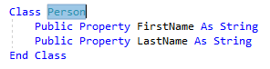

# Move a type to a matching file refactoring

This refactoring applies to:

- C#

- Visual Basic

**What:** Lets you move the selected type to a separate file with the same name.

**When:** You have multiple classes, structs, interfaces, etc. in the same file which you want to separate.

**Why:** Placing multiple types in the same file can make it difficult to find these types. By moving types to files with the same name, code becomes more readable and easier to navigate.

## How-to

1. Highlight or place the text cursor inside the name of the type to move:

   - C#:

    

   - Visual Basic:

    

1. Next, do one of the following:

   - **Keyboard**
     - Press **Ctrl**+**.** to trigger the **Quick Actions and Refactorings** menu and select **Move type to *TypeName*.cs** from the Preview window popup, where *TypeName* is the name of the type you have selected.
   - **Mouse**
     - Right-click the code, select the **Quick Actions and Refactorings** menu and select **Move type to *TypeName*.cs** from the Preview window popup, where *TypeName* is the name of the type you have selected.

   The type is moved to a new file with that name, as part of your solution.

   - C#:

    

   - Visual Basic:

    

## See also

- [Refactoring](../refactoring-in-visual-studio.md)