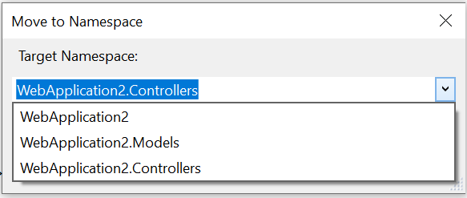

# Move type to namespace

This refactoring applies to:

- C#

**What:** Move type to namespace.

**When:** You want to move a type to a different namespace or folder. 

**Why:** You want to refactor parts of your solution and have a quick way to move a type to a different namespace or folder. 

## How-to

1. Place your cursor in the class name.
2. Press **Ctrl**+**.** to trigger the **Quick Actions and Refactorings** menu.
3. Select **Move to namespace**.

   

4. In the dialog box that opens, select the target namespace you'd like to move the type to. 

   

## See also

- [Refactoring](../refactoring-in-visual-studio.md)
