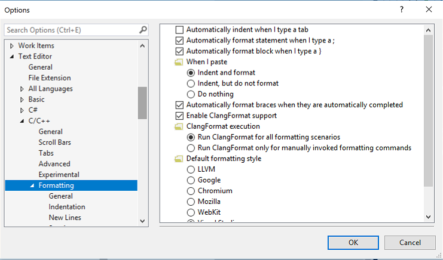

# Options, Text Editor, C/C++, Formatting

Use these property pages to change the default behavior of the code editor when you are programming in C or C++.

To access this page, in the **Options** dialog box, in the left pane, expand **Text Editor**, expand **C/C++**, and then click **Formatting**.

> [!NOTE]
> Your computer might show different names or locations for some of the Visual Studio user interface elements in the following instructions. The Visual Studio edition that you have and the settings that you use determine these elements. For more information, see [Personalize the Visual Studio IDE](../../ide/personalizing-the-visual-studio-ide.md).

## General Page

This page has options for formatting statements and blocks as you type them.

::: moniker range="vs-2017"

**Visual Studio 2017 version 15.7 and later**:

::: moniker-end

The page also has options for configuring support for [ClangFormat](https://clang.llvm.org/docs/ClangFormat.html) version 5.0. ClangFormat is a utility that makes it easy to style and format your code based on a set of rules that can be configured in a .clang-format or _clang-format file.

### Configuring ClangFormat options

::: moniker range="vs-2017"

**Visual Studio 2017 version 15.7 and later**:

::: moniker-end

ClangFormat support is enabled by default. You can choose which of these common formating conventions to apply to all your projects: LLVM, Google, Chromium, Mozilla, or WebKit. You can also create a custom format definition .clang-format or _clang-format file. If such a file is present in a project folder, Visual Studio uses it to format all source code files in that folder and its subfolders.

By default, Visual Studio runs clangformat.exe in the background applies formatting as you type. You can also specify to run it only for manually invoked formatting commands **Format Document (Ctrl+K, Ctrl+D)** or **Format Selection (Ctrl + K, Ctrl + F)**.

## Indentation, New Lines, Spacing Wrapping pages

These pages enable various formatting customizations but are ignored if ClangFormat is enabled.

## See also

- [General, Environment, Options Dialog Box](../../ide/reference/general-environment-options-dialog-box.md)
- [Using IntelliSense](../../ide/using-intellisense.md)