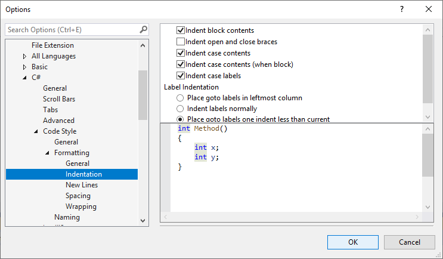
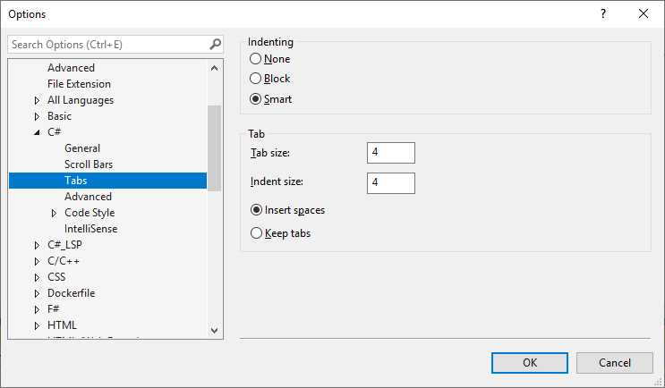

# Options dialog box: Text Editor \> C# \> Code Style \> Formatting

Use the **Formatting** options page and its subpages ([**Indentation**](#indentation-page), **New Lines**, **Spacing**, and **Wrapping**) to set options for formatting code in the code editor.

To access this options page, choose **Tools** > **Options** from the menu bar. In the **Options** dialog box, choose **Text Editor** > **C#** > **Code Style** > **Formatting**.

> [!TIP]
> The **Indentation**, **New Lines**, **Spacing**, and **Wrapping** subpages each display a preview window at the bottom that shows the effect of each option. To use the preview window, select a formatting option. The preview window shows an example of the selected option. When you change a setting by selecting a radio button or check box, the preview window updates to show the effect of the new setting.

## Formatting (General) page

### General settings

These settings affect *when* the code editor applies formatting options to code.

|Label|Description|
|-----------|-----------------|
|**Automatically format when typing**|When deselected, the **format statement on ;** and **format block  on }** options are disabled.|
|**Automatically format statement on ;**|When selected, formats statements at completion according to the formatting options selected for the editor.|
|**Automatically format block on }**|When selected, formats code blocks according to the formatting options selected for the editor as soon as you complete the code block.|
|**Automatically format on return**|When selected, formats text when **Enter** is pressed, to fit the formatting options selected for the editor.|
|**Automatically format on paste**|When selected, formats text that is pasted into the editor to fit the formatting options selected for the editor.|

::: moniker range="vs-2019"

If you previously applied code style settings for C# files using the **Format Document** command in Visual Studio 2017, that functionality is now available as [**Code Cleanup**](../code-styles-and-code-cleanup.md#apply-code-styles).

::: moniker-end

## Indentation page

The indentation options on this page apply when code is formatted automatically. One example of when code is automatically formatted is when you paste code into the file while **Automatically format on paste** is selected. (The **Automatically format on paste** option is under **Formatting** > **General**.)

> [!TIP]
> There are also indentation options on the **Text Editor** > **C#** > **Tabs** options page. Those options only determine where the code editor places the cursor when you press **Enter** at the end of a line.
>
> 

## New Lines page

Use the new lines options on this page to control whether you want braces, keywords, or expressions to appear on new lines in the code editor.

> [!IMPORTANT]
> The settings on this page can be overridden by your .editorconfig file. To learn more, see [Create portable, custom editor settings with EditorConfig](../create-portable-custom-editor-options.md).

:::image type="content" source="media/csharp-new-lines-options.png" alt-text="Screenshot of the C# new lines options in Visual Studio .":::

## See also

- [General, Environment, Options dialog box](../../ide/reference/general-environment-options-dialog-box.md)
