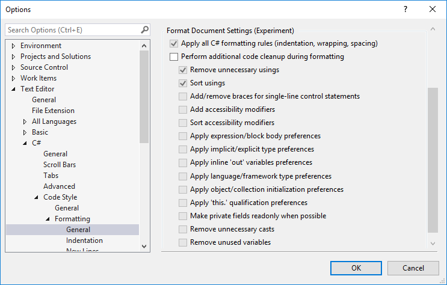

# Options dialog box: Text Editor \> C# \> Code Style \> Formatting

Use the **Formatting** options page and its subpages ([**Indentation**](#indentation-page), **New Lines**, **Spacing**, and **Wrapping**) to set options for formatting code in the code editor.

To access this options page, choose **Tools** > **Options** from the menu bar. In the **Options** dialog box, choose **Text Editor** > **C#** > **Code Style** > **Formatting**.

> [!TIP]
> The **Indentation**, **New Lines**, **Spacing**, and **Wrapping** subpages each display a preview window at the bottom that shows the effect of each option. To use the preview window, select a formatting option. The preview window shows an example of the selected option. When you change a setting by selecting a radio button or check box, the preview window updates to show the effect of the new setting.

## Formatting (General) page

### General settings

These settings affect *when* the code editor applies formatting options to code.

|Label|Description|
|-----------|-----------------|
|**Automatically format when typing**|When deselected, the **format statement on ;** and **format block  on }** options are disabled.|
|**Automatically format statement on ;**|When selected, formats statements at completion according to the formatting options selected for the editor.|
|**Automatically format block on }**|When selected, formats code blocks according to the formatting options selected for the editor as soon as you complete the code block.|
|**Automatically format on return**|When selected, formats text when **Enter** is pressed, to fit the formatting options selected for the editor.|
|**Automatically format on paste**|When selected, formats text that is pasted into the editor to fit the formatting options selected for the editor.|

::: moniker range="vs-2019"

If you previously applied code style settings for C# files using the **Format Document** command in Visual Studio 2017, that functionality is now available as [**Code Cleanup**](../code-styles-and-code-cleanup.md#apply-code-styles).

::: moniker-end

::: moniker range="vs-2017"

### Format Document settings

These settings configure the **Format Document** command to perform additional code cleanup on a file. For more information about how these settings are applied, see [Format Document command](../code-styles-and-code-cleanup.md#apply-code-styles).

|Label|Description|Corresponding EditorConfig and Tools > Options rules|
|-----------|-----------------|-----------------|-----------------|
|**Apply all C# formatting rules (indentation, wrapping, spacing)**|The **Format Document** command always fixes formatting issues. This setting can't be changed.| [Core EditorConfig options](../../ide/create-portable-custom-editor-options.md) [.NET EditorConfig formatting options](/dotnet/fundamentals/code-analysis/style-rules/formatting-rules)  **Tools** > **Options** > **Text Editor** > **C#** > **Formatting** > [**Indentation** or **New Lines** or **Spacing** or **Wrapping**]|
|**Perform addition code cleanup during formatting**|When selected, applies fixes for the rules specified below on the **Edit.FormatDocument** command.| N/A |
|**Remove unnecessary usings**|When selected, removes unnecessary `using` directives when **Edit.FormatDocument** is triggered.| N/A |
|**Sort usings**|When selected, sorts `using` directives when **Edit.FormatDocument** is triggered.| dotnet_sort_system_directives_first  **Tools** > **Options** > **Text Editor** > **C#** > **Advanced** > **Place 'System' directives first when sorting usings** |
|**Add/remove braces for single-line control statements**|When selected, adds or removes braces from single-line control statements when **Edit.FormatDocument** is triggered.| csharp_prefer_braces  **Tools** > **Options** > **Text Editor** > **C#** > **Code Style** > **Code block preferences** > **Prefer braces** |
|**Add accessibility modifiers**|When selected, adds missing accessibility modifiers when **Edit.FormatDocument** is triggered.| dotnet_style_require_accessibility_modifiers |
|**Sort accessibility modifiers**|When selected, sorts accessibility modifiers when **Edit.FormatDocument** is triggered.| csharp_preferred_modifier_order visual_basic_preferred_modifier_order |
|**Apply expression/block body preferences**|When selected, converts expression-bodied members to block bodies, or vice versa, when **Edit.FormatDocument** is triggered.| [Expression-bodied member EditorConfig options](/dotnet/fundamentals/code-analysis/style-rules/language-rules#expression-bodied-members)  **Tools** > **Options** > **Text Editor** > **C#** > **Code Style** > **Expression preferences** > **Use expression body for methods, constructors, etc.** |
|**Apply implicit/explicit type preferences**|When selected, converts `var` to the explicit type, or vice versa, when **Edit.FormatDocument** is triggered.| [Explicit type EditorConfig options](/dotnet/fundamentals/code-analysis/style-rules/language-rules#implicit-and-explicit-types)  **Tools** > **Options** > **Text Editor** > **C#** > **Code Style** > **'var' preferences** |
|**Apply inline 'out' variables preferences**|When selected, inlines `out` variables where possible when **Edit.FormatDocument** is triggered.| csharp_style_inlined_variable_declaration  **Tools** > **Options** > **Text Editor** > **C#** > **Code Style** > **Variable preferences** > **Prefer inlined variable declaration** |
|**Apply language/framework type preferences**|When selected, converts language types to framework types, or vice versa, when **Edit.FormatDocument** is triggered.| dotnet_style_predefined_type_for_locals_parameters_members dotnet_style_predefined_type_for_member_access  **Tools** > **Options** > **Text Editor** > **C#** > **Code Style** > **predefined type preferences** |
|**Apply object/collection initialization preferences**|When selected, uses object and collection initializers where possible when **Edit.FormatDocument** is triggered.| dotnet_style_object_initializer dotnet_style_collection_initializer  **Tools** > **Options** > **Text Editor** > **C#** > **Code Style** > **Expression preferences** > **Prefer object initializer** or **Prefer collection initializer** |
|**Apply 'this.' qualification preferences**|When selected, applies `this.` preferences when **Edit.FormatDocument** is triggered.| [this. qualification EditorConfig options](/dotnet/fundamentals/code-analysis/style-rules/language-rules#this-and-me)  **Tools** > **Options** > **Text Editor** > **C#** > **Code Style** > **'this.' preferences** |
|**Make private fields readonly when possible**|When selected, makes private fields `readonly` where possible when **Edit.FormatDocument** is triggered.| dotnet_style_readonly_field  **Tools** > **Options** > **Text Editor** > **C#** > **Code Style** > **Field preferences** > **Prefer readonly** |
|**Remove unnecessary casts**|When selected, removes unnecessary casts where possible when **Edit.FormatDocument** is triggered.| N/A |
|**Remove unused variables**|When selected, removes variables that are unused when **Edit.FormatDocument** is triggered.| N/A |

::: moniker-end

## Indentation page

The indentation options on this page apply when code is formatted automatically. One example of when code is automatically formatted is when you paste code into the file while **Automatically format on paste** is selected. (The **Automatically format on paste** option is under **Formatting** > **General**.)

> [!TIP]
> There are also indentation options on the **Text Editor** > **C#** > **Tabs** options page. Those options only determine where the code editor places the cursor when you press **Enter** at the end of a line.
>
> 

## See also

- [General, Environment, Options dialog box](../../ide/reference/general-environment-options-dialog-box.md)
