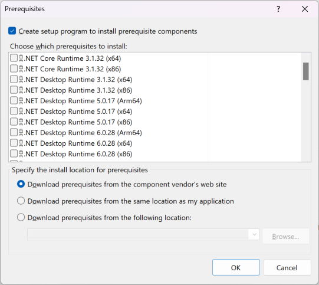

# Prerequisites dialog box

The **Prerequisites** dialog box specifies which prerequisite components are installed, how they're installed, and which order the packages are installed.

To access the dialog box, select a project node in **Solution Explorer**, and then select **Project** > **Properties**. When the **Project Designer** appears, select the **Publish** tab, and then select **Prerequisites**. For Setup projects, on the **Project** menu, click **Properties**. When the **Property Pages** dialog box appears, click **Prerequisites**.

[!INCLUDE[ndptecclick](../../deployment/includes/dotnet-publish-tool.md)]

## UIElement list

|Element|Description|
|-------------|-----------------|
|**Create setup program to install prerequisite components**|Includes the prerequisite components in your application's Setup program (*Setup.exe*) so that they'll be installed before your application, in order of dependency. By default, this option is selected. If it isn't selected, no *Setup.exe* is created.|
|**Choose which prerequisites to install**|Specifies whether to install components such as .NET Framework and C++ runtime libraries.  For example, by selecting the check box next to **SQL Server 2012 Express**, you specify that the Setup program must verify whether this component is installed on the target computer, and install it if it's not.  For detailed information about each prerequisite package, see [Prerequisites information](#prerequisites-information).|
|**Download prerequisites from the component vendor's web site**|Specifies that the prerequisite components be installed from the vendor's website. This is the default option.|
|**Download prerequisites from the same location as my application**|Specifies that the prerequisite components be installed from the same location as the application. This copies all the prerequisite packages to the publish location. For this option to work, the prerequisite packages must be on the development computer.|
|**Download prerequisites from the following location**|Specifies that the prerequisite components be installed from the location that you enter. You can use the **Browse** button to select a location.|

> [!NOTE]
> For information on where to put prerequisites, see [Create bootstrapper packages](../../deployment/creating-bootstrapper-packages.md#create-custom-bootstrapper-packages).

## Prerequisites information

The prerequisite components that appear in the **Prerequisites** dialog box might differ from those in the following list. The prerequisite packages listed in the **Prerequisites Dialog Box** are set automatically the first time that you open the dialog box. If you subsequently change the project's target framework, you have to select the prerequisites manually to match the new target framework.

|Element|Description|
|-------------|-----------------|
|**.NET Desktop runtime 3.x, ..., 8.x**|This package installs the [.NET Desktop runtime](/dotnet/core/install/windows) for the specified platform architecture (x86, x64, or Arm64). This runtime supports Windows Presentation Foundation (WPF) and Windows Forms apps that are built with .NET. This isn't the same as .NET Framework. This runtime includes .NET Runtime, but doesn't include ASP.NET Core Runtime, which must be installed separately.|
|**.NET runtime 5.x, ..., 8.x**|This package installs the [.NET runtime](/dotnet/core/install/windows) for the specified platform architecture (x86, x64, or Arm64). This is the base runtime, and contains just the components needed to run a console app. Typically, you'd install .NET Desktop Runtime instead of this one.|
|**Microsoft .NET Framework 4.x**|This package installs the .NET Framework 4.x for both the x86 and x64 platforms.|
|**.NET Framework 3.5 SP1**|This package installs the following:   -   .NET Framework versions 2.0, 3.0, and 3.5. -   Support for all .NET Framework versions on 32-bit (x86) and 64-bit (x64) operating systems. -   Language packs for each .NET Framework version that is installed with the package. -   Service packs for .NET Framework 2.0 and 3.0.   .NET Framework 3.0 is included with Windows Vista, and .NET Framework 3.5 is included with Visual Studio. .NET Framework 3.5 is required for all Visual Basic and C# projects that are compiled for 32-bit operating systems and for which the target framework is set to **.NET Framework 3.5**, and for Visual Basic and C# projects compiled for 64-bit operating systems. (IA64 isn't supported.) Note that Visual Basic and C# projects are compiled for any CPU architecture by default. For more information, see [Framework targeting overview](../../ide/visual-studio-multi-targeting-overview.md) and [Deploy prerequisites for 64-bit apps](../../deployment/deploying-prerequisites-for-64-bit-applications.md).|
|**Microsoft System CLR Types for SQL Server 2014 (x64 and x86)**|This package installs Microsoft System CLR Types for SQL Server 2014 for either x64 or x86.|
|**SQL Server 2008 R2 Express**|This package installs Microsoft SQL Server 2008 R2 Express, a free edition of Microsoft SQL Server 2008 R2, an ideal database for small web, server, or desktop applications. It can be used for free for development and production.|
|**SQL Server 2012 Express**|This package installs Microsoft SQL Server 2012 Express.|
|**SQL Server 2012 ... 2019 Express LocalDB**|This package installs Microsoft SQL Server Express LocalDB for the specified version of SQL Server.|
|**Visual C++ "14" Runtime Libraries (ARM)**|This package installs the Visual C++ run-time libraries for the Itanium architecture, which provide routines for programming for the Microsoft Windows operating system. These routines automate many common programming tasks that aren't provided by the C and C++ languages.   For more information, see [C Run-Time Library Reference](/cpp/c-runtime-library/c-run-time-library-reference).|
|**Visual C++ "14" Runtime Libraries (x64)**|This package installs the Visual C++ run-time libraries for the x64 operating systems, which provide routines for programming for the Microsoft Windows operating system. These routines automate many common programming tasks that aren't provided by the C and C++ languages.   For more information, see [C Run-Time Library Reference](/cpp/c-runtime-library/c-run-time-library-reference).|
|**Visual C++ "14" Runtime Libraries (x86)**|This package installs the Visual C++ run-time libraries for the x86 operating systems, which provide routines for programming for the Microsoft Windows operating system. These routines automate many common programming tasks that aren't provided by the C and C++ languages.   For more information, see [C Run-Time Library Reference](/cpp/c-runtime-library/c-run-time-library-reference).|

## See also

- [Publish Page, Project Designer](../../ide/reference/publish-page-project-designer.md)
- [Application Deployment Prerequisites](../../deployment/application-deployment-prerequisites.md)
- [Deploying Prerequisites for 64-bit Applications](../../deployment/deploying-prerequisites-for-64-bit-applications.md)
- [Framework targeting overview](../../ide/visual-studio-multi-targeting-overview.md)
