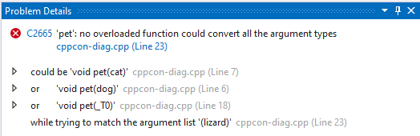
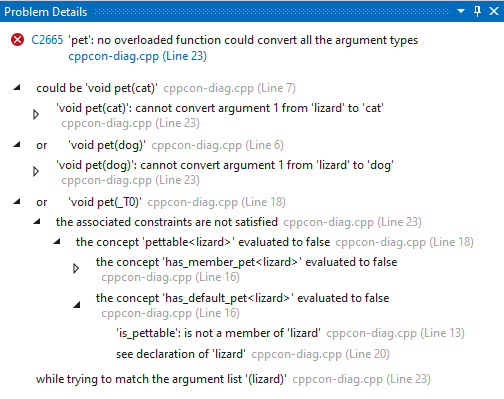

# Problem Details Window

 [!INCLUDE [Visual Studio](~/includes/applies-to-version/vs-windows-only.md)]

The **Problem Details** window enables you to view and navigate structured diagnostics issued by the MSVC compiler or [code analysis for C/C++](/cpp/code-quality/code-analysis-for-c-cpp-overview).

You can open the **Problem Details** window by interacting with entries in the [**Error List** window](error-list-window.md) which show an icon in their **Details** column to indicate that structured diagnostics are available for that entry. 

[An Error List entry with an icon in its Details column.](media/error-list-details-column.png)

Such entries are produced in two scenarios:

1. C++ compilations using [**MSBuild**](/cpp/build/creating-and-managing-visual-cpp-projects) and the MSVC compiler may emit structured diagnostics.
2. Code analysis warnings that support [**Key Event**](https://devblogs.microsoft.com/cppblog/microsoft-cpp-code-analysis-warnings-with-key-events) data emit structured diagnostics.

To open the **Problem Details** window for such an entry, you can either:

- Double click on the entry or press **Enter** with the entry highlighted (this behavior can be disabled with **Tools** > **Options** > **Text Editor** > **C/C++** > **Advanced** > **Show Problem Details on Double Click**).
- Single click on the icon in the **Details** column.
- Open the shortcut menu for the entry and click the **Open Problem Details** option.

By default, the **Problem Details** window opens in the same location as the **Error List** window. If you move the **Problem Details** window and close it, then when it is reopened, it will open in the same location at which it was closed.

The **Problem Details** window displays structured information that may be nested. When the window opens, all entries that have nested children begin collapsed.

You can expand an entry to view its children by either clicking on the arrow at the left-hand side of an entry, or by pressing **Right** with the entry highlighted.

Structured diagnostics can be enabled or disabled with the **Project** > **Properties** > **Advanced** > **Enable MSVC Structured Output** option. You can affect several projects by creating a [Directory.Build.props](/visualstudio/msbuild/customize-by-directory) file with the **UseStructuredOutput** property defined to true or false.
