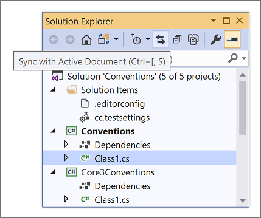

# Options dialog box: Projects and Solutions \> General

Use this page to define Visual Studio's behavior related to projects and solutions. To access these options, select **Tools** > **Options**, expand **Projects and Solutions**, and then select **General**.

The following options are available on the **General** page.

## Always show Error List if build finishes with errors

Opens the **Error List** window on build completion, only if a project failed to build. Errors that occur during the build process are displayed. When this option is cleared, the errors still occur but the window does not open when the build is complete. This option is enabled by default.

## Track active item in Solution Explorer

When selected, **Solution Explorer** automatically opens and the active item is selected. The selected item changes as you work with different files in a project or solution, or different components in a designer. When this option is cleared, the selection in **Solution Explorer** does not change automatically. This option is enabled by default.

> [!TIP]
> If you disable this option, an easy way to navigate to the active document in Solution Explorer is by selecting **Sync with Active Document** on the **Solution Explorer** toolbar.
>
> 

::: moniker range="vs-2019"

## Warn user when the project location is not trusted

If you attempt to create a new project or open an existing project in a location that is not fully trusted (for example, on a UNC path or an HTTP path), a message is displayed. Use this option to specify whether the message is displayed each time that you attempt to create or open a project in a location that is not fully trusted.

::: moniker-end

## Show Output window when build starts

Automatically displays the [Output window](output-window.md) in the IDE at the outset of solution builds.

## Prompt before moving files to a new location

When selected, Visual Studio displays a confirmation message box before the locations of files are changed by actions in **Solution Explorer**.

## Allow parallel project initialization

When selected, Visual Studio loads large .NET solutions much faster when you reload the same solution. For more information, see the "*Parallel project load*" section of the [Load solutions faster](https://devblogs.microsoft.com/visualstudio/load-solutions-faster-with-visual-studio-2017-version-15-6/) blog post.

## Reopen documents on solution load

When selected, documents that were left open the previous time the solution was closed are automatically opened when the solution is opened.

Reopening certain types of files or designers can delay solution load. Uncheck this option to [improve solution load performance](../visual-studio-performance-tips-and-tricks.md#disable-automatic-file-restore) if you don't want to restore the solution's previous context.

## Restore Solution Explorer project hierarchy state on solution load

When selected, restores the state of nodes in Solution Explorer with respect to whether they were expanded or collapsed the last time the solution was open. Deselect this option to decrease solution load time for large solutions.

## Open project files with double-click or the Enter key

When this option is selected and you double-click a project node in Solution Explorer or select it and then press **Enter**, the project file (for example, \*.csproj file) opens in the editor. When deselected, double-clicking a project node in Solution Explorer or selecting it and pressing **Enter** expands or collapses the node only.

If you don't have this option selected and you want to edit a project file, right-click the project node in Solution Explorer and select **Edit Project File**. 

## Enable symbolic renaming when renaming files

When selected, you can rename all the references in a project to that of the code element. 

### Prompt for symbolic renaming when renaming files

When selected, Visual Studio displays a message box asking whether or not it should also rename all references in the project to that of the code element.

::: moniker range="vs-2022"

## Enable namespace update when moving files

When selected, Visual Studio automatically adjusts the namespace of a file when it is moved to a new location.

### Prompt to update namespace when moving files

When selected, Visual Studio displays a message box asking whether or not it should automatically adjust the namespace of a file when it is moved to a new location.

::: moniker-end

## See also

- [Options dialog box: Projects and Solutions \> Locations](projects-solutions-locations-options.md)
- [Options Dialog Box, Projects and Solutions, Build and Run](options-dialog-box-projects-and-solutions-build-and-run.md)
- [Options Dialog Box, Projects and Solutions, Web Projects](/previous-versions/visualstudio/visual-studio-2017/ide/reference/options-dialog-box-projects-and-solutions-web-projects)