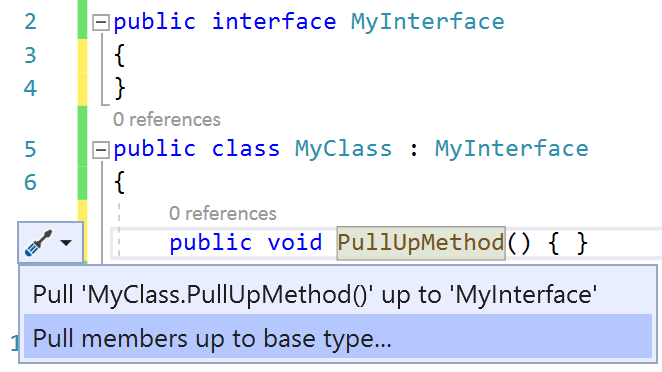
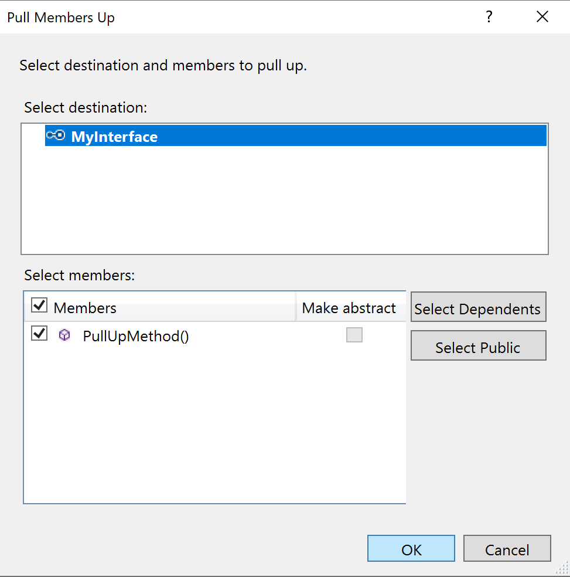
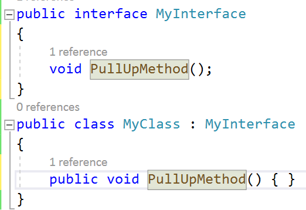

# Pull members up

This refactoring applies to:

- C#

- Visual Basic

**What:** Lets you pull members up to the base type.

**When:** You have implemented an interface and you want to move a member to the base type.

**Why:** Pulling members up enables other implementations of your interface to inherit those members as well.

## How-to

1. Place your cursor in any member of an implemented interface.
2. Press **Ctrl**+**.** to trigger the **Quick Actions and Refactorings** menu.

   

2. Select **Pull Members up to base type**.

3. In the dialog, select what members you would like to add to the selected interface.

   

4. Choose **OK**. The selected members are pulled up to the interface.

   

## See also

- [Refactoring](../refactoring-in-visual-studio.md)
