# Rename and move refactorings

Visual Studio provides several refactorings for renaming and reorganizing code symbols and files. You can access these refactorings through the **Quick Actions and Refactorings** menu (**Ctrl**+**.**).

## Rename a code symbol

**Applies to:** C#, Visual Basic

This refactoring safely renames identifiers for code symbols, such as fields, local variables, methods, namespaces, properties, and types. All references across the project are updated automatically, avoiding errors from manual find-and-replace.

1. Highlight or place the text cursor inside the item to be renamed:

   - C#:

       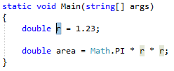

   - Visual Basic:

       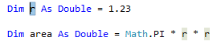

1. Next, use your keyboard or mouse as follows:

   - **Keyboard**
      - Press **Ctrl+R**, then **Ctrl+R**. (Your keyboard shortcut may be different based on which profile you selected.)
   - **Mouse**
      - Select **Edit > Refactor > Rename**.
      - Right-click the code and select **Rename**.

1. Rename the item simply by typing the new name.

   - C#:

      

   - Visual Basic:

      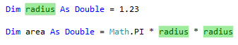

   ::: moniker range=">= vs-2022"
   > [!TIP]
   > You can also update comments and other strings to use this new name, as well as [preview the changes](../../ide/preview-changes.md) before saving, using the checkboxes in the **Rename** box that appear when you open the drop-down menu.
   ::: moniker-end

1. When you're happy with the change, choose the **Apply** button or press **Enter** and the changes are committed.

### Remarks

- Starting in Visual Studio 2019 version 16.3, when you rename a type that matches the name of the file it's in, a checkbox appears that enables you to rename the file at the same time. This option appears when you rename a class, interface, or enumeration. This option isn't supported for partial types with multiple definitions.

   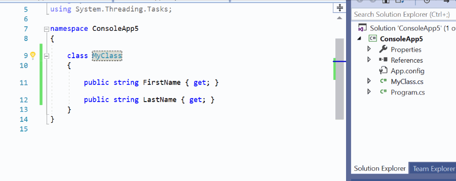

- If you use a name that already exists which would cause a conflict, the **Rename** box warns you.

   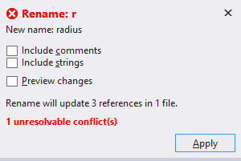

- Another way to rename a symbol is to change its name in the editor. Then, with the cursor in the symbol name, press **Ctrl**+**.** or just expand the light bulb icon menu that appears and choose **Rename \<old name> to \<new name>**.

   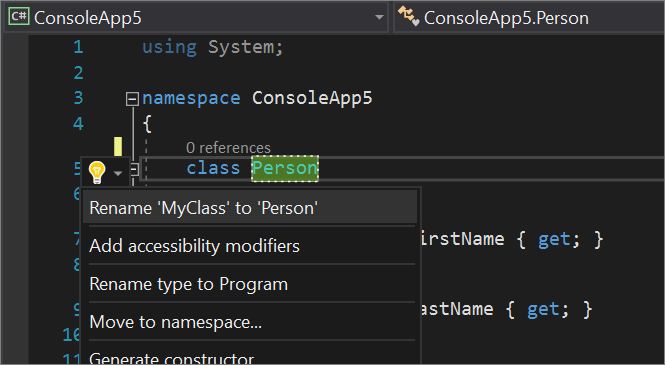

## Move type to matching file

**Applies to:** C#, Visual Basic

This refactoring moves a type to a separate file with the same name, improving code organization and navigation when you have multiple types in one file.

1. Place the cursor inside the name of the type where it is defined. For example:

   ### [C#](#tab/csharp)
   ```csharp
   class Person
   ```

   ### [VB](#tab/vb)
   ```vb
   Class Person
   ```
   ---

1. Next, do one of the following:

   - Press **Ctrl**+**.**
   - Right-click on the type name and select **Quick Actions and Refactorings**

1. Select **Move type to *TypeName*.cs** from the menu, where *TypeName* is the name of the type you've selected.

   The type is moved to a new file in the project that has the same name as the type.

   - C#:

      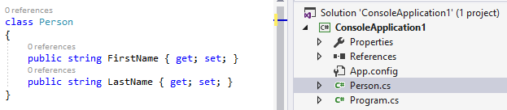

   - Visual Basic:

      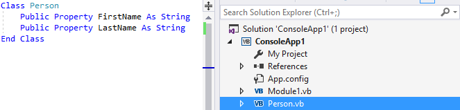

## Sync type and filename

**Applies to:** C#, Visual Basic

This refactoring renames a type to match the filename, or renames a filename to match the type it contains, keeping code organized and easy to navigate.

> [!NOTE]
> This refactoring is not yet available for .NET Standard and .NET Core projects.

1. Highlight or place the text cursor inside the name of the type to synchronize:

   - C#:

       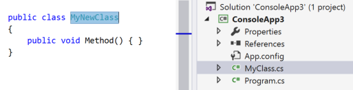

   - Visual Basic:

       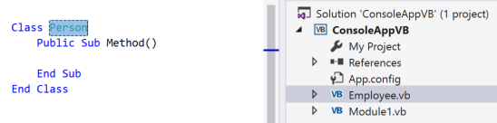

1. Next, do one of the following:

   - **Keyboard**
      - Press **Ctrl**+**.** to trigger the **Quick Actions and Refactorings** menu and select **Rename file to *TypeName*.cs** from the Preview window popup, where *TypeName* is the name of the type you have selected.
      - Press **Ctrl**+**.** to trigger the **Quick Actions and Refactorings** menu and select **Rename type to _Filename_** from the Preview window popup, where *Filename* is the name of the current file.
   - **Mouse**
      - Right-click the code, select the **Quick Actions and Refactorings** menu, and select **Rename file to *TypeName*.cs** from the Preview window popup, where *TypeName* is the name of the type you have selected.
      - Right-click the code, select the **Quick Actions and Refactorings** menu, and select **Rename type to _Filename_** from the Preview window popup, where *Filename* is the name of the current file.

   The type or file is renamed.

   - C#: In the example below, the file **MyClass.cs** was renamed to **MyNewClass.cs** to match the type name.

       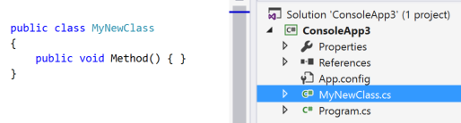

   - Visual Basic: In the example below, the file **Employee.vb** was renamed to **Person.vb** to match the type name.

       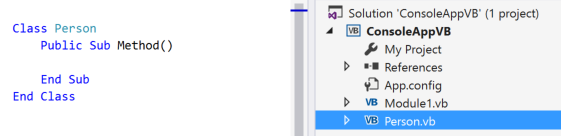

## Sync namespace and folder name

**Applies to:** C#

This refactoring updates the namespace to match the folder structure when you move a file to a new folder.

1. Place your cursor in the namespace name.
1. Press **Ctrl**+**.** to trigger the **Quick Actions and Refactorings** menu.
1. Select **Change namespace to \<folder name>**.

   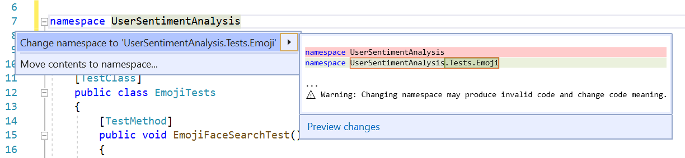

## Move declaration near reference

**Applies to:** C#, Visual Basic

This refactoring moves variable declarations closer to their usage, improving readability and narrowing variable scope.

1. Place your cursor in the variable declaration.

1. Next, do one of the following:

   - **Keyboard**
      - Press **Ctrl**+**.** to trigger the **Quick Actions and Refactorings** menu and select **Move declaration near reference** from the Preview window popup.
   - **Mouse**
      - Right-click the code, select the **Quick Actions and Refactorings** menu, and select **Move declaration near reference** from the Preview window popup.

1. When you're happy with the change, press **Enter** or click the fix in the menu and the changes are committed.

Example:

```csharp
// Before
int x;
if (condition)
{
    x = 1;
    Console.WriteLine(x);
}

// Move declaration near reference

// After
if (condition)
{
    int x = 1;
    Console.WriteLine(x);
}
```

## Related content

- [Refactoring](../refactoring-in-visual-studio.md)
- [Preview Changes](../../ide/preview-changes.md)
