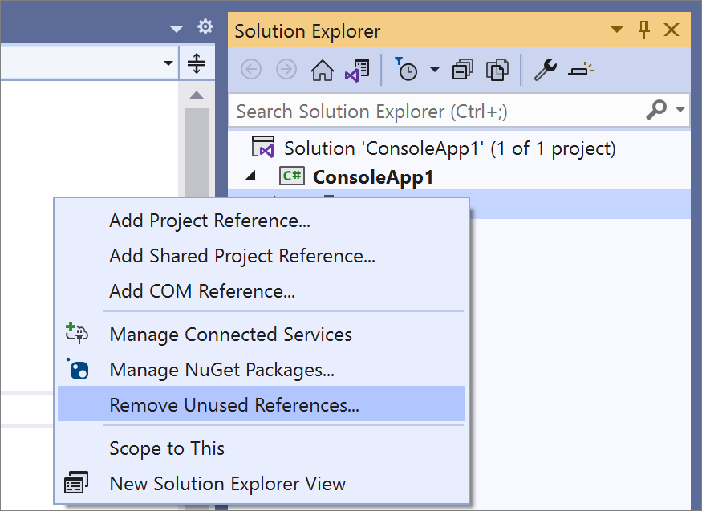
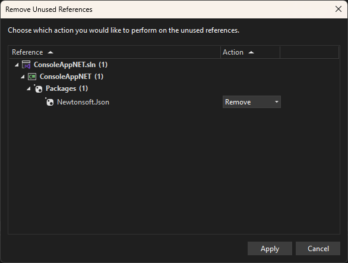
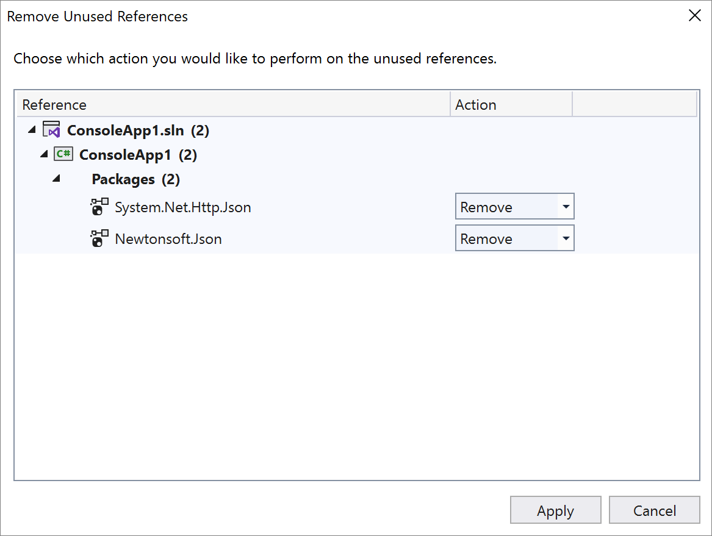

# Remove Unused References

This refactoring applies to:

- C#
- Visual Basic

**What:** For [SDK style projects](../../msbuild/how-to-use-project-sdk.md) only, lets you remove unused references.

**When:** You want to clean up project references and NuGet packages that have no usage.

**Why:** Removing project references that have no usage can help save space and reduce startup time of your application, because it takes time to load each module and avoids having the compiler load metadata that will never be used.

> [!NOTE]
> You can use the [.NET Upgrade Assistant](https://dotnet.microsoft.com/platform/upgrade-assistant) right from Visual Studio to upgrade your app to the latest .NET versions.

## How-to

1. Verify that the option is enabled.

   Select **Tools** > **Options** > **Text Editor** > **C#** > **Advanced**, and enable **Show "Removed Unused References" command in Solution Explorer**.

1. In Solution Explorer, right click on a project name or the **Dependencies** node.

1. Select **Remove Unused References**.

   ::: moniker range=">= vs-2022"
   
   ::: moniker-end
   ::: moniker range="vs-2019"
   
   ::: moniker-end

1. The **Remove Unused References** dialog opens, displaying references that have no usage in source code. Unused references are pre-selected for removal with an option to preserve references by selecting `Keep` from the Action drop down.

   ::: moniker range=">= vs-2022"
   
   ::: moniker-end
   ::: moniker range="vs-2019"
   
   ::: moniker-end

1. Click `Apply` to remove selected references.

## See also

- [Refactoring](../refactoring-in-visual-studio.md)
