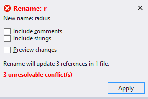

# Rename a code symbol in Visual Basic

**What:** Lets you rename identifiers for code symbols, such as fields, local variables, methods, namespaces, properties and types.

**When:** You want to safely rename something without having to find all instances, and copy/paste the new name.

**Why:** Copy and pasting the new name across an entire project would likely result in errors.  This refactoring tool will accurately perform the renaming action.

**How:**

1. Highlight or place the text cursor inside the item to be renamed:

   

1. Next, do one of the following:
   * **Keyboard**
     * Press **Ctrl+R**, then **Ctrl+R**.  (Note that your keyboard shortcut may be different based on which profile you've selected.)
   * **Mouse**
     * Select **Edit > Refactor > Rename**.
     * Right-click the code and select **Rename**.

1. Rename the item simply by typing the new name.

   

   > [!TIP]
   > You can also update comments and other strings to use this new name, as well as [preview changes](../../ide/preview-changes.md) before saving, using the checkboxes in the **Rename** box which appears at the top right of your IDE.

1. When you're happy with the change, click the **Apply** button or press **Enter** and the changes will be committed.

> [!NOTE]
> If you use a name that already exists which would cause a conflict, the **Rename** box in your IDE will warn you.
>
> 

## See also

[Refactoring](../refactoring-in-visual-studio.md)  
[Preview Changes](../../ide/preview-changes.md)