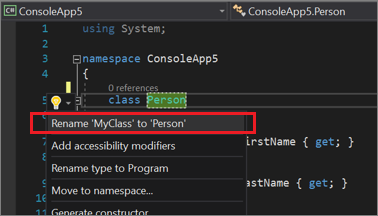

# Rename a code symbol refactoring

This refactoring applies to:

- C#

- Visual Basic

**What:** Lets you rename identifiers for code symbols, such as fields, local variables, methods, namespaces, properties, and types.

**When:** You want to safely rename something without having to find all instances, and copy/paste the new name.

**Why:** Copy and pasting the new name across an entire project would likely result in errors. This refactoring tool accurately performs the renaming action.

## How-to

1. Highlight or place the text cursor inside the item to be renamed:

   - C#:

       

   - Visual Basic:

       

2. Next, use your keyboard or mouse as follows:

   - **Keyboard**
      - Press **Ctrl+R**, then **Ctrl+R**. (Your keyboard shortcut may be different based on which profile you selected.)
   - **Mouse**
      - Select **Edit > Refactor > Rename**.
      - Right-click the code and select **Rename**.

3. Rename the item simply by typing the new name.

   - C#:

      

   - Visual Basic:

      

   ::: moniker range=">= vs-2022"
   > [!TIP]
   > You can also update comments and other strings to use this new name, as well as [preview the changes](../../ide/preview-changes.md) before saving, using the checkboxes in the **Rename** box that appear when you open the drop-down menu.
   ::: moniker-end

   ::: moniker range="vs-2019"
   > [!TIP]
   > You can also update comments and other strings to use this new name, as well as [preview the changes](../../ide/preview-changes.md) before saving, using the checkboxes in the **Rename** box that appears at the top right of your editor.
   ::: moniker-end

4. When you're happy with the change, choose the **Apply** button or press **Enter** and the changes are committed.

## Remarks

- Starting in Visual Studio 2019 version 16.3, when you rename a type that matches the name of the file it's in, a checkbox appears that enables you to rename the file at the same time. This option appears when you rename a class, interface, or enumeration. This option isn't supported for partial types with multiple definitions.

   

- If you use a name that already exists which would cause a conflict, the **Rename** box warns you.

   

- Another way to rename a symbol is to change its name in the editor. Then, with the cursor in the symbol name, press **Ctrl**+**.** or just expand the light bulb icon menu that appears and choose **Rename \<old name> to \<new name>**.

   

## See also

- [Refactoring](../refactoring-in-visual-studio.md)
- [Preview Changes](../../ide/preview-changes.md)
