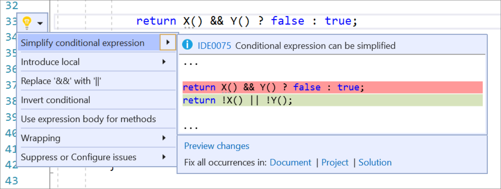

# Simplify conditional expression refactoring

This refactoring applies to:

- C#

**What:** Lets you simplify a [conditional expression](/dotnet/csharp/language-reference/operators/conditional-operator).

**When:** You want to remove unnecessary code to provide more clarity.

**Why:** Simplifying a conditional expression can provide more clarity and concise syntax. This refactoring tool will perform the task automatically instead of having to do it manually.

## How-to

1. Place your caret on the conditional expression:

2. Press **Ctrl**+**.** to trigger the **Quick Actions and Refactorings** menu.

3. Select **Simplify conditional expression**

    

## See also

- [Refactoring](../refactoring-in-visual-studio.md)