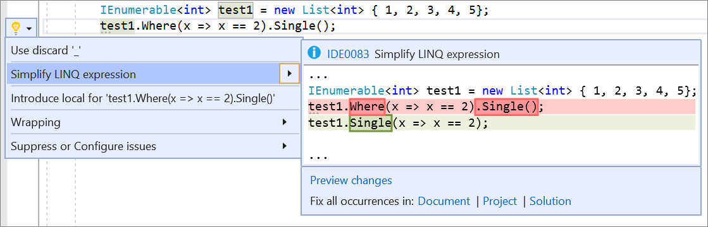

# Simplify LINQ expression

This refactoring applies to:

- C#

**What:** Refactors instances of `SomeEnumerableType.Where(<LambdaExpression>).Single()` to `SomeEnumerable.Single(<LambdaExpression>)` for `Enumerable.Single()` as well as the following Enumerable methods: `SingleOrDefault()`, `Last()`, `LastOrDefault()`, `Any()`, `Count()`, `First()`, and `FirstOrDefault()`.

**When:**  All instances where the method calls `Single()`, `SingleOrDefault()`, and so on, doesn't have any arguments and is preceded by a `Where()` expression. The input to the `Where()` expression cannot be constructed as an expression tree.

**Why:** Removing the unnecessary call to the Enumerable for the `.Where()` method improves readability and in some cases performance, see remarks.

## How-to

1. Place your cursor within the `SomeEnumerableType.Where(<LambdaExpression>).Single()` instance in visual studio.
2. Press **Ctrl**+**.** to trigger the **Quick Actions and Refactorings** menu.
3. Select **Simplify LINQ expression**

   
   
## Remarks

In some cases this refactoring may reduce performance. LINQ operations on `List<T>` and `T[]` are not optimized in this case and result in worse performance.

## See also

- [Refactoring](../refactoring-in-visual-studio.md)
