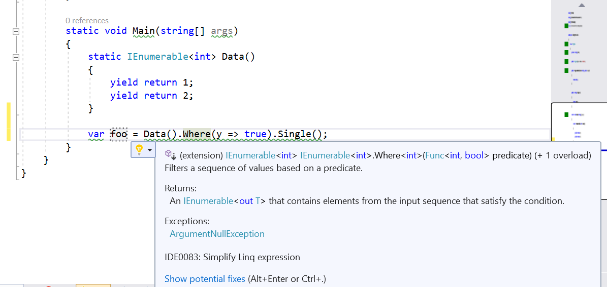

# Simplify LINQ Expression

This refactoring applies to:

- C#

**What:** Refactors instances of SomeEnumerableType.Where(`<LambdaExpression>`).Single() to SomeEnumerable.Single(`<LambdaExpression>`) for Enumerable.Single as well as these other Enumerable methods: SingleOrDefault, Last, LastOrDefault, Any, Count, First, FirstOrDefault.

**When:**  All instances where the method call Single, SingleOrDefault, and so on, doesn't have any arguments and is preceded by a Where expression. The input to the Where expression cannot be constructed as an expression tree.

**Why:** Removing the unnecessary call to the Enumerable.Where method improves performance and readability.

## How-to

1. Place your cursor within the SomeEnumerableType.Where(`<LambdaExpression>`).Single() instance in visual studio.
2. Press **Ctrl**+**.** to trigger the **Quick Actions and Refactorings** menu.
3. Select **Simplify Linq Expression**

   

## See also

- [Refactoring](../refactoring-in-visual-studio.md)
