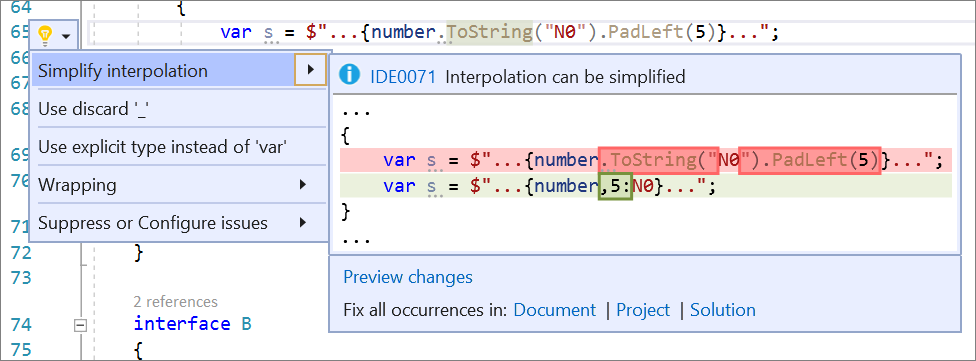

# Simplify string interpolation refactoring

This refactoring applies to:

- C#

- Visual Basic

**What:** Lets you simplify a [string interpolation](/dotnet/csharp/tutorials/string-interpolation).

**When:** You have a string interpolation that can be simplified.

**Why:** Simplifying a string interpolation can provide more clarity and concise syntax. This refactoring tool will perform the task automatically instead of having to do it manually.

## How-to

1. Place your caret on the string interpolation:

2. Press **Ctrl**+**.** to trigger the **Quick Actions and Refactorings** menu.

3. Select **Simplify interpolation**

    

## See also

- [Refactoring](../refactoring-in-visual-studio.md)