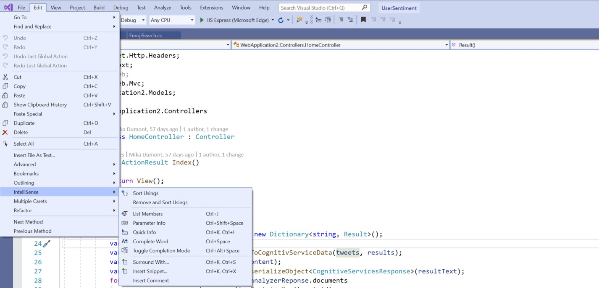
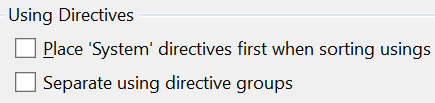

# Sort usings

This refactoring applies to:

- C#

- Visual Basic

**What:** Sort usings.

**When:** You want to sort `using` directives at the top of your file so that they are in alphabetical order. 

**Why:** It makes it easier to find a using directive.

## How-to

1. Select **Edit** from the menu bar.
2. Select **Intellisense** > **Sort Usings**.

   

3. You can also configure different settings for `using` directives in **Tools** > **Options** > **Text Editor** > **C#** > **Advanced**.

   

## See also

- [Refactoring](../refactoring-in-visual-studio.md)
