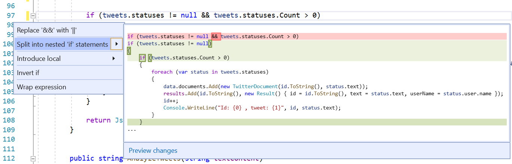
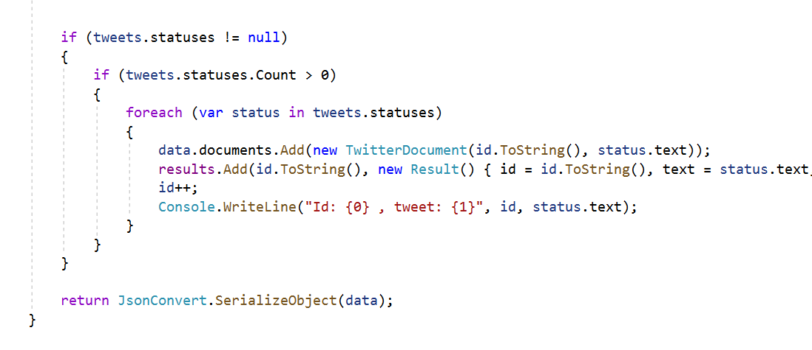
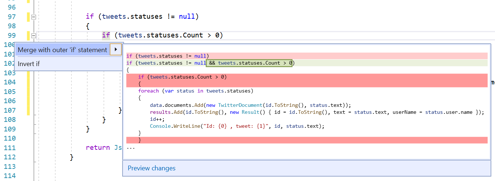
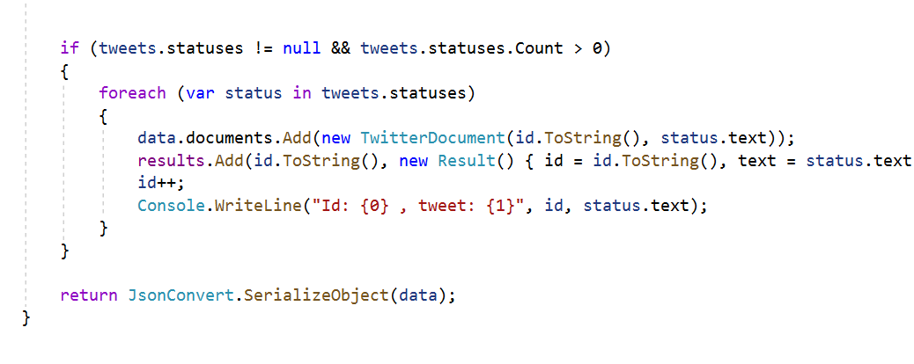

# Split or merge if statements

This refactoring applies to:

- C#

- Visual Basic

**What:** **What:** Split or merge [if](/dotnet/csharp/language-reference/keywords/if-else) statements.

**When:** You want to split an `if` statement that uses the `&&` or `||` operators into a nested `if` statement, or merge an `if` statement with an outer `if` statement.

**Why:** It's a matter of style preference.  

## How-to

If you want to split the `if` statement:

1. Place your cursor in the `if` statement by the `&&` or `||` operator.

2. Press **Ctrl**+**.** to trigger the **Quick Actions and Refactorings** menu.

    

3. Select **Split into nested if statements**.

    

If you want to merge the inner `if` statement with the outer `if` statement: 

1. Place your cursor in the inner `if` keyword.

2. Press **Ctrl**+**.** to trigger the **Quick Actions and Refactorings** menu.

    

3. Select **Merge with outer if statement**.

    

## See also

- [Refactoring](../refactoring-in-visual-studio.md)