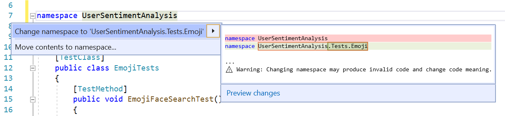

# Sync namespace and folder name

This refactoring applies to:

- C#

**What:** Sync namespace and folder name.

**When:** You want to rearchitect parts of your solution by dragging a file to a new folder. 

**Why:** You want to make sure your namespace keeps up-to date with your new folder structure.

## How-to

1. Place your cursor in the namespace name.
2. Press **Ctrl**+**.** to trigger the **Quick Actions and Refactorings** menu.
3. Select **Change namespace to \<folder name>**.

   

## See also

- [Refactoring](../refactoring-in-visual-studio.md)
