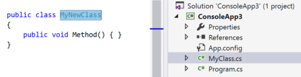

# Sync a type to a filename, or a filename to a type refactoring

This refactoring applies to:

- C#

- Visual Basic

**What:** Lets you rename a type to match the filename, or rename a filename to match the type it contains.

**When:** You have renamed a file or type and haven't yet updated the corresponding file or type to match.

**Why:** Placing a type in a file with a different name, or vice-versa, makes it difficult to find what you're looking for. By renaming either the type or filename, code becomes more readable and easier to navigate.

> [!NOTE]
> This refactoring is not yet available for .NET Standard and .NET Core projects.

## How-to

1. Highlight or place the text cursor inside the name of the type to synchronize:

   - C#:

       

   - Visual Basic:

       

2. Next, do one of the following:

   - **Keyboard**
      - Press **Ctrl**+**.** to trigger the **Quick Actions and Refactorings** menu and select **Rename file to *TypeName*.cs** from the Preview window popup, where *TypeName* is the name of the type you have selected.
      - Press **Ctrl**+**.** to trigger the **Quick Actions and Refactorings** menu and select **Rename type to _Filename_** from the Preview window popup, where *Filename* is the name of the current file.
   - **Mouse**
      - Right-click the code, select the **Quick Actions and Refactorings** menu, and select **Rename file to *TypeName*.cs** from the Preview window popup, where *TypeName* is the name of the type you have selected.
      - Right-click the code, select the **Quick Actions and Refactorings** menu, and select **Rename type to _Filename_** from the Preview window popup, where *Filename* is the name of the current file.

   The type or file is renamed.

   - C#: In the example below, the file **MyClass.cs** was renamed to **MyNewClass.cs** to match the type name.

       

   - Visual Basic: In the example below, the file **Employee.vb** was renamed to **Person.vb** to match the type name.

       

## See also

- [Refactoring](../refactoring-in-visual-studio.md)
