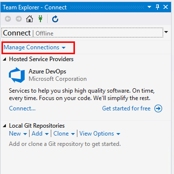

# Work in Team Explorer

You use **Team Explorer** to coordinate your code efforts with other team members to develop a project, and optionally to manage work that's assigned to you, your team, or your projects. Working from different platforms, developers and stakeholders can effectively collaborate using **Team Explorer** connected to projects hosted on Azure DevOps Services or an on-premises Team Foundation Server (TFS).

**Team Explorer** connects Visual Studio to projects, Git and GitHub repositories, and Team Foundation version control (TFVC) repositories. You can manage source code, work items, and builds.

## Prerequisites

- You must have a project defined in Azure DevOps Services or Team Foundation Server. If you need to add a project, see [Create a project](/azure/devops/organizations/projects/create-project).
- You must be a member of the project you connect to. To get added, see [Add users to a project or team](/azure/devops/organizations/security/add-users-team-project).

## Connect to a project or repository

From the **Connect** page in **Team Explorer**, you can select the projects you want to connect to and quickly switch connection to a different project or repository. For details, see [Connect to a project](/azure/devops/organizations/projects/connect-to-projects).

> [!TIP]
> If you open Visual Studio and **Team Explorer** doesn't appear, open it by choosing **View** > **Team Explorer** from the menu bar.

The Git and TFVC repos support different pages and functions. For a comparison of the two version control systems, see [Choose the right version control for your project](/azure/devops/repos/tfvc/comparison-git-tfvc).

| Home page with Git | Home page with TFVC |
|-------------|----------|
| | |

## Home

- [Web Portal](/azure/devops/project/navigation/index)
- [Task Board](/azure/devops/boards/sprints/task-board)

## Git

- [Create, add, or clone repositories](/azure/devops/repos/git/creatingrepo)
- [Clone an existing repo](/azure/devops/repos/git/clone)
- **Changes**: [Save work with commits](/azure/devops/repos/git/commits)
- **Branches**: [Create work in branches](/azure/devops/repos/git/branches)
- **Pull Requests**: [Review code with pull requests](/azure/devops/repos/git/pullrequest)
- **Sync**: [Update code with fetch and pull](/azure/devops/repos/git/pulling)
- **Tags**: [Work with Git tags](/azure/devops/repos/git/git-tags)

## TFVC

- [Configure workspace](/azure/devops/repos/tfvc/share-your-code-in-tfvc-vs#configure-your-workspace)
- **My Work**: [Suspend/resume work](/azure/devops/repos/tfvc/suspend-your-work-manage-your-shelvesets)  &#124; [Code review](/azure/devops/repos/tfvc/day-life-alm-developer-suspend-work-fix-bug-conduct-code-review)
- **Pending Changes**: [Manage pending changes](/azure/devops/repos/tfvc/develop-code-manage-pending-changes) &#124; [Find shelvesets](/azure/devops/repos/tfvc/suspend-your-work-manage-your-shelvesets) &#124; [Resolve conflicts](/azure/devops/repos/tfvc/resolve-team-foundation-version-control-conflicts)
- **Source Control Explorer**: [Add/view files and folders](/azure/devops/repos/tfvc/add-files-server)

## Work Items

- [About work items](/azure/devops/boards/work-items/about-work-items)

### Default experience

- [View and add work items](/azure/devops/boards/work-items/view-add-work-items)
- [Set the Work Items experience in Visual Studio](/azure/devops/boards/work-items/set-work-item-experience-vs)

### Legacy experience

- [Add work items](/azure/devops/boards/backlogs/add-work-items)
- [Use the query editor to list and manage queries](/azure/devops/boards/queries/using-queries)
- [Organize query folders and set query permissions](/azure/devops/boards/queries/set-query-permissions)
- [Open query in Excel](/azure/devops/boards/backlogs/office/bulk-add-modify-work-items-excel)
- [Open query in Project](/azure/devops/boards/backlogs/office/create-your-backlog-tasks-using-project)
- [Email query results list using Outlook](/azure/devops/boards/queries/share-plans)
- [Create reports from query in Excel](/azure/devops/report/excel/create-status-and-trend-excel-reports) (TFS only)

## Builds

- [Create build pipelines](/azure/devops/pipelines/tasks/index)
- [View and manage builds](/azure/devops/pipelines/overview)
- [Manage the build queue](/azure/devops/pipelines/agents/pools-queues)
- [Install continuous delivery (CD) tools for Visual Studio](/azure/devops/pipelines/apps/cd/azure/aspnet-core-to-acr#install-continuous-delivery-cd-tools-for-visual-studio-2017)
- [Configure and execute continuous delivery (CD) for your app](/azure/devops/pipelines/apps/cd/azure/aspnet-core-to-acr#configure-and-execute-continuous-delivery-cd-for-your-app)

## Settings

From the **Settings** page, you can configure administrative features for either a project or project collection. To learn more about each page, see the following articles. Most of the links open to a web portal administration page.

| Project | Project Collection | Other |
| - | - | - |
| [Security, Group Membership](/azure/devops/organizations/security/set-project-collection-level-permissions) [Security, Source Control (TFVC)](/azure/devops/organizations/security/set-git-tfvc-repository-permissions) [Work Item Areas](/azure/devops/organizations/settings/set-area-paths) [Work Item Iterations](/azure/devops/organizations/settings/set-iteration-paths-sprints.) [Portal Settings](/azure/devops/report/sharepoint-dashboards/configure-or-add-a-project-portal) [Project Alerts](/azure/devops/notifications/howto-manage-team-notifications) | [Security, Group Membership](/azure/devops/organizations/security/set-project-collection-level-permissions) [Source Control (TFVC)](/azure/devops/repos/tfvc/decide-between-using-local-server-workspace) [Process Template Manager](/azure/devops/boards/work-items/guidance/manage-process-templates) | [Git Global Settings](/azure/devops/repos/git/git-config) [Git Repository Settings](/azure/devops/repos/git/git-config) |