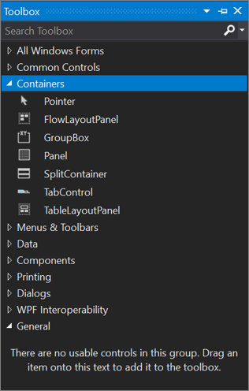

# Toolbox

The **Toolbox** window displays controls that you can add to Visual Studio projects. To open **Toolbox**, choose **View** > **Toolbox** from the menu bar, or press **Ctrl**+**Alt**+**X**.

You can drag and drop different controls onto the surface of the designer you are using, and resize and position the controls.

Toolbox appears in conjunction with designer views, such as the designer view of a XAML file or a Windows Forms App project. **Toolbox** displays only those controls that can be used in the current designer. You can search within **Toolbox** to further filter the items that appear.

> [!NOTE]
> For some project types, **Toolbox** may not show any items.

The .NET version that your project targets also affects the set of controls visible in Toolbox. You can change the target framework version from the project's property pages, if necessary. Select the project node in **Solution Explorer**, and then on the menu bar, choose **Project** > **projectname Properties**. On the **Application** tab, use the **Target framework** drop-down.

## Manage the Toolbox window and its controls

By default, **Toolbox** is collapsed along the left side of the Visual Studio IDE and appears when the cursor is moved over it. You can pin **Toolbox** (by clicking the **Pin** icon on its toolbar) so that it remains open when you move the cursor. You can also undock the **Toolbox** window and drag it anywhere on your screen. You can dock, undock, and hide **Toolbox** by right-clicking its toolbar and selecting one of the options.

> [!TIP]
> If the Toolbox no longer appears as collapsed along the left side of the Visual Studio IDE, you can add it back by choosing **Window** > **Reset Window Layout** from the menu bar.

You can rearrange the items in a **Toolbox** tab or add custom tabs and items by using the following commands on the right-click context menu:

- **Rename Item** - Renames the selected item.

- **List View** - Shows the controls in a vertical list. If unchecked, the controls appear horizontally.

- **Show All** - Shows all possible controls (not just the ones that apply to the current designer).

- **Choose Items** - Opens the **Choose Toolbox Items** dialog box so that you can specify the items that appear in the **Toolbox**. You can show or hide an item by selecting or clearing its check box.

- **Sort Items Alphabetically** - Sorts the items by name.

- **Reset Toolbar** - Restores the default **Toolbox** settings and items.

- **Add Tab** - Adds a new **Toolbox** tab.

- **Move Up** - Moves the selected item up.

- **Move Down** - Moves the selected item down.

## Create and distribute custom Toolbox controls

You can create custom **Toolbox** controls, starting either with a project template that's based on [Windows Presentation Foundation](../../extensibility/creating-a-wpf-toolbox-control.md) or on [Windows Forms](../../extensibility/creating-a-windows-forms-toolbox-control.md). You can then distribute your custom control to your teammates, or publish it on the web by using the [Toolbox Controls Installer](https://download.microsoft.com/download/8/3/6/836657BD-9CCB-4ED4-B9D2-FB769473B284/TCI_whitepaper.docx).

## Next steps

Peruse the following links to learn more about some of the available **Toolbox** tabs:

- [Toolbox, Data Tab](../../ide/reference/toolbox-data-tab.md)
- [Toolbox, Components Tab](../../ide/reference/toolbox-components-tab.md)
- [Toolbox, HTML Tab](../../ide/reference/toolbox-html-tab.md)

## See also

- [Choose Toolbox items, WPF components](choose-toolbox-items-wpf-components.md)
