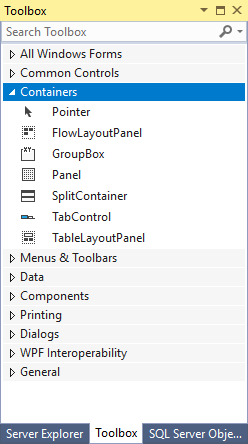

# Toolbox

The **Toolbox** displays icons for controls and other items that you can add to Visual Studio projects. To open the Toolbox, choose **Toolbox** on the **View** menu. You can dock the **Toolbox**, and you can pin it open or set it to **Auto Hide**.

Toolbox items can be dragged to a design view or pasted into a code editor. Either action adds the fundamental code to create an instance of the **Toolbox** item in the active project file.

The Toolbox only displays items that are applicable to the type of file you are working in. For some project types, the Toolbox may not show any items. You can search within the Toolbox to further filter the items that appear.

## Help on Toolbox tabs

The following topics provide more information about some of the available **Toolbox** tabs.

- [Toolbox, Data Tab](../../ide/reference/toolbox-data-tab.md)

- [Toolbox, Components Tab](../../ide/reference/toolbox-components-tab.md)

- [Toolbox, HTML Tab](../../ide/reference/toolbox-html-tab.md)

## See also

[Using the Toolbox](../../ide/using-the-toolbox.md)