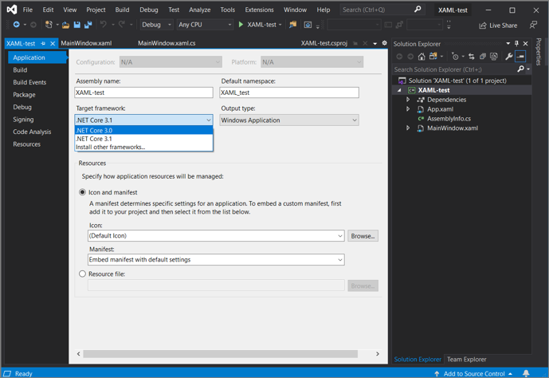

# Toolbox

The **Toolbox** window displays controls that you can add to Visual Studio projects. To open **Toolbox**, choose **View** > **Toolbox** from the menu bar, or press **Ctrl**+**Alt**+**X**.


You can drag and drop different controls onto the surface of the designer you are using, and resize and position the controls.

Toolbox appears in conjunction with designer views, such as the designer view of a XAML file or a Windows Forms App project. **Toolbox** displays only those controls that can be used in the current designer. You can search within **Toolbox** to further filter the items that appear.

> [!NOTE]
> For some project types, **Toolbox** may not show any items.

The .NET version that your project targets also affects the set of controls visible in Toolbox. You can change the target framework version from the project's property pages, if necessary. Select the project node in **Solution Explorer**, and then on the menu bar, choose **Project** > **projectname Properties**. On the **Application** tab, use the **Target framework** drop-down.



## Manage the Toolbox window and its controls

By default, **Toolbox** is collapsed along the left side of the Visual Studio IDE and appears when the cursor is moved over it. You can pin **Toolbox** (by clicking the **Pin** icon on its toolbar) so that it remains open when you move the cursor. You can also undock the **Toolbox** window and drag it anywhere on your screen. You can dock, undock, and hide **Toolbox** by right-clicking its toolbar and selecting one of the options.

> [!TIP]
> If the Toolbox no longer appears as collapsed along the left side of the Visual Studio IDE, you can add it back by choosing **Window** > **Reset Window Layout** from the menu bar.

You can rearrange the items in a **Toolbox** tab or add custom tabs and items by using the following commands on the right-click context menu:

- **Rename Item** - Renames the selected item.

- **List View** - Shows the controls in a vertical list. If unchecked, the controls appear horizontally.

- **Show All** - Shows all possible controls (not just the ones that apply to the current designer).

- **Choose Items** - Opens the **Choose Toolbox Items** dialog box so that you can specify the items that appear in the **Toolbox**. You can show or hide an item by selecting or clearing its check box.

- **Sort Items Alphabetically** - Sorts the items by name.

- **Reset Toolbar** - Restores the default **Toolbox** settings and items.

- **Add Tab** - Adds a new **Toolbox** tab.

- **Move Up** - Moves the selected item up.

- **Move Down** - Moves the selected item down.

## Create and distribute custom Toolbox controls

You can create custom **Toolbox** controls, starting either with a project template that's based on [Windows Presentation Foundation](../../extensibility/creating-a-wpf-toolbox-control.md) or on [Windows Forms](../../extensibility/creating-a-windows-forms-toolbox-control.md). You can then distribute your custom control to your teammates, or publish it on the web by using the [Toolbox Controls Installer](https://download.microsoft.com/download/8/3/6/836657BD-9CCB-4ED4-B9D2-FB769473B284/TCI_whitepaper.docx).

## Toolbox, Components tab

Displays components you can add to Visual Basic and C# designers for Windows Forms. In addition to the .NET components that are included with Visual Studio, such as the <xref:System.Messaging.MessageQueue> and <xref:System.Diagnostics.EventLog> components, you can add your own or third-party components to this tab.

To display this tab, open a Windows Forms designer. Select **View** > **Toolbox**. In **Toolbox**, select the **Components** tab.

### Components

**BackgroundWorker**

Creates a <xref:System.ComponentModel.BackgroundWorker> component instance that can run an operation on a separate, dedicated thread. For more information, see [BackgroundWorker component](/dotnet/framework/winforms/controls/backgroundworker-component).

**DirectoryEntry**

Creates a <xref:System.DirectoryServices.DirectoryEntry> component instance that encapsulates a node or object in the Active Directory hierarchy and can be used to interact with Active Directory service providers.

**DirectorySearcher**

Creates a <xref:System.DirectoryServices.DirectorySearcher> component instance that you can use to perform queries against the Active Directory.

**ErrorProvider**

Creates a <xref:System.Windows.Forms.ErrorProvider> component instance, which indicates to the end user that a control on a form has an error associated with it. For more information, see [ErrorProvider component](/dotnet/framework/winforms/controls/errorprovider-component-windows-forms).

**EventLog**

Creates an <xref:System.Diagnostics.EventLog> component instance you can use to interact with system and custom event logs, including writing events to a log and reading log data.

**FileSystemWatcher**

Creates a <xref:System.IO.FileSystemWatcher> component instance that you can use to monitor for changes to any directory or file to which you have access.

**HelpProvider**

Creates a <xref:System.Windows.Forms.HelpProvider> component instance that provides pop-up or online help for controls. For more information, see [HelpProvider component](/dotnet/framework/winforms/controls/helpprovider-component-windows-forms).

**ImageList**

Creates a <xref:System.Windows.Forms.ImageList> component instance that provides methods to manage a collection of <xref:System.Drawing.Image> objects. For more information, see [ImageList component](/dotnet/framework/winforms/controls/imagelist-component-windows-forms).

**MessageQueue**

Creates a <xref:System.Messaging.MessageQueue> component instance that you can use to interact with message queues, including reading messages from and writing messages to queues, processing transactions, and performing queue administration tasks.

**PerformanceCounter**

Creates a <xref:System.Diagnostics.PerformanceCounter> component instance that you can use to interact with Windows performance counters, including creating new categories and instances, reading values from counters, and performing calculations on counter data.

**Process**

Creates a <xref:System.Diagnostics.Process> component instance you can use to stop, start, and manipulate the data associated with processes on your system.

**SerialPort**

Creates a <xref:System.IO.Ports.SerialPort> component instance that provides synchronous and event-driven I/O, access to pin and break states, and access to serial driver properties.

**ServiceController**

Creates a <xref:System.ServiceProcess.ServiceController> component instance you can use to manipulate existing services, including starting and stopping services and sending commands to them.

**Timer**

Creates a <xref:System.Windows.Forms.Timer> component instance you can use to add time-based functionality to your Windows-based applications. For more information, see [Timer component](/dotnet/framework/winforms/controls/timer-component-windows-forms).

> [!NOTE]
> There is also a system-based <xref:System.Timers.Timer> that you can add to the **Toolbox** This <xref:System.Timers.Timer> is optimized for server applications, and the Windows Forms <xref:System.Windows.Forms.Timer> is best suited for use on Windows Forms.

## Toolbox, HTML tab

The **HTML** tab of the Toolbox provides components that are useful on web pages and web forms. To view this tab, first open a document for editing in the HTML designer. On the **View** menu, click **Toolbox**, and then click the **HTML** tab of the Toolbox.

To create an instance of a tool on the **HTML** tab, either double-click the tool to add it to your document at the current insertion point, or select the tool and drag it to the desired position on the editing surface.

The following tools are available by default on the HTML tab.

**Pointer**


This tool is selected by default when any Toolbox tab opens. It cannot be deleted. The pointer enables you to drag objects onto the Design view surface, resize them, and reposition them on the page or form. For more information, see [Toolbox](../../ide/reference/toolbox.md).

**Input (Button)**


Inserts an `input` element of `type="button"`. To change the text that is displayed, edit the `name` property. By default, `id="Button1"` is inserted for the first button, `id="Button2"` for the second, and so on.

When you drag **Input (Button)** onto the Design view surface, HTML markup like the following is inserted into your document:

```html
<input id="Button1" type="button" value="Button" name="Button1">
```

**Input (Reset)**


Inserts an `input` element of `type="reset"`. To change the text that is displayed, edit the `name` property. By default, `id="Reset1"` is inserted for the first reset button, `id="Reset2"` for the second, and so on.

When you drag **Input (Reset)** onto the Design view surface, HTML markup like the following is inserted into your document:

```html
<input id="Reset1" type="reset" value="Reset" name="Reset1">
```

**Input (Submit)**


Inserts an `input` element of `type="submit"`. To change the text that is displayed, edit the `name` property. By default, `id="Submit1"` is inserted for the first submit button, `id="Submit2"` for the second, and so on.

When you drag **Input (Submit)** onto the Design view surface, HTML markup like the following is inserted into your document:

```html
<input id="Submit1" type="submit" value="Submit" name="Submit1">
```

**Input (Text)**


Inserts an `input` element of `type="text"` in your document. To change the default text that is displayed, edit the `value` attribute. By default, `id="Text1"` is inserted for the first text field, `id="Text2"` for the second, and so on.

When you drag **Input (Text)** onto the Design view surface, HTML markup like the following is inserted into your document:

```html
<input id="Text1" TYPE="text" value="Text Field" name="Text1">
```

> [!IMPORTANT]
>It is recommended that you validate all user input. For more information, see [Validating User Input in ASP.NET Web Pages (Razor) Sites](/aspnet/web-pages/overview/ui-layouts-and-themes/validating-user-input-in-aspnet-web-pages-sites).

**Input (File)**


Inserts an `input` element of `type="file"` in your document. By default, `id="File1"` is inserted for the first file field, `id="File2"` for the second, and so on.

When you drag **Input (File)** onto the Design view surface, HTML markup like the following is inserted into your document:

```html
<input id="File1" type="file" name="File1">
```

> [!IMPORTANT]
> It is recommended that you validate all user input. For more information, see [Validating User Input in ASP.NET Web Pages (Razor) Sites](/aspnet/web-pages/overview/ui-layouts-and-themes/validating-user-input-in-aspnet-web-pages-sites).

**Input (Password)**


Inserts an `input` element of `type="password"`. By default, `id="Password1"` is inserted for the first password field, `id="Password2"` for the second, and so on.

When you drag **Input (Password)** onto the Design view surface, HTML markup like the following is inserted into your document:

```html
<input id="Password1" type="password" name="Password1">
```

> [!IMPORTANT]
> If your application transmits user names and passwords, you should configure your website to use Secure Sockets Layer (SSL) to encrypt the transmission. For more information, see [Securing Connections](/previous-versions/tn-archive/bb418917(v=technet.10)). Additionally, it is recommended that you validate all user input. For more information, see [Validating User Input in ASP.NET Web Pages (Razor) Sites](/aspnet/web-pages/overview/ui-layouts-and-themes/validating-user-input-in-aspnet-web-pages-sites).

**Input (Check box)**


Inserts an `input` element of `type="checkbox"`. To change the text that is displayed, edit the `name` property. By default, `id="Checkbox1"` is inserted for the first check box, `id="Checkbox2"` for the second, and so on.

When you drag **Input (Check box)** onto the Design view surface, HTML markup like the following is inserted into your document:

```html
<input id="Checkbox1" type="checkbox" name="Checkbox1">
```

**Input (Radio)**


Inserts an `input` element of `type="radio"`. To change the text that is displayed, edit the `name` property. By default, `id="Radio1"` is inserted for the first radio button, `id="Radio2"` for the second, and so on.

When you drag **Input (Radio)** onto the Design view surface, HTML markup like the following is inserted into your document:

```html
<input id="Radio1" type="radio" name="Radio1">
```

**Input (Hidden)**


Inserts an `input` element of `type="hidden"`. By default, `id="Hidden1"` is inserted for the first hidden field, `id="Hidden2"` for the second, and so on.

When you drag **Input (Hidden)** onto the Design view surface, HTML markup like the following is inserted into your document:

```html
<input id="Hidden1" type="hidden" name="Hidden1">
```

**Textarea**


Inserts a `textarea` element. You can resize the text area, or use its scroll bars to view text that extends beyond its display area. To change the default text that is displayed, edit the `value` attribute. By default, `id="textarea1"` is inserted the first text area, `id=" textarea 2"` for the second, and so on.

When you drag **Textarea** onto the Design view surface, HTML markup like the following is inserted into your document:

```html
<textarea id=" textarea 1 name=" textarea 1" rows=2 cols=20></textarea>
```

> [!IMPORTANT]
> It is recommended that you validate all user input. For more information, see [Validating User Input in ASP.NET Web Pages (Razor) Sites](/aspnet/web-pages/overview/ui-layouts-and-themes/validating-user-input-in-aspnet-web-pages-sites).

**Table**


Inserts a `table` element.

When you drag **Table** onto the Design view surface, HTML markup like the following is inserted into your document:

```html
<table cellspacing="1" width="75%" border=1> <tr><td></td></tr></table>
```

**Image**


Inserts an `img` element. Edit this element to specify its `src` and its `alt` text.

When you drag **Image** onto the Design view surface, HTML markup like the following is inserted into your document:

```html

```

**Select**


Inserts a dropdown `select` element (without a `size` attribute). By default, `id="select1"` is inserted for the first list box, `id="select2"` for the second, and so on.

When you drag **Select** onto the Design view surface, HTML markup like the following is inserted into your document:

```html
<select id="select1" name="select1"><option selected></option></select>
```

You can create a multi-line `select` element by increasing the value of the size property.

**Horizontal Rule**


Inserts an `hr` element. To increase the thickness of the line, edit the `size` attribute.

When you drag **Horizontal Rule** onto the Design view surface, HTML markup like the following is inserted into your document:

```html
<hr width="100%" size=1>
```

**Div**


Inserts a `div` element that includes an `ms_positioning="FlowLayout"` attribute. Except for the width and height, this item is identical to a Flow Layout Panel. To format the text that is contained within the `div` element, add a `class="stylename"` attribute to the opening tag.

When you drag **Div** onto the Design view surface, HTML markup like the following is inserted into your document:

```html
<div ms_positioning="FlowLayout" style="width: 70px; position: relative; height: 15px">Label</div>
```

## Toolbox, Data tab

Displays data objects you can add to a forms and components. The **Data** tab of the **Toolbox** appears when you create a project that has an associated designer. The **Toolbox** appears by default in the Visual Studio integrated development environment; if you need to display the **Toolbox**, select **Toolbox** from the **View** menu.

> [!TIP]
> Running the Data Source Configuration Wizard automatically creates and configures most data items. For more information, see [Add new data sources](../../data-tools/add-new-data-sources.md).

To go directly to the .NET reference page for a component, press **F1** on the item in the **Toolbox** or on the component item in the tray of the designer.

|Name|Description|
|----------|-----------------|
|<xref:System.Data.DataSet>|Adds an instance of a typed or untyped dataset to the form or component. When you drag this object onto a designer, it displays a dialog box that allows you to select an existing typed dataset class or specify that you want to create a new, blank, untyped dataset. **Note:**  You do not use the <xref:System.Data.DataSet> object on the **Toolbox** to create a new typed dataset schema and class. For more information, see [Create and configure datasets](../../data-tools/create-and-configure-datasets-in-visual-studio.md).|
|<xref:System.Windows.Forms.DataGridView>|Provides a powerful and flexible way to display data in a tabular format.|
|<xref:System.Windows.Forms.BindingSource>|Simplifies the process of binding controls to an underlying data source.|
|<xref:System.Windows.Forms.BindingNavigator>|Represents the navigation and manipulation user interface (UI) for controls on a form that are bound to data.|

## See also

- [Controls to use on Windows Forms](/dotnet/framework/winforms/controls/controls-to-use-on-windows-forms)
- [Choose Toolbox items, WPF components](choose-toolbox-items-wpf-components.md)
