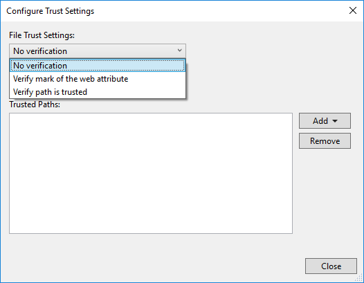

# Configure trust settings for files and folders

::: moniker range=">=vs-2022"

In Visual Studio 2022, we've revamped the **Trust Settings** functionality to show a warning whenever untrusted code is opened in the IDE.
With Visual Studio 2022 version 17.12 and later, Mark of the web (MotW) security warnings are now integrated into the overall trust functionality.

Software developers are increasingly being targeted by malware. The new **Trust Settings** functionality aims to raise awareness about the risks of handling unfamiliar code, and helps protect against malicious actors, who are targeting scenarios ranging from opening content (for example, repositories, solutions, projects, and files) to building and running applications with Visual Studio. 

By default, Visual Studio displays a security warning when the [**Mark of the Web** identifier](#when-opening-content-from-the-web-mark-of-the-web) is detected. However, this default behavior can be customized to [always show a security warning](#always-require-a-trust-decision), regardless of the content's original location.

## Customize trust settings

You can customize the trust policies to configure the security settings for opening content in Visual Studio.

### When opening content from the web (Mark of the Web)

Visual Studio 2022 version 17.12 and later now shows a security warning when you try to open content tagged with the Mark of the Web (MotW) identifier. This new trust-related alert informs you of the possible security risks associated with opening files from potentially unsafe sources, such as internet downloads.

:::image type="content" source="media/vs-2022/web-content-alert.png" alt-text="Screenshot showing the mark of the web alert.":::

You can modify the default trust experience from **Tools** > **Options** > **Environment** > **Security**.

:::image type="content" source="media/vs-2022/web-content-trust-settings.png" alt-text="Screenshot showing how to modify the Security options related to opening content from the web.":::

The Mark of the Web is a security feature used by Windows to identify files that originate from the internet. When you download a file, Windows adds this identifier to the file's metadata, signaling that the content may be unsafe to execute or open. Visual Studio 2022 uses this identifier to protect your development environment from potential threats.

### Always require a trust decision

When **Always require a trust decision** is enabled, Visual Studio detects if you're attempting to open content that isn't designated as *trusted* and shows a dialog that warns you about the security implications.
To enable the **Always require a trust decision** feature, follow these steps:

1. Open **Tools** > **Options** > **Environment** > **Security**.

2. In the **Trust Policies** pane, select **Always require a trust decision** from the **Require a trust decision** dropdown.

:::image type="content" source="media/vs-2022/trusted-settings-options-dialog.png" alt-text="Screenshot showing how to enable trusted locations by using the Trust Settings options.":::

> [!NOTE]
> The **Skip trust checks for temporary locations Visual Studio creates automatically** option is not enabled by default. It has no impact unless the **Always require a trust decision** option is also enabled.

:::image type="content" source="media/vs-2022/trusted-settings-warning-dialog.png" alt-text="Screenshot of the Trust Settings warning dialog.":::

## Manage trust settings

Here's how to add trusted locations, and to remove them.

### Add trusted locations

After you've enabled the feature, all content that you open with Visual Studio 2022 is considered untrusted until you add it to the list of **Trusted locations**.  You can trust a folder location directly from the *warning* dialog. Here's how:

1. Choose the folder you want to trust (the current folder or the parent folder) from the **Trust level** dropdown list.

   :::image type="content" source="media/vs-2022/trust-folder-trust-level.png" alt-text="Screenshot showing how to trust a folder from the warning dialog.":::

1. Select the **Trust and continue** button on the dialog.

   Visual Studio adds the folder path to the **Trusted locations** list at **Tools** > **Options** > **Security**.

You can also add folders to **Trusted locations** from the **Trust Settings** dialog. Here's how:

1. Open  **Tools** > **Options** > **Security**. You can also open it by selecting **Manage trust settings** from the *warning* dialog.

2. Select **Add a Folder** in the right-hand **Trust Policies** pane.

3. Navigate to and select the folder you want to add to the trusted list.

   The folder path appears in the **Trusted locations** list. This folder that you added manually is listed as **Trusted By** the **Local User**.
   
   :::image type="content" source="media/vs-2022/trusted-locations.png" alt-text="Screenshot showing a folder added to the **Trusted locations**.":::

> [!NOTE]
> After you've enabled the **Trusted locations** feature, the folder path for any content you create in Visual Studio will automatically get added to the **Trusted locations** list. This folder path is listed as **Trusted By** the **System**.
> 
> :::image type="content" source="media/vs-2022/trusted-by-values.png" alt-text="Screenshot showing the **Trusted By** values of *Local User* and *System* in the **Trusted locations** list.":::

### Remove trusted locations

To remove trusted locations, follow these steps:

1. Open **Tools** > **Options** > **Trust Settings**.

2. Select the path you'd like to remove in the **Trusted locations** list, and then click **Remove**.

   > [!TIP]
   > To select multiple entries, hold down **Shift** while you select the paths.

   The selected paths are removed from the **Trusted locations** list.

::: moniker-end

::: moniker range="<=vs-2019"

Visual Studio prompts for user approval before opening projects that have the [Mark of the Web](/previous-versions/windows/internet-explorer/ie-developer/compatibility/ms537628(v=vs.85)). For added security, you can also configure Visual Studio to prompt for user approval before opening any file or folder that has the mark of the web attribute, or that isn't designated as *trusted*. File and folder checks are disabled by default.

> [!WARNING]
> You should still ensure that the file, folder, or solution comes from a trusted person or a trusted location before approving it.

> [!NOTE]
> In Visual Studio 2022, we've revamped the Trust Settings functionality to show a warning whenever untrusted code in files, folders, projects, and solutions are about to be opened in the IDE. This feature is disabled by default. To learn more, see the [Visual Studio 2022 version of this page](?view=vs-2022&preserve-view=true).

## Configure trust settings

To change trust settings, follow these steps:

1. Open **Tools** > **Options** > **Trust Settings** and select the **Configure Trust Settings** link in the right-hand pane.

2. Choose the level of checks you'd like for files and folders. You can have different checks for each one. The options are:

   * **No verification**: Visual Studio doesn't perform any checks.

   * **Verify mark of the web attribute**: If the file or folder has the mark of the web attribute, Visual Studio blocks and asks for permission to open.

   * **Verify path is trusted**: If the file or folder path isn't part of the **Trusted Paths** list, Visual Studio blocks and asks for permission to open.

   

## Add trusted paths

To add trusted paths, follow these steps:

1. Open **Tools** > **Options** > **Trust Settings** and select the **Configure Trust Settings** link in the right-hand pane.

2. Click **Add** in the **Trust Settings** dialog, and then select **File** or **Folder**.

3. Navigate to and select the file or folder you want to add to the trusted list.

   The file or folder path appears in the **Trusted Paths** list.

   

## Remove trusted paths

To remove trusted paths, follow these steps:

1. Open **Tools** > **Options** > **Trust Settings** and select the **Configure Trust Settings** link in the right-hand pane.

2. Select the path you'd like to remove in the **Trusted Paths** list, and then click **Remove**.

   > [!TIP]
   > To select multiple entries, hold down **Shift** while you select the paths.

   The selected paths are removed from the **Trusted Paths** list.

::: moniker-end

## See also

[Build an application in Visual Studio](../walkthrough-building-an-application.md)
