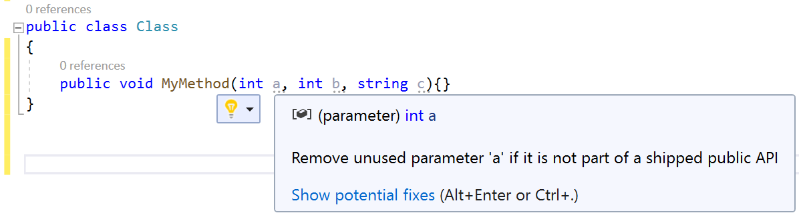
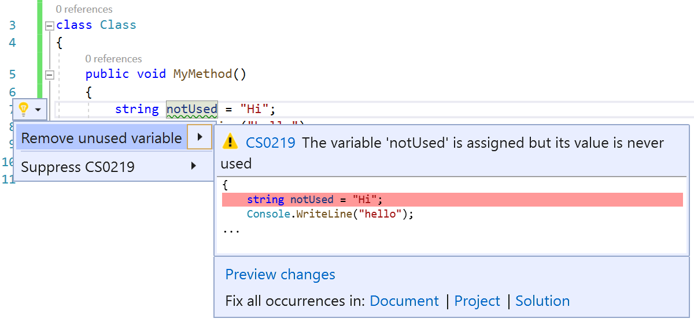
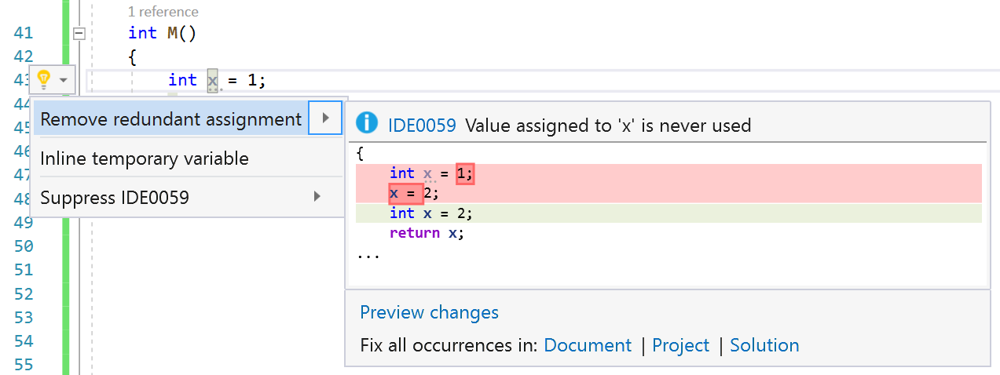
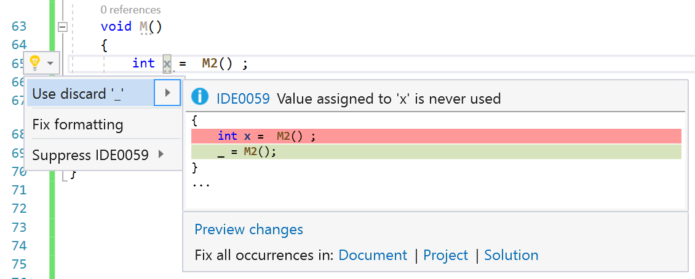

# Unused value assignments, variables, and parameters

This refactoring applies to:

- C#
- Visual Basic

**What:** Fades out unused parameters and generates a warning for unused expression values. The compiler also performs a flow analysis to find any unused value assignments. Unused value assignments fade out and a light bulb appears with a [Quick Action](../quick-actions.md) to remove the redundant assignment. Unused variables with unknown values show a [Quick Action](../quick-actions.md) suggestion to use [discards](/dotnet/csharp/discards) instead. (Discards are temporary, dummy variables that are intentionally unused in application code. They can reduce memory allocation and make your code easier to read.)

**When:** You have value assignments, parameters, or expression values that are never used.

**Why:** Sometimes it's difficult to tell if a value assignment, variable, or parameter is no longer being used. By fading out these values or generating a warning, you get a visual cue of what code you can delete.

## Unused expression values and parameters diagnostic

1. Have any value assignment, variable, or parameter that isn't used.
2. The unused value assignment or parameter appears faded out. The unused expression value generates a warning.

  
  
  
  

## See also

- [Overview of Code Refactoring in Visual Studio](../refactoring-in-visual-studio.md)
- [Productivity features](../productivity-features.md)
