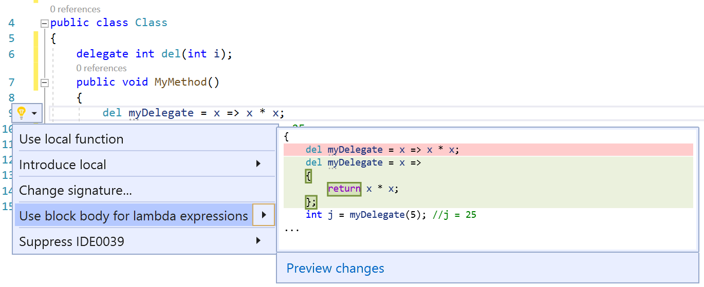

# Use expression body or block body for lambda expressions

This refactoring applies to:

- C#

**What:** Lets you refactor a lambda expression to use an expression body or a block body.

**When:** You prefer lambda expressions to use either an expression body or a block body.

**Why:** Lambda expressions can be refactored to improve readability according to your user preference.

## Lambda expression body or block body refactoring

1. Place your cursor on the right of a lambda operator.
2. Press **Ctrl**+**.** to trigger the **Quick Actions and Refactorings** menu.

  

3. Select **Use block body for lambda expressions** or **Use expression body for lambda expressions**.

## See also

- [Refactoring](../refactoring-in-visual-studio.md)
- [Productivity features](../productivity-features.md)
