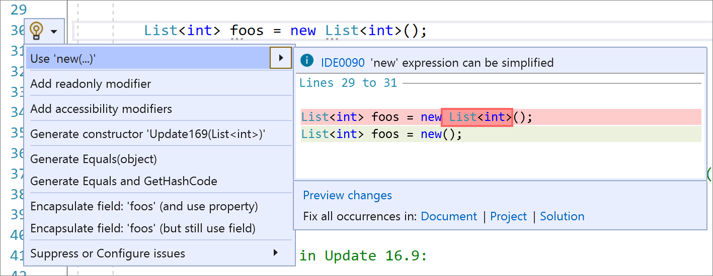

# Use `new()`

This applies to:

- C#

**What:** Use `new()`.

**When:** You have a field that can't use `var` or a code style preference to not use `var`.

**Why:** So you don't have to write repetitive code by repeating the type twice.

## How-to

1. Place your caret on the field declaration.

2. Press **Ctrl**+**.** to trigger the **Quick Actions and Refactorings** menu.

3. Select **Use 'new(…)'**:

    

## See also

- [Refactoring](../refactoring-in-visual-studio.md)
