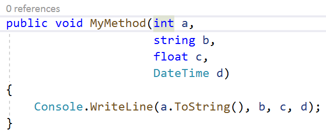

# Wrap, indent, and align parameters

This refactoring applies to:

- C#

- Visual Basic

**What:** Lets you wrap, indent, and align parameters.

**When:** You have a method declaration or call that has multiple parameters.

**Why:** Reading a long list of parameters is easier when they're wrapped or indented according to user preference.

## How-to

1. Place your cursor in a parameter list.
2. Press **Ctrl**+**.** to trigger the **Quick Actions and Refactorings** menu.

   

3. Press **Enter** to accept the refactoring.

   

## See also

- [Refactoring](../refactoring-in-visual-studio.md)
