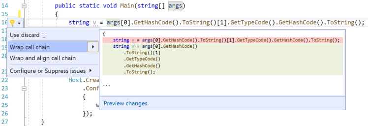
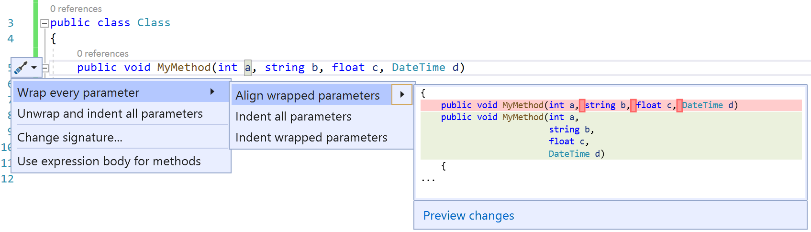
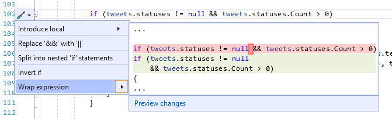

# Wrap, indent, and align refactorings

## Wrap and align call chains

This refactoring applies to:

- C#

- Visual Basic

**What:** Lets you wrap and align chains of method calls.

**When:** You have a long chain consisting of several method calls in one statement.

**Why:** Reading a long list is easier when they're wrapped or indented according to user preference.

### How-to

1. Place your cursor in any of the call chains.
2. Press **Ctrl**+**.** to trigger the **Quick Actions and Refactorings** menu.
3. Select **Wrap call chain** or **Wrap and align call chain** to accept the refactoring.

   

## Wrap, indent, and align parameters or arguments

This refactoring applies to:

- C#

- Visual Basic

**What:** Lets you wrap, indent, and align parameters or arguments.

**When:** You have a method declaration or call that has multiple parameters or arguments.

**Why:** Reading a long list of parameters or arguments is easier when they're wrapped or indented according to user preference.

### How-to

1. Place your cursor in a parameter list.
2. Press **Ctrl**+**.** to trigger the **Quick Actions and Refactorings** menu.

   

3. Select **Wrap every parameter** to accept the refactoring.

## Wrap binary expressions

This refactoring applies to:

- C#

- Visual Basic

**What:** Lets you wrap binary expressions.

**When:** You have a binary expression.

**Why:** Reading a binary expression is easier when it is wrapped to user preference.

### How-to

1. Place your cursor in the binary expression.
2. Press **Ctrl**+**.** to trigger the **Quick Actions and Refactorings** menu.
3. Select **Wrap expression** to accept the refactoring.

   

## See also

- [Refactoring](../refactoring-in-visual-studio.md)
