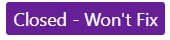

# Report a problem: States and FAQ

The Report a Problem tool enables the Visual Studio developer community to submit issues. Each one of your problem reports becomes a work item in our core engineering system, empowering you to engage directly with our product teams to help us identify and resolve impactful issues. Your feedback submitted with rich diagnostic information is critical to improving the Visual Studio product family. We really appreciate you taking the time to report problems.

In addition, you can vote on feedback from other community members to bring more attention to a problem and help fix it faster.

## Problem status

After you report a problem, states indicate where your submissions are in their lifecycle. As Microsoft teams review your feedback, they set it with an appropriate state.  Track the progress of your problem reports by referencing the states listed below, along with their meaning and color indicators.

**New** indicates that the bug or issue is newly reported, and no action has been taken on it yet.

- - -

**Triaged** indicates that preliminary steps such as moderation, translation, and  initial check for duplicates are  complete. Your ticket has been routed to the appropriate engineering team for consideration.

- - -

**Under Consideration** indicates that Microsoft is reviewing your problem for community impact and will prioritize it accordingly. If the community impact isn't clear or significant yet, we'll continue to monitor the problem in this state.

- - -

**Under Investigation** indicates that engineers are actively investigating your problem to find a resolution.

- - -

**Need More Info** indicates that we need more diagnostic information from you so that we can go forward with the investigation.  [Learn how to respond to Need More Info requests.](./how-to-report-a-problem-with-visual-studio.md#when-further-information-is-needed-need-more-info)

- - -

**Fixed - Pending Release** indicates that we have a fix for the problem and it will be available in an upcoming preview or release.  When the fix becomes available in a preview, the problem is tagged with a 'fixed in' tag specifying the preview version.

- - -

**Closed - Fixed** indicates that we've released a fix for the problem. The problem is also now tagged with a "fixed in:" tag specifying the release version.

- - -

**Closed - Duplicate** indicates that your issue has already been reported via another feedback. We'll provide you with the link where you can track the original problem report.

- - -

**Closed - Lower Priority** To focus on bringing each of you in our developer community the best value, we prioritize issues with the highest customer impact. Although we're unable to address this particular issue at this time, be assured that all your feedback is valuable and helps improve Visual Studio.

- - -

**Closed - Not a Bug**  indicates that we've determined that the reported functionality is by current design.

- - -

**Closed - Not Enough Info** indicates that we don't have enough information to investigate this for you. We'll be happy to reconsider the feedback after the necessary information is available.

- - -

**Closed - Other Product** indicates we've determined that your issue applies to another product. See the comment from Microsoft for which external product and any related links.

- - -

**Closed - Won't Fix** indicates that we aren't pursuing this issue due to factors such as lack of product direction alignment or community impact. See the comment from Microsoft for any additional clarity.  Although we're unable to address this particular issue, be assured that all your feedback is valuable and helps improve Visual Studio.

- - -

## FAQ

### How can I increase the chance of my problem getting resolved quickly?

We recommend using search to ensure that the problem you're about to report hasn't already been reported. If you find an existing item matching your problem, follow and vote on that problem ticket.

Provide all the information you can to help our teams reproduce what you're experiencing.  This information includes  necessary repro steps, code fragments, screenshots, repro recordings, log files, and other artifacts.  Here is [how to report a problem in Visual Studio](./how-to-report-a-problem-with-visual-studio.md).

### How is my feedback prioritized?

We receive a large number of valuable problems from our customers. To ensure that we're bringing the best value to each of you in our developer community, we prioritize action on feedback that has the highest community impact.

If we aren't able to respond personally to your feedback, know that we fully appreciate your input. Be assured that all your feedback gets to the right team.

We truly value the time you invest in making Visual Studio better.

### What actions can I take if I'm not satisfied with the resolution?

Our teams do their best to diagnose and fix any issues you experience, however there may be times when you're not fully satisfied with our recommendation. Comment back on the feedback and let us know exactly what you're not satisfied with, and we'll try our best to ensure that we meet your needs.

### How will I get notified of progress on my feedback?

Microsoft engineering teams will communicate with you by commenting on the feedback ticket and changing the state of your ticket as they make progress. Watch for e-mail notifications that are sent when  ticket state changes or a comment is posted.  You can manage frequency of notifications in Profile and Preferences settings on Developer Community site.

### Why can't I add a problem for Visual Studio IDE on the Developer Community website?

Reporting a problem through Visual Studio allows for diagnostic information to automatically be included in the report. It's essential information that gives our engineers the context they need to fully understand your issue and work to resolve it.

When you report through Visual Studio, you can easily share rich diagnostic information with us, such as large log files, crash information, screenshots, repro recording, and other artifacts that help us deliver higher-quality resolutions faster to you.
