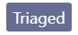
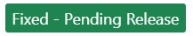
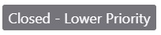

# Report a problem 

Report a problem enables the Visual Studio developer community to submit issues and bugs.  Each one of your problem reports becomes a work item in our core engineering system, empowering you to engage directly with our product teams to help us identify impactful issues.  Your valuable feedback is critical to improving the Visual Studio product family and we really appreciate you taking the time to report a problem so we can diagnose and fix it.

In addition to reporting a problem, when you vote on feedback from other community members, you help us understand the impact it has for the larger developer community.

## Problem status

After you report a problem, states indicate where your submissions are in their lifecycle. As Microsoft teams review your feedback, they tag it with an appropriate state.  Track the progress of your problem reports by referencing the states listed below, along with their meaning and color indicators.

**New** indicates that the bug or issue is newly reported, no action has been taken on it yet.

- - -

**Triaged** indicates that preliminary checks such as duplicates are complete. Your ticket has been routed to the appropriate engineering team for consideration.

- - -

**Under Consideration** indicates that Microsoft is reviewing your problem for community impact and will prioritize it accordingly. If the community impact is not clear or significant yet, we will continue to monitor the problem in this state.

- - -

**Under Investigation** indicates that engineers are actively investigating your problem to find a fix.

- - -

**Need More Info** indicates that we need more diagnostic information from you so that we can proceed further with the investigation.

- - -

**Fixed - Pending Release** indicates that we have fixed your problem for an upcoming preview or release.

- - -

 

**Closed - Fixed** indicates that we have fixed your issue. Look for the "fixed in:" tag to check out the preview or release where your fix is available.

- - -

**Closed - Duplicate** indicates that your issue has already been reported via another feedback. We will provide you with the link where you can track the original problem report.

- - -

**Closed - Lower Priority** To focus on bringing each of you in our developer community the best value, we prioritize issues with the highest customer impact. Although we are unable to address this particular issue at this time, please be assured that all your feedback is valuable and helps improve Visual Studio.

- - -

**Closed - Not a Bug**  indicates that we have determined that the reported bug doesn’t exist in the latest release  

- - -

**Closed - Not Enough Info** indicates that we don't have enough information to investigate this for you. We will be happy to reconsider the feedback once the necessary information is available.

- - -

**Closed - Other Product** indicates  we have determined that your issue applies to  another product. Check the tags to see which product the issue applies to and track the other product bug via the link in the comments.

- - -

**Closed - Won't Fix** To ensure we bring each of you in our developer community the best value, we prioritize issues having the highest community impact. Although we are unable to address this particular issue, please be assured that all your feedback is valuable and helps improve Visual Studio.

- - -

## FAQ

### How can I increase the chance of my problem getting resolved quickly?

We recommend using search to ensure that the problem you're about to report hasn't already been reported. If you find an existing item matching your problem, please follow and vote on that problem ticket.

Where possible, provide all the information you can to help our teams reproduce what you're experiencing.

### How is my feedback prioritized?

We receive a very large number of valuable suggestions from our customers. To ensure that we're bringing the best value to each of you in our developer community, we prioritize action on feedback that has the highest community impact. 

If we're not able to respond personally to your feedback, know that we fully appreciate your input. Please be assured that all your feedback gets to the right person and team. 

We truly value the time you invest in making Visual Studio better.

### What actions can I take if I'm not satisfied with the resolution?

Our teams do their best to diagnose and fix any issues you experience, however there may be times when you're not fully satisfied with our recommendation. Please comment back on the feedback and let us know exactly what you're not satisfied with, and we will try our best to ensure we meet your needs.

### How will I get notified of progress on my feedback?

Microsoft engineering teams will communicate with you by commenting on the feedback ticket and changing the state of your ticket as they make progress. Watch for e-mail notifications that are sent every time the ticket state changes or a comment is posted.

### Why can't I add a problem for Visual Studio IDE on the Developer Community website?

Reporting a problem through Visual Studio allows for diagnostic information to automatically be included in the report. This is essential to give our engineers the context they need to fully understand your issue and work to resolve it. 

When you initiate your problem report through Visual Studio, you're enabled to give our engineers an idea of your environment, send them a reproduction of the issue, and you can easily see if your problem has already been reported.