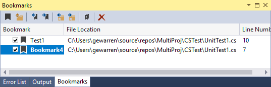

# Set bookmarks in code

You can use bookmarks to mark lines in your code so that you can quickly return to a specific location, or jump back and forth between locations. Bookmark commands and icons are available in two places: the **Bookmark Window** (**View** > **Bookmark Window**) and the text editor toolbar.

## Manage bookmarks

To add a bookmark, place the cursor on the line you want to bookmark. Choose the **Toggle a bookmark** button, or press **Ctrl**+**K**, **Ctrl**+**K**. This adds the bookmark. If you choose the **Toggle a bookmark** button (or press **Ctrl**+**K**, **Ctrl**+**K**) again, the bookmark is removed.

To know at a glance what a specific bookmark is for, you can rename it in the **Bookmark Window** from the right-click or context menu. You can delete bookmarks by choosing the **Delete** button in the bookmark window.

> [!IMPORTANT]
> The bookmark is set to the line number, not to the code. If you modify the code, the bookmark is retained at the line number, and does not move with the code.

You can navigate between bookmarks by using the **Next bookmark** and **Previous bookmark** buttons in the bookmark window.

You can organize bookmarks into virtual folders by choosing **New Folder** in the bookmark window and then dragging selected bookmarks into the new folder.

You can turn off bookmarks (without removing them) by choosing the **Disable All Bookmarks** button in the bookmark window. You can re-enable them by choosing the same button (which is now called **Enable All Bookmarks**).

## See also

- [Features of the code editor](../ide/writing-code-in-the-code-and-text-editor.md)