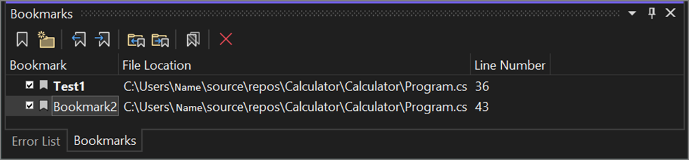
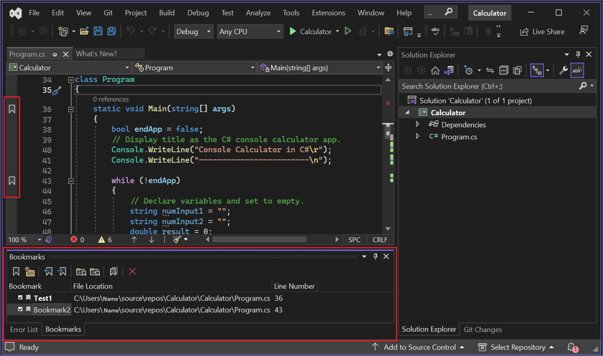

# Bookmark code in Visual Studio

 [!INCLUDE [Visual Studio](~/includes/applies-to-version/vs-windows-only.md)]

You can use bookmarks to mark lines in your code so that you can quickly return to a specific location, or jump back and forth between locations. Bookmarks can help you keep track of important parts of your code and remind you of what you might want to work on next, which can improve your productivity.

Bookmark commands and icons are available in two places: 

- The **Bookmarks** window; to open it, select **View** > **Bookmark Window** from the menu bar, or use the **Ctrl**+**K**, **Ctrl**+**W** keyboard shortcut. 

  

- The **Bookmarks** toolbar

  

  The following table includes available toolbar commands and their [keyboard shortcuts](default-keyboard-shortcuts-in-visual-studio.md), listed from left to right.

    | Icon                              | Action   | Keyboard shortcut |
    |-----------------------------------|----------|-------------------|
    | **Toggle a bookmark**             |  Create a new bookmark on the current line, or toggle between existing bookmarks line by line | **Ctrl**+**K**, **Ctrl**+**K** |
    | **New Folder**                    |  Create a new folder                       | **Ctrl**+**K**, **Ctrl**+**F** | 
    | **Previous bookmark**             |  Move the caret to the previous bookmark   | **Ctrl**+**K**, **Ctrl** **P** |
    | **Next bookmark**                 |  Move the caret to the next bookmark       | **Ctrl**+**K**, **Ctrl** **N** |
    | **Previous bookmark in a folder** |  Move the caret to the previous bookmark in the current folder | **Ctrl**+**Shift**+**K**, **Ctrl**+**Shift**+**P** | 
    | **Next bookmark in a folder**     |  Move the caret to the next bookmark in the current folder     | **Ctrl**+**Shift**+**K**, **Ctrl**+**Shift**+**N** | 
    | **Disable/Enable All Bookmarks**  |  Disable or enable all bookmarks           |  --- | 
    | **Delete**                        |  Delete (bookmark, folder)                 |  --- | 

## Add bookmarks

Here's how to add a bookmark:

1. Place the cursor on the line of code you want to bookmark. 
1. Select **Toggle a bookmark**.
1. Notice that Visual Studio adds a bookmark icon next to the line you selected, and a corresponding entry to the **Bookmarks** window. 

  

If you select **Toggle a bookmark** again, the bookmark is removed.

## Rename bookmarks

Here's how to rename a bookmark:

1. If the **Bookmarks** window isn't open, select **View** > **Bookmark Window** from the menu bar. Or, enter **Ctrl**+**K**, **Ctrl**+**K**.
1. Right-click the bookmark to open the context menu, and then select **Rename**.

   :::image type="content" source="media/bookmarks-window-rename.png" alt-text="Screenshot of the Rename function in the right-click context menu in the Bookmarks window.":::

## Disable or delete bookmarks

You can delete bookmarks by selecting the **Delete** button in the bookmark window.

You can turn off bookmarks (without removing them) by selecting the **Disable All Bookmarks** button in the bookmark window. You can re-enable them by selecting the same button, which is now labeled **Enable All Bookmarks**.

## Navigate and organize bookmarks

You can navigate between bookmarks by using the **Next bookmark** and **Previous bookmark** buttons in the bookmark window.

You can organize bookmarks into virtual folders by selecting **New Folder** in the bookmark window and then dragging selected bookmarks into the new folder. And, you can rename the folders by using the right-click context menu, too.

## See also

- Explore more [features of the code editor](../ide/writing-code-in-the-code-and-text-editor.md).
- Learn about other productivity features in the [Productivity guide for Visual Studio](productivity-features.md).
