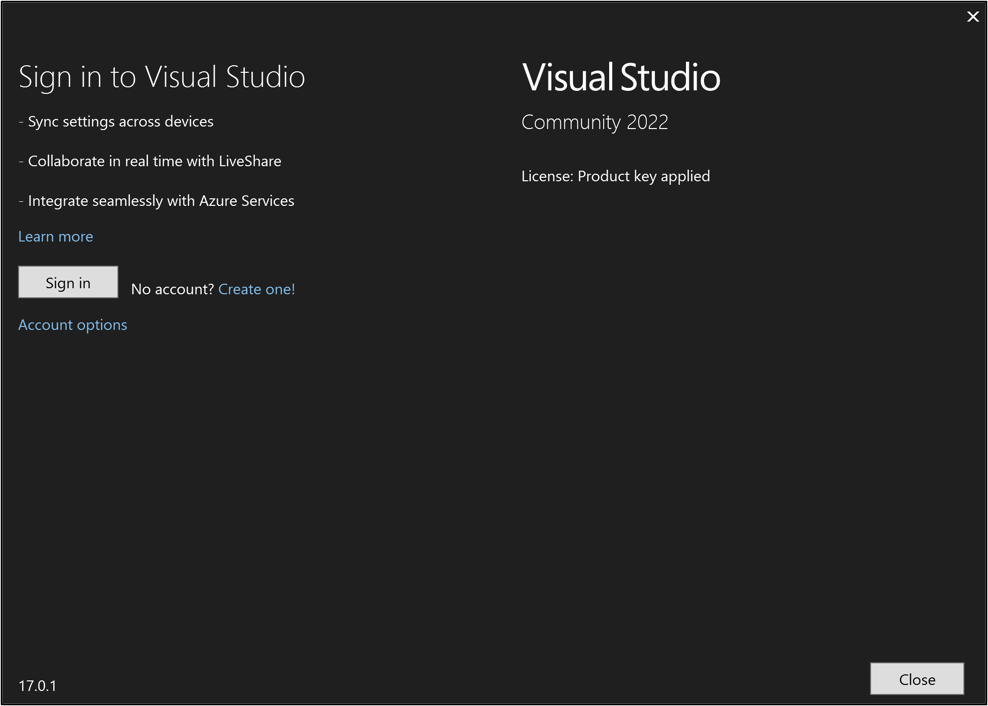
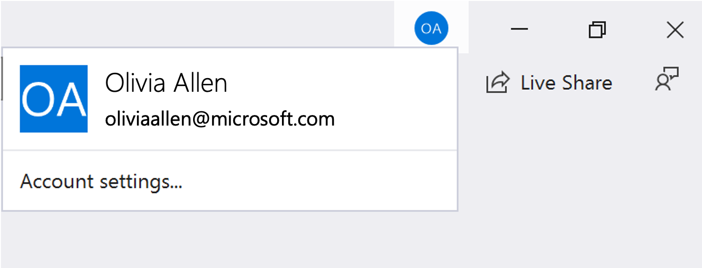

# Sign in to Visual Studio on Windows 

 [!INCLUDE [Visual Studio](~/includes/applies-to-version/vs-windows-only.md)]

In this article, you'll learn:
+ [The benefits to account sign in](#benefits)
+ How to [sign in](#sign-in) with an account
+ How to [add & switch accounts](#add-and-switch)
+ How to [sign out of your account](#sign-out-of-account)
+ How to [update your profile](#profile)

You can also get [subscription support](https://visualstudio.microsoft.com/subscriptions/support/).

## Benefits: why sign in? 

While you don't have to sign in, there are many advantages to doing so.   

|Benefit|Description|
|---|---|
|[Extend your Visual Studio trial period](../ide/how-to-unlock-visual-studio.md)|Use Visual Studio Professional or Visual Studio Enterprise **for an additional 90 days**, instead of being limited to the trial period of 30 days.|
|[Unlock Visual Studio](../ide/how-to-unlock-visual-studio.md)|Unlock Visual Studio if you use an account that's associated with a [Visual Studio subscription](/visualstudio/subscriptions/using-the-subscriber-portal) or an Azure DevOps organization.|
|[Synchronize](../ide/synchronized-settings-in-visual-studio.md) your settings|Settings that you customize, such as key bindings, window layout, and color theme, apply immediately when you sign in to Visual Studio on any device.|
|Auto-connect to Azure services|Connect to services, such as Azure and Azure DevOps Services, in the IDE without prompting again for credentials for the same account.|
|Use Community edition without interruptions|While it's not required to sign in, you might periodically get prompts to sign-in if you haven't done so. Please sign in to the IDE to continue using Visual Studio Community without interruptions.|
|[Get 'Visual Studio Dev Essentials'](https://visualstudio.microsoft.com/dev-essentials/)|This program includes free software, training, support, and more.|

## Sign in with a Microsoft or organizational account

::: moniker range="<=vs-2019"

1. Launch Visual Studio. When you open Visual Studio for the first time, you're asked to sign in and provide some basic registration information.

   
   
   > [!NOTE]
   > If you choose not to sign in when you first open Visual Studio, it's easy to do so later. Look for the **Sign in** link in the upper-right corner of the Visual Studio environment.

::: moniker-end

::: moniker range="vs-2022"

1. Launch Visual Studio.  When you open Visual Studio for the first time, you're asked to sign in and provide some basic registration information.

   

::: moniker-end

2. Choose a Microsoft account or a work or school account.  If you don't have one, [create a Microsoft account for free](https://support.microsoft.com/help/4026324/microsoft-account-how-to-create) by selecting the link near the **Sign in** button. 

3. Choose your preferred color theme and other UI settings.  Visual Studio [remembers these settings and synchronizes](../ide/synchronized-settings-in-visual-studio.md) them across all Visual Studio environments you have signed in to. You can change the settings later if you open the **Tools** > **Options** menu in Visual Studio.

   You can see that you're successfully signed in the upper-right corner of the Visual Studio environment.   Unless you sign out, you're automatically signed in to Visual Studio whenever you start it, and any changes to synchronized settings are automatically applied.

::: moniker range="<=vs-2019"

   

::: moniker-end

::: moniker range="vs-2022"

   

::: moniker-end

## Update your account profile

1. Go to **File > Account Settings...** and select the **Manage Visual Studio profile** link.
1. In the browser window, select **Edit profile** and change the settings that you want.
1. When you're done, select **Save changes**.

## Add and switch user accounts

If you have multiple Microsoft accounts and/or work or school accounts, you can add them all to Visual Studio so that you can access the resources from any account without having to sign in to it separately.

After you add multiple accounts on one machine, that set of accounts roams with you if you sign in to Visual Studio on another machine.

> [!NOTE]
> Although the account names roam, the credentials do not. You'll be prompted to enter credentials for those other accounts the first time you attempt to use their resources on a new machine.

### Add an additional account to Visual Studio

To add an additional account to Visual Studio:

1. Choose **File** > **Account Settings**.

1. From **All Accounts**, choose an account by using the **+** or the **Add** dropdown.

1. On the **Sign in to your account** page, select the account or choose **Use another account**. Follow the prompts to enter the new account credentials.

(Optional) Now you can go to **Server Explorer** and see the Azure services associated with the account you just added. In **Server Explorer**, right-click on the **Azure** node and choose **Manage and Filter Subscriptions**. Choose the new account by clicking the drop-down arrow next to the current account, and then choose which subscriptions you want to display in **Server Explorer**. You should see all the services associated with the specified subscription. Even though you're not currently signed into Visual Studio with the second account, you are signed in to that account's services and resources. The same is true for **Project** > **Add Connected Service**.

### Add a GitHub account to Visual Studio

Starting with version 16.8, you’ll be able to add both GitHub and GitHub Enterprise accounts to your keychain. You’ll be able to add and leverage them just as you do with Microsoft accounts, which means that you’ll have an easier time accessing your GitHub resources across Visual Studio.

For detailed instructions, see [Work with GitHub accounts in Visual Studio](work-with-github-accounts.md).

### Add a multi-factor authentication (MFA) enabled account to Visual Studio

Starting with version 16.6, users can access resources secured via CA policies such as MFA. To use this enhanced workflow, you'll need to opt into using your system's default web browser as the mechanism to add and reauthenticate Visual Studio accounts.  For detailed instructions, see [Work with accounts that require multi-factor authentication (MFA)](work-with-multi-factor-authentication.md)

## Sign out of account

1. Select the icon with your profile name in the upper-right corner of the Visual Studio environment.
1. Select **Account settings..**.
1. Select **Sign out**.
