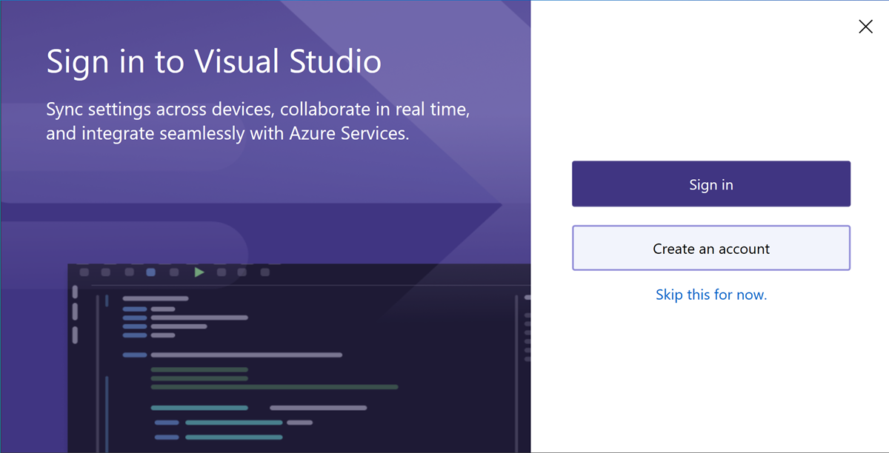

# Sign in or switch Visual Studio user accounts 

In this article, you'll learn how to sign in to Visual Studio, add and switch user accounts, update your profile, sign out of your account, and the benefits to signing in.  If you are looking to learn how to use multiple accounts for sign-ins, check out our article, [Access multiple accounts associated with the Visual Studio sign-in account](sign-in-access-multiple-accounts.md).

You can get subscription support and search the frequently asked questions about subscriptions, accounts, and billing [on our Subscription support page](https://visualstudio.microsoft.com/subscriptions/support/).

## Sign in to your account

You can sign in to your Microsoft or organizational account.  To add another account, see [Add and switch user accounts](#add-and-switch).

::: moniker range="<=vs-2019"

1. Launch Visual Studio. When you open Visual Studio for the first time, you're asked to sign in and provide some basic registration information.

   
   
   > [!NOTE]
   > If you choose not to sign in when you first open Visual Studio, it's easy to do so later. Look for the **Sign in** link in the upper-right corner of the Visual Studio environment.

::: moniker-end

::: moniker range="vs-2022"

1. Launch Visual Studio.  When you open Visual Studio for the first time, you're asked to sign in and provide some basic registration information.

   

   > [!NOTE]
   > If you choose not to sign in when you first open Visual Studio, it's easy to do so later. Look for the **Sign in** link in the upper-right corner of the Visual Studio environment.

::: moniker-end

2. Choose a Microsoft account or a work or school account.  If you don't have one, you can [create a Microsoft account for free](https://support.microsoft.com/help/4026324/microsoft-account-how-to-create). 

3. Choose your preferred color theme and other UI settings.  Visual Studio [remembers these settings and synchronizes](../ide/synchronized-settings-in-visual-studio.md) them across all Visual Studio environments you have signed in to. You can change the settings later if you open the **Tools** > **Options** menu in Visual Studio.

You can see that you're successfully signed in the upper-right corner of the Visual Studio environment. Unless you sign out, you're automatically signed in to Visual Studio whenever you start it, and any changes to synchronized settings are automatically applied.

## Benefits: why sign in? 

While you don't have to sign in, there are many advantages to doing so.   

|Benefit|Description|
|---|---|
|[Extend your Visual Studio trial period](../ide/how-to-unlock-visual-studio.md)|Use Visual Studio Professional or Visual Studio Enterprise **for an additional 90 days**, instead of being limited to the trial period of 30 days.|
|[Unlock Visual Studio](../ide/how-to-unlock-visual-studio.md)|Unlock Visual Studio if you use an account that's associated with a [Visual Studio subscription](/visualstudio/subscriptions/using-the-subscriber-portal) or an Azure DevOps organization.|
|[Synchronize](../ide/synchronized-settings-in-visual-studio.md) your settings|Settings that you customize, such as key bindings, window layout, and color theme, apply immediately when you sign in to Visual Studio on any device.|
|Auto-connect to Azure services|Connect to services, such as Azure and Azure DevOps Services, in the IDE without prompting again for credentials for the same account.|
|Use Community edition without interruptions|While it's not required to sign in, you might periodically get prompts to sign-in if you haven't done so. Please sign in to the IDE to continue using Visual Studio Community without interruptions.|
|[Get 'Visual Studio Dev Essentials'](https://visualstudio.microsoft.com/dev-essentials/)|This program includes free software, training, support, and more.|

## Add and switch user accounts to Visual Studio

If you have multiple accounts, you can add them all to Visual Studio so that you can access the resources from any account without having to sign in to it separately.

After you add multiple accounts on one machine, that group of accounts roams with you if you sign in to Visual Studio on another machine.  However, your account credentials do not roam therefore you'll be prompted to enter credentials for those other accounts the first time you attempt to use their resources on a new machine.

There are several types of accounts you can add: 

- Add a standard Visual Studio account:
  
  ::: moniker range="vs-2019"
  
  1. Choose **File** > **Account Settings**.
  1. From **All Accounts**, choose an account by using the **+** or the **Add** dropdown. 
  1. On the **Sign in to your account** page, select the account or choose **Use another account**.
  1. Follow the prompts to enter the new account credentials.

  ::: moniker-end

  ::: moniker range="vs-2022"
  
  1. Select the icon with your profile name in the upper-right corner of the Visual Studio environment.
  1. Select **Add another account** and then choose an account to sign into.
  1. On the **Sign in to your account** page, select the account or choose **Use another account**. 
  1. Follow the prompts to enter the new account credentials.

  ::: moniker-end

- [Add a GitHub account](work-with-github-accounts.md)
- [Add a Multifactor authentication (MFA) account](work-with-multi-factor-authentication.md)

## Update your account profile

1. Go to **File > Account Settings...** and select the **Manage Visual Studio profile** link.
1. In the browser window, select **Edit profile** and change the settings that you want.
1. When you're done, select **Save changes**.
