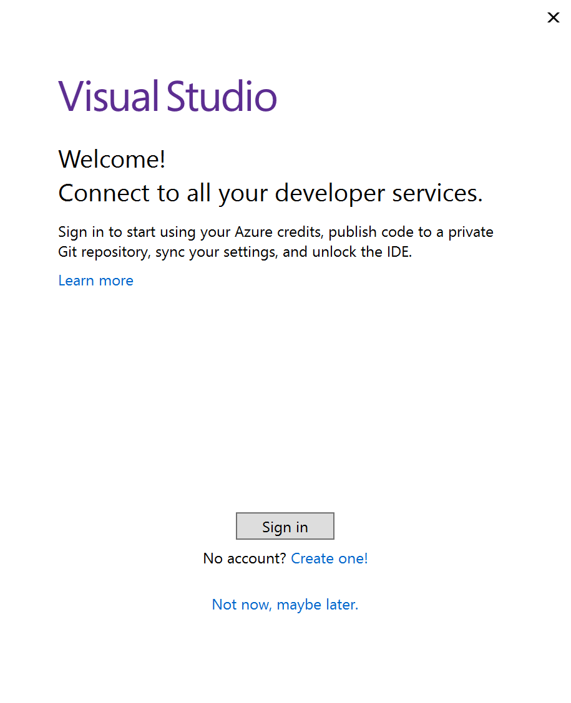

# Sign in or switch Visual Studio user accounts 

::: moniker range="<=vs-2019"

In this article, you learn how to sign in to Visual Studio, add and switch user accounts, update your profile, sign out of your account, and the benefits to signing in. 

To learn how to access multiple user accounts in Visual Studio, see [Access multiple accounts associated with the Visual Studio sign-in account](sign-in-access-multiple-accounts.md). For guidance on how to add your public GitHub or GitHub Enterprise account to your Visual Studio keychain, see [Work with GitHub accounts in Visual Studio](work-with-github-accounts.md). You can get subscription support and search the frequently asked questions about subscriptions, accounts, and billing [on our Subscription support page](https://visualstudio.microsoft.com/subscriptions/support/).

## Sign in to your account

You can sign in to your Microsoft or organizational account, or your GitHub account. Sign in with a Microsoft account to sync settings across devices, collaborate in real time, and access Azure services. Sign in with a GitHub account to access GitHub Copilot and GitHub repositories. To add another account, see [Add and switch user accounts](#add-and-switch).

1. Launch Visual Studio. When you open Visual Studio for the first time, you're prompted to sign in and provide some basic registration information.

   
   
   > [!NOTE]
   > If you choose not to sign in when you first open Visual Studio, it's easy to do so later. Look for the **Sign in** link in the upper-right corner of the Visual Studio environment.

1. Choose a Microsoft account or a work or school account.  If you don't have one, you can [create a Microsoft account for free](https://support.microsoft.com/help/4026324/microsoft-account-how-to-create).

1. Choose your preferred color theme and other UI settings to personalize your Visual Studio experience. Visual Studio [remembers these settings and synchronizes](../ide/synchronized-settings-in-visual-studio.md) them across all Visual Studio environments you signed in to. You can change the settings later if you open the **Tools** > **Options** menu in Visual Studio.

You can see that you've successfully signed in, in the upper-right corner of the Visual Studio environment. Unless you sign out, you automatically sign in to Visual Studio whenever you start it, and any changes to synchronized settings are automatically applied.

### Sign in from the IDE

 If you choose to not sign in when you first open Visual Studio, you can sign in later from the IDE. 

1. Select the **Sign in** icon in the upper-right corner of the Visual Studio environment.
1. Select a Microsoft account to sign in.
1. Follow the prompts to enter the new account credentials.

## Benefits: why sign in? 

While you don't have to sign in with your Microsoft account, there are many advantages to doing so.   

|Benefit|Description|
|---|---|
|[Extend your Visual Studio trial period](../ide/how-to-unlock-visual-studio.md)|Use Visual Studio Professional or Visual Studio Enterprise **for an additional 90 days**, instead of being limited to the trial period of 30 days.|
|[Unlock Visual Studio](../ide/how-to-unlock-visual-studio.md)|Unlock Visual Studio if you use an account that's associated with a [Visual Studio subscription](/visualstudio/subscriptions/using-the-subscriber-portal) or an Azure DevOps organization.|
|[Synchronize](../ide/synchronized-settings-in-visual-studio.md) your settings|Settings that you customize, such as key bindings, window layout, and color theme, apply immediately when you sign in to Visual Studio on any device.|
|Auto-connect to Azure services|Connect to services, such as Azure and Azure DevOps Services, in the IDE without prompting again for credentials for the same account.|
|Use Community edition without interruptions|While it's not required to sign in, you might periodically get prompts to sign-in if you haven't done so. Please sign in to the IDE to continue using Visual Studio Community without interruptions.|
|[Get 'Visual Studio Dev Essentials'](https://visualstudio.microsoft.com/dev-essentials/)|This program includes free software, training, support, and more.|

::: moniker-end

::: moniker range="vs-2022"

In this article, you learn how to sign in to Visual Studio with your Microsoft or GitHub account, add and switch user accounts, update your profile, sign out of your account, and the benefits to signing in.

## Sign in to your account

You can sign in to your Microsoft or organizational account, or your GitHub account. Sign in with a Microsoft account to sync settings across devices, collaborate in real time, and access Azure services. Sign in with a GitHub account to access GitHub Copilot and GitHub repositories.

1. Launch Visual Studio.  When you open Visual Studio for the first time, you're prompted to sign in and provide some basic registration information.

   :::image type="content" source="../ide/media/vs-2022/visual-studio-sign-in-pop-up.png" alt-text="Screenshot of first launch Sign in dialog in the Visual Studio IDE.":::

   > [!NOTE]
   > If you choose to not sign in when you first open Visual Studio, it's easy to do so later. Look for the [**Sign in** link in the upper-right corner of the Visual Studio environment](#sign-in-from-the-ide).

1. Choose a Microsoft account or a GitHub account.  If you don't have one, you can [create a Microsoft account for free](https://support.microsoft.com/help/4026324/microsoft-account-how-to-create). The account you sign in with is set as your Personalization Account. GitHub accounts can't be used to roam settings across devices. [Add](#add-and-switch) your Microsoft account to enable roaming settings.

1. Choose to **Sign up for Copilot Free**, sign in with an existing GitHub account, or [add your GitHub account later from the IDE](work-with-github-accounts.md#add-a-github-account-from-the-profile-card).

1. Choose your preferred color theme and other UI settings to personalize your Visual Studio experience. Visual Studio [remembers these settings and synchronizes](../ide/synchronized-settings-in-visual-studio.md) them across all Visual Studio environments depending on your account setup. You can change the settings later if you open the **Tools** > **Options** menu in Visual Studio.

You can see that you've successfully signed in, in the upper-right corner of the Visual Studio environment. Unless you sign out, you automatically sign in to Visual Studio whenever you start it, and any changes to synchronized settings are automatically applied if you're signed in with your Microsoft account.

### Sign in from the IDE

 If you choose to not sign in when you first open Visual Studio, you can sign in later from the IDE. 

1. Select the **Sign in** icon in the upper-right corner of the Visual Studio environment.

   :::image type="content" source="../ide/media/vs-2022/signing-in-to-visual-studio/sign-in-icon-ide.png" alt-text="Screenshot of Sign in icon in the Visual Studio IDE.":::

1. Select **Microsoft** (work, school, or personal account) or **GitHub** (GitHub account) to sign in.
1. Follow the prompts to enter the new account credentials.

You can also sign in from **File > Account Settings...**. To add another account, see [Add and switch user accounts](#add-and-switch).

## Benefits: why sign in? 

While you can sign in using a GitHub account to seamlessly access GitHub Copilot and other GitHub resources, we recommend you sign in with a Microsoft account, then add a GitHub account as a secondary account.

The following benefits apply when you use a Microsoft account to sign in:

|Benefit|Description|
|---|---|
|[Extend your Visual Studio trial period](../ide/how-to-unlock-visual-studio.md)|Use Visual Studio Professional or Visual Studio Enterprise **for an additional 90 days**, instead of being limited to the trial period of 30 days.|
|[Unlock Visual Studio](../ide/how-to-unlock-visual-studio.md)|Unlock Visual Studio if you use an account that's associated with a [Visual Studio subscription](/visualstudio/subscriptions/using-the-subscriber-portal) or an Azure DevOps organization.|
|[Synchronize](../ide/synchronized-settings-in-visual-studio.md) your settings|Settings that you customize, such as key bindings, window layout, and color theme, apply immediately when you sign in to Visual Studio on any device.|
|Auto-connect to Azure services|Connect to services, such as Azure and Azure DevOps Services, in the IDE without prompting again for credentials for the same account.|
|Use Community edition without interruptions|While it's not required to sign in, you might periodically get prompts to sign-in if you haven't done so. Please sign in to the IDE to continue using Visual Studio Community without interruptions.|
|[Get 'Visual Studio Dev Essentials'](https://visualstudio.microsoft.com/dev-essentials/)|This program includes free software, training, support, and more.|

::: moniker-end

## Add and switch user accounts in Visual Studio

If you have multiple accounts, you can add them all to Visual Studio so that you can access the resources from any account without having to sign in to it separately.

After you add multiple accounts on one machine, that group of accounts roams with you if you sign in to Visual Studio on another machine.  However, your account credentials do not roam therefore you'll be prompted to enter credentials for those other accounts the first time you attempt to use their resources on a new machine.

To authenticate and access Azure resources from Visual Studio, sign in to Visual Studio with an account that has access to Azure resources and select this account for [Azure Service Authentication](/dotnet/api/overview/azure/service-to-service-authentication#authenticating-with-visual-studio) in **Tools** > **Options** > **Azure Service Authentication** > **Account Selection**.

There are several types of accounts you can add: 

- Add a standard Visual Studio account:
  
  ::: moniker range="vs-2019"
  
  1. Choose **File** > **Account Settings**.
  1. From **All Accounts**, choose an account by using the **+** or the **Add** dropdown. 
  1. On the **Sign in to your account** page, select the account or choose **Use another account**.
  1. Follow the prompts to enter the new account credentials.

  ::: moniker-end

  ::: moniker range="vs-2022"
  
  1. Select the icon with your profile name in the upper-right corner of the Visual Studio environment.
  1. Select **Add another account** and then choose **Microsoft** account to sign into.
  1. On the **Sign in** window, select the account or choose **Use a different account**. 
  1. Follow the prompts to enter the new account credentials.

  ::: moniker-end

- [Add a GitHub account](work-with-github-accounts.md)
- [Add a Multifactor authentication (MFA) account](work-with-multi-factor-authentication.md)

::: moniker range="vs-2019"

## Update your account profile

1. Go to **File > Account Settings...** and select the **Manage Visual Studio profile** link.
2. In the browser window, select **Edit profile** and change the settings that you want.
2. When done, select **Save changes**.

## Remove an account

You can remove any of the multiple accounts you've added to Visual Studio. When you remove an account, only that specific account is impacted and any resources associated with that account are no longer accessible. However, if you select **Sign out**, [all accounts are signed out](#sign-out-of-all-accounts).

1. Select **File > Account Settings...**.
1. **All Accounts** lists all accounts signed into Visual Studio. Select **Remove** for the account you want to remove.
1. Confirm the removal on the dialog that appears.

## Sign out of all accounts

To sign out of all accounts:

1. Select **File > Account Settings...**.
1. Select **Sign out**.

::: moniker-end

::: moniker range="vs-2022"

## Update your Personalization Account profile

1. Go to **File > Account Settings...** and select **Manage Visual Studio profile** or **Manage GitHub profile** link.
1. In the browser window, select **Edit profile** and change the settings that you want.
1. When done, select **Save**.

If you signed in with first with a GitHub account, it is set as your Personalization Account. GitHub accounts can't be used to roam settings across devices. Sign in with a Microsoft account to enable roaming settings.
When you sign in with a Microsoft account, it becomes your Personalization Account even if you're already signed in with a GitHub account.

## Remove an account

You can remove any of the multiple accounts you've added to Visual Studio. When you remove an account, only that specific account is impacted and any resources associated with that account are no longer accessible. However, if you select **Sign out**, [all accounts are signed out](#sign-out-of-all-accounts).

*If your Personalization Account is a Microsoft account, removing this account removes all accounts and is similar to signing out of all accounts.

1. Select the icon with your profile name in the upper-right corner of your Visual Studio environment.
1. Select **Remove account** for the account you want to remove.

   :::image type="content" source="media/vs-2022/signing-in-to-visual-studio/remove-an-account.png" alt-text="Screenshot of removing an account.":::

You can also use the **Account Settings** dialog to remove an account.

1. Select the icon with your profile name in the upper-right corner of your Visual Studio environment.
1. **All Accounts** lists all accounts signed into Visual Studio. Select **Remove** for the account you want to remove.
1. Confirm the removal on the dialog that appears.

   :::image type="content" source="media/vs-2022/signing-in-to-visual-studio/remove-an-account-account-settings.png" alt-text="Screenshot of removing an account in Account Settings.":::

## Sign out of all accounts

Signing out of Visual Studio removes all accounts on the Visual Studio keychain, settings no longer roam across devices, and associated resources aren't accessible anymore.

To sign out of all accounts:

1. Select the icon with your profile name in the upper-right corner of your Visual Studio environment.
1. Select **Sign out**.
 
   :::image type="content" source="media/vs-2022/signing-in-to-visual-studio/sign-out-profile-card.png" alt-text="Screenshot of signing out of all accounts from profile card.":::

You can also use the **Account Settings** dialog to sign out of all accounts.

::: moniker-end

## Related content

- [Access multiple accounts associated with the Visual Studio sign-in account](sign-in-access-multiple-accounts.md)
- [Work with GitHub accounts in Visual Studio](work-with-github-accounts.md)
- [Extend a trial version or update a license](how-to-unlock-visual-studio.md)
- [Sign in to Visual Studio with accounts that require multifactor authentication (MFA)](work-with-multi-factor-authentication.md)
- [Subscription support page](https://visualstudio.microsoft.com/subscriptions/support/)
