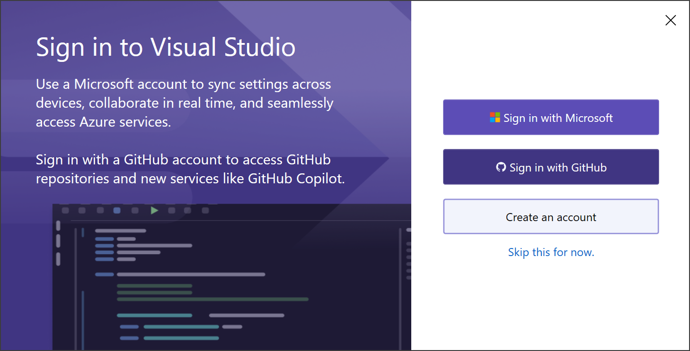

# Sign in to Visual Studio on Windows 

 [!INCLUDE [Visual Studio](~/includes/applies-to-version/vs-windows-only.md)]

In this article, you'll learn:
+ [The benefits to account sign in](#benefits)
+ How to [sign in](#sign-in) with an account
+ How to [add & switch accounts](#add-and-switch)
+ How to [access](#access) multiple user accounts
+ How to [sign out of your account](#sign-out-of-account)
+ How to [update your profile](#profile)

You can also get [subscription support](https://visualstudio.microsoft.com/subscriptions/support/).

## Benefits: why sign in? 

While you don't have to sign in, there are many advantages to doing so.   

|Benefit|Description|
|---|---|
|[Extend your Visual Studio trial period](../ide/how-to-unlock-visual-studio.md)|Use Visual Studio Professional or Visual Studio Enterprise **for an additional 90 days**, instead of being limited to the trial period of 30 days.|
|[Unlock Visual Studio](../ide/how-to-unlock-visual-studio.md)|Unlock Visual Studio if you use an account that's associated with a [Visual Studio subscription](/visualstudio/subscriptions/using-the-subscriber-portal) or an Azure DevOps organization.|
|[Synchronize](../ide/synchronized-settings-in-visual-studio.md) your settings|Settings that you customize, such as key bindings, window layout, and color theme, apply immediately when you sign in to Visual Studio on any device.|
|Auto-connect to Azure services|Connect to services, such as Azure and Azure DevOps Services, in the IDE without prompting again for credentials for the same account.|
|Continue using our Community edition without interruptions|If the installation prompts you to sign-in periodically, sign in to the IDE to continue using Visual Studio Community without interruptions.|
|[Get 'Visual Studio Dev Essentials'](https://visualstudio.microsoft.com/dev-essentials/)|This program includes free software, training, support, and more.|

## Sign in with a Microsoft or organizational account

::: moniker range="<=vs-2019"

1. Launch Visual Studio. When you open Visual Studio for the first time, you're asked to sign in and provide some basic registration information.

   
   
   > [!NOTE]
   > If you choose not to sign in when you first open Visual Studio, it's easy to do so later. Look for the **Sign in** link in the upper-right corner of the Visual Studio environment.

::: moniker-end

::: moniker range="vs-2022"

1. Launch Visual Studio.  When you open Visual Studio for the first time, you're asked to sign in and provide some basic registration information.

   

::: moniker-end

2. Choose a Microsoft account or a work or school account.  If you don't have one, [create a Microsoft account for free](https://support.microsoft.com/help/4026324/microsoft-account-how-to-create) by selecting the link near the **Sign in** button. 

3. Choose your preferred color theme and other UI settings.  Visual Studio [remembers these settings and synchronizes](../ide/synchronized-settings-in-visual-studio.md) them across all Visual Studio environments you have signed in to. You can change the settings later if you open the **Tools** > **Options** menu in Visual Studio.

   You can see that you're successfully signed in the upper-right corner of the Visual Studio environment.   Unless you sign out, you're automatically signed in to Visual Studio whenever you start it, and any changes to synchronized settings are automatically applied.

::: moniker range="<=vs-2019"

   

::: moniker-end

::: moniker range="vs-2022"

   

::: moniker-end

## Update your account profile

1. Go to **File > Account Settings...** and select the **Manage Visual Studio profile** link.
1. In the browser window, select **Edit profile** and change the settings that you want.
1. When you're done, select **Save changes**.

## Add and switch user accounts

If you have multiple Microsoft accounts and/or work or school accounts, you can add them all to Visual Studio so that you can access the resources from any account without having to sign in to it separately.

After you add multiple accounts on one machine, that set of accounts roams with you if you sign in to Visual Studio on another machine.

> [!NOTE]
> Although the account names roam, the credentials do not. You'll be prompted to enter credentials for those other accounts the first time you attempt to use their resources on a new machine.

### Add an additional account to Visual Studio

To add an additional account to Visual Studio:

1. Choose **File** > **Account Settings**.

1. From **All Accounts**, choose an account by using the **+** or the **Add** dropdown.

1. On the **Sign in to your account** page, select the account or choose **Use another account**. Follow the prompts to enter the new account credentials.

(Optional) Now you can go to **Server Explorer** and see the Azure services associated with the account you just added. In **Server Explorer**, right-click on the **Azure** node and choose **Manage and Filter Subscriptions**. Choose the new account by clicking the drop-down arrow next to the current account, and then choose which subscriptions you want to display in **Server Explorer**. You should see all the services associated with the specified subscription. Even though you're not currently signed into Visual Studio with the second account, you are signed in to that account's services and resources. The same is true for **Project** > **Add Connected Service**.

### Add a GitHub account to Visual Studio

Starting with version 16.8, you’ll be able to add both GitHub and GitHub Enterprise accounts to your keychain. You’ll be able to add and leverage them just as you do with Microsoft accounts, which means that you’ll have an easier time accessing your GitHub resources across Visual Studio.

For detailed instructions, see [Work with GitHub accounts in Visual Studio](work-with-github-accounts.md).

### Add a multi-factor authentication (MFA) enabled account to Visual Studio

Starting with version 16.6, users can access resources secured via CA policies such as MFA. To use this enhanced workflow, you'll need to opt into using your system's default web browser as the mechanism to add and reauthenticate Visual Studio accounts.  For detailed instructions, see [Work with accounts that require multi-factor authentication (MFA)](work-with-multi-factor-authentication.md)

## Access multiple accounts associated with the Visual Studio sign-in account

After you sign-in to Visual Studio with a Microsoft or an organizational account, you can see the resources accessible from your accounts in places such as the **Add Connected Service** dialog, **Server Explorer**, and **Team Explorer**.

Azure, Application Insights, Azure DevOps, and Microsoft 365 services all support the streamlined sign-in experience.

### Access your Azure account in Server Explorer

To open Server Explorer, choose **View** > **Server Explorer** (or, if you're using the "General" [environment settings](../ide/environment-settings.md), press **Ctrl**+**Alt**+**S**). Expand the **Azure** node and notice that it contains the resources available in the Azure account that's associated with the account that you used to sign in to Visual Studio. It looks similar to the following image:

::: moniker range="<=vs-2019"

::: moniker-end

::: moniker range="vs-2022"

::: moniker-end

The first time you use Visual Studio on any specific device, the dialog only shows the subscriptions registered under the account that you signed in with. You can access resources for any of your other accounts directly from **Server Explorer** by right-clicking on the **Azure** node, choosing **Manage and Filter Subscriptions**, and then adding your accounts from the account picker control. You can then choose another account, if desired, by clicking the down arrow and choosing from the list of accounts. After choosing the account, you can customize which subscriptions under that account to display in **Server Explorer**.

The next time you open **Server Explorer**, the resources for that subscription are displayed.

### Access your Azure account via Add Connected Service dialog

1. Open an existing project, or create a new project.

1. Choose the project node in **Solution Explorer**, and then right-click and choose **Add** > **Connected Service**.

   The **Connected Services** window appears and shows you the list of services in the Azure account that's associated with your Visual Studio personalization account. You don't have to sign in separately to Azure. However, you do need to sign in to the other accounts the first time you attempt to access their resources from a different machine.

### Access Azure Active Directory in a Web project

Azure Active Directory (Azure AD) enables support for end-user single sign-in in ASP.NET MVC web apps or AD authentication in web API services. Domain authentication is different from individual user account authentication. Users that have access to your Active Directory domain can use their existing Azure AD accounts to connect to your web applications. Microsoft 365 apps can also use domain authentication.

::: moniker range="vs-2019"

To see this in action, create a new **ASP.NET Core Web App** project. On the **Additional information** page, choose **.NET Core 3.1 (Long-term support)** from the **Target Framework** drop-down, and then choose an authentication type from the **Authentication Type** drop-down.

::: moniker-end

::: moniker range=">=vs-2022"

To see this in action, create a new **ASP.NET Core Web App** project. On the **Additional information** page, choose **.NET Core 6 (Long-term support)** from the **Target Framework** drop-down, and then choose an authentication type from the **Authentication Type** drop-down.

### Identity: Proxy support for Azure Active Directory backed accounts

Visual Studio can now detect when users are behind a proxy and proactively prompt for proxy credentials when adding  Microsoft accounts (MSA) or work or school accounts (WSA) to Visual Studio. 

Proxy credentials are stored in the Windows Credential Manager and are used as needed to complete identity related operations.

> [!NOTE]
> If the proxy server starts or changes after opening Visual Studio, the **Account Settings** dialog will show a warning, but you'll need to restart Visual Studio to get the proxy credentials prompt.

::: moniker-end

## Sign out of account

1. Select the icon with your profile name in the upper-right corner of the Visual Studio environment.
1. Select **Account settings..**.
1. Select **Sign out**.
