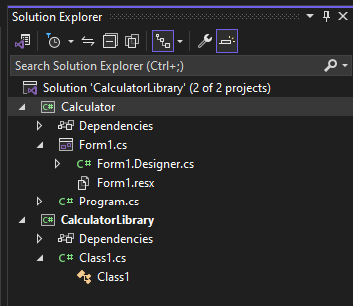

# What are solutions and projects in Visual Studio?

In this article, you'll learn what  a *project* and a *solution* is in Visual Studio. It also briefly covers the Solution Explorer tool window and how to create a new project.

> [!NOTE]
> This topic applies to Visual Studio on Windows. For Visual Studio for Mac, see [Projects and solutions in Visual Studio for Mac](/visualstudio/mac/projects-and-solutions).

## Projects

When you create an app or website in Visual Studio, you start with a *project*. In a logical sense, a project contains all files that are compiled into an executable, library, or website. Those files can include source code, icons, images, data files, and so on. A project also contains compiler settings and other configuration files that might be needed by various services or components that your program communicates with.

### Project file

Visual Studio uses [MSBuild](../msbuild/msbuild.md) to build each project in a solution, and each project contains an MSBuild project file. The file extension reflects the type of project, for example, a C# project (.csproj), a Visual Basic project (.vbproj), or a database project (.dbproj). The project file is an XML document that contains all the information and instructions that MSBuild needs in order to build your project, including the content, platform requirements, versioning information, web server or database server settings, and the tasks to perform.

Project files are based on the [MSBuild XML schema](../msbuild/msbuild-project-file-schema-reference.md). To look at the contents of newer, [sdk-style project files](../msbuild/how-to-use-project-sdk.md) in Visual Studio, right-click on the project node in **Solution Explorer** and select **Edit \<projectname\>**. To look at the contents of .NET Framework and other projects of that style, first unload the project (right-click on the project node in **Solution Explorer** and select **Unload Project**). Then, right-click on the project and choose **Edit \<projectname\>**.

> [!NOTE]
> You don't have to use solutions or projects in Visual Studio to edit, build, and debug code. You can simply open the folder that contains your source files in Visual Studio and start editing. For more information, see [Develop code in Visual Studio without projects or solutions](../ide/develop-code-in-visual-studio-without-projects-or-solutions.md).

### Create new projects

The easiest way to create a new project is to use a project template for the project type you want. A project template includes a basic set of pre-generated code files, config files, assets, and settings. Use **File** > **New** > **Project** to select a project template. For more information, see [Create a new project](create-new-project.md).

You can also create a custom project template that you can use to create new projects from. For more information, see [Create project and item templates](../ide/creating-project-and-item-templates.md).

When you create a new project, Visual Studio saves it to its default location, *%USERPROFILE%\source\repos*. To change this location, go to **Tools** > **Options** > **Projects and Solutions** > **Locations**. For more information, see [Options dialog box: Projects and Solutions > Locations](./reference/projects-solutions-locations-options.md).

## Solutions

A project is contained within a *solution*. Despite its name, a solution is not an "answer". It's simply a container for one or more related projects, along with build information, Visual Studio window settings, and any miscellaneous files that aren't associated with a particular project.

### Solution file

Visual Studio uses two file types (*.sln* and *.suo*) to store settings for solutions:

|Extension|Name|Description|
|---------------|----------|-----------------|
|.sln|Visual Studio Solution|Organizes projects, project items, and solution items in the solution.|
|.suo|Solution User Options|Stores user-level settings and customizations, such as breakpoints.|

> [!IMPORTANT]
> A solution is described by a text file (extension *.sln*) with its own unique format; it's not intended to be edited by hand. Conversely, the *.suo* file is a hidden file that is not displayed under the default File Explorer settings. To show hidden files, on the **View** menu in File Explorer, select the **Hidden Items** checkbox.

### Solution folder

A "solution folder" is a virtual folder that's only in **Solution Explorer**, where you can use it to group projects in a solution. If you want to locate a solution file on a computer, go to **Tools** > **Options** > **Projects and Solutions** > **Locations**. For more information, see [Options dialog box: Projects and Solutions > Locations](./reference/projects-solutions-locations-options.md).

> [!TIP]
> For an example of a project and solution created from scratch, complete with step-by-step instructions and sample code, see [Introduction to projects and solutions](../get-started/tutorial-projects-solutions.md).

## Solution Explorer

After you create a new project, you can use **[Solution Explorer](use-solution-explorer.md)** to view and manage the project and solution and their associated items. The following illustration shows **Solution Explorer** with a C# solution that contains two projects:

::: moniker range="vs-2017"

The toolbar across the top of **Solution Explorer** has buttons to switch from a solution view to a folder view, show hidden files, collapse all nodes, and more.

::: moniker-end

::: moniker range=">=vs-2019"

The toolbar across the top of **Solution Explorer** has buttons to switch from a solution view to a folder view, filter pending changes, show all files, collapse all nodes, view [properties](managing-project-and-solution-properties.md) pages, preview code in the [code editor](writing-code-in-the-code-and-text-editor.md), and more.

::: moniker-end

Many menu commands are available from the right-click context menu on various items in **Solution Explorer**. These commands include building a project, managing NuGet packages, adding a reference, renaming a file, and running tests, just to name a few. For more information, see [How to use Solution Explorer](use-solution-explorer.md).

For ASP.NET Core projects, you can customize how files are nested in **Solution Explorer**. For more information, see [Customize file nesting in Solution Explorer](file-nesting-solution-explorer.md).

> [!TIP]
> If you've closed Solution Explorer and you want to open it again, choose **View** > **Solution Explorer** from the menu bar, or press **Ctrl**+**Alt**+**L**. And, if you've closed side tabs and you want to restore them to their default locations, choose **Window** > **Reset Window Layout** from the menu bar.

> [!NOTE]
> To view the application images and icons that appear in Visual Studio, download the [**Visual Studio Image Library**](https://www.microsoft.com/download/details.aspx?id=35825).

## See also

- [Introduction to projects and solutions](../get-started/tutorial-projects-solutions.md)
- [Manage project and solution properties](managing-project-and-solution-properties.md)
- [Filtered solutions in Visual Studio](filtered-solutions.md)
- [Port, migrate, and upgrade projects](../porting/port-migrate-and-upgrade-visual-studio-projects.md)
- [Projects and solutions (Visual Studio for Mac)](/visualstudio/mac/projects-and-solutions)
