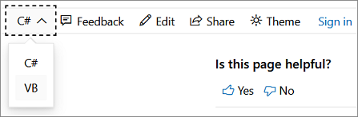

# Step 6: Add a timer
Next, you add a <xref:System.Windows.Forms.Timer> control to the matching game. A timer waits a specified number of milliseconds, and then fires an event, referred to as a *tick*. This is useful for starting an action, or repeating an action on a regular basis. In this case, you'll use a timer to enable players to choose two icons, and if the icons don't match, hide the two icons again after a short period of time.

## To add a timer

1. From the toolbox in **Windows Forms Designer**, choose **Timer** (in the **Components** category) and then choose the **Enter** key, or double-click the timer to add a timer control to the form. The timer's icon, called **Timer1**, should appear in a space below the form, as shown in the following image.

      
***Timer***

    > [!NOTE]
    > If the toolbox is empty, be sure to select the form designer, and not the code behind the form, before opening the toolbox.

2. Choose the **Timer1** icon to select the timer. In the **Properties** window, switch from viewing events to viewing properties. Then, set the timer's **Interval** property to **750**, but leave its **Enabled** property set to **False**. The **Interval** property tells the timer how long to wait between *ticks*, or when it triggers its <xref:System.Windows.Forms.Timer.Tick> event. A value of 750 tells the timer to wait three quarters of a second (750 milliseconds) before it fires its Tick event. You'll call the <xref:System.Windows.Forms.Timer.Start> method to start the timer only after the player chooses the second label.

3. Choose the timer control icon in **Windows Forms Designer** and then choose the **Enter** key, or double-click the timer, to add an empty Tick event handler. Either replace the code with the following code, or manually enter the following code into the event handler.

     [!code-csharp[VbExpressTutorial4Step6#7](../ide/codesnippet/CSharp/step-6-add-a-timer_1.cs)]
     [!code-vb[VbExpressTutorial4Step6#7](../ide/codesnippet/VisualBasic/step-6-add-a-timer_1.vb)]

      > [!IMPORTANT]
      > Use the programming language control at the top right of this page to view either the C# code snippet or the Visual Basic code snippet.  

     The Tick event handler does three things: First, it makes sure the timer isn't running by calling the <xref:System.Windows.Forms.Timer.Stop> method. Then it uses two reference variables, `firstClicked` and `secondClicked`, to make the icons of the two labels that the player chose invisible again. Finally, it resets the `firstClicked` and `secondClicked` reference variables to `null` in C# and `Nothing` in Visual Basic. This step is important because it's how the program resets itself. Now it's not keeping track of any <xref:System.Windows.Forms.Label> controls, and it's ready for the player to choose a label again.

    > [!NOTE]
    > A Timer object has a `Start()` method that starts the timer, and a `Stop()` method that stops it. When you set the timer's **Enabled** property to **True** in the **Properties** window, it starts ticking as soon as the program begins. But when you leave it set to **False**, it doesn't start ticking until its `Start()` method is called. Normally, a timer fires its Tick event over and over again, using the **Interval** property to determine how many milliseconds to wait between ticks. You may have noticed how the timer's `Stop()` method is called inside the Tick event. That puts the timer into *one shot mode*, meaning that when the `Start()` method is called, it waits for the specified interval, triggers a single Tick event, and then stops.

4. To see the new timer in action, go to the code editor and add the following code to the top and bottom of the `label_Click()` event handler method. (You're adding an `if` statement to the top, and three statements to the bottom; the rest of the method stays the same.)

     [!code-csharp[VbExpressTutorial4Step6#8](../ide/codesnippet/CSharp/step-6-add-a-timer_2.cs)]
     [!code-vb[VbExpressTutorial4Step6#8](../ide/codesnippet/VisualBasic/step-6-add-a-timer_2.vb)]

     The code at the top of the method checks whether the timer was started by checking the value of the **Enabled** property. That way, if the player chooses the first and second Label controls and the timer starts, choosing a third label won't do anything.

     The code at the bottom of the method sets the `secondClicked` reference variable to track the second Label control that the player chose, and then it sets that label's icon color to black to make it visible. Then, it starts the timer in one shot mode, so that it waits 750 milliseconds and then fires a single Tick event. The timer's Tick event handler hides the two icons and resets the `firstClicked` and `secondClicked` reference variables so the form is ready for the player to choose another pair of icons.

5. Save and run your program. Choose an icon, and it becomes visible.

6. Choose another icon. It appears briefly, and then both icons disappear. Repeat this numerous times. The form now keeps track of the first and second icons that you choose, and uses the timer to pause before making the icons disappear.

## To continue or review

- To go to the next tutorial step, see **[Step 7: Keep pairs visible](../ide/step-7-keep-pairs-visible.md)**.

- To return to the previous tutorial step, see [Step 5: Add label references](../ide/step-5-add-label-references.md).
