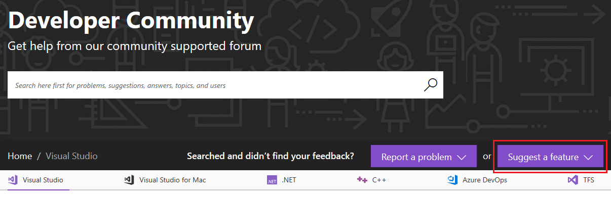
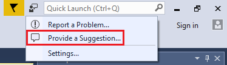
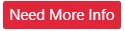
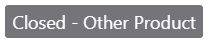
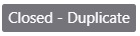
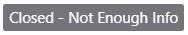
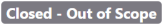
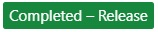

# Suggest a feature for Visual Studio

We've introduced a new experience for suggesting features alongside the current ability to report problems on [Visual Studio Developer Community](https://aka.ms/feedback/suggest?space=8). This is a new way you can be empowered to engage directly with Visual Studio's engineering workflow.

You can also start a feature suggestion directly from Visual Studio by choosing **Provide a Suggestion** from the **Provide Feedback** icon near the top right of the main Visual Studio window:

Choosing **Provide a Suggestion** takes you to [Developer Community](https://aka.ms/feedback/suggest?space=8), where you can enter your suggestion.

## Suggestion status

After you submit a feature suggestion, states indicate where your feature submission is in its lifecycle. As we take your feedback into consideration and move it along the workflow, we tag it with the corresponding state. The various states associated with feature suggestions are listed here, along with a description of their meaning and color indicators.

- - -
| **State** | **Description**                                                                                                         |
|-------------|-------------------------------------------------------------------------------------------------------------------------|
|            | **New** means the suggestion has been newly reported from you or someone else. No action has been taken on it yet. The front line will do some preliminary checks to make sure we can proceed further. Expect to hear from us in about five business days with our next steps.                    |
|             | **Under Review** indicates that the feature suggestion has been queued up for prioritization. We prioritize features to bring our broader developer community the best value, also taking the product roadmap into consideration. Even if we're unable to pursue your new feature suggestion immediately, we'll continue to monitor your idea for about 90 days, let the community weigh in, and then make a decision on the next steps.                    |
|         | **On Roadmap** means that your feature suggestion has a broad community impact and will help improve the product experience. We've allocated time for it on our roadmap. We'll update you on the progress.                   |
|            | A feature suggestion marked **Need More Info** means that we need more details so we can better understand your suggestion. Check the comments, where we'll ask for additional information to get a deeper understanding.                    |
|            | **Closed - Other Product** means we're unable to address your feature suggestion at this time because it's not applicable to the product it was reported for. However, we'll provide details on where you can share your new feature suggestion for the appropriate product.                    |
|            | **Closed - Duplicate** indicates that someone else has already suggested the same feature. Review the comments to find the link to the existing feature suggestion. Votes and comments have been merged in the original suggestion. Follow the original suggestion.                    |
|            | **Closed - Not Enough Info** indicates that after several attempts, we haven't received enough information to understand your feature suggestion fully. We have to close the new feature suggestion as we're unable to take any further action at this stage. Found the information we were looking for? You may request to reactivate the ticket when you have the additional information.                    |
|             | **Closed - Out of Scope** If a suggestion doesn’t match our overall product direction, we will close it as *Out of Scope*. For example, we may have similar investments in other members of the Visual Studio family of products. Or the feature suggested might only be relevant to a few people, making an extension better suited to provide it.                    |
|             | **Completed - Preview** indicates that we implemented the feature you suggested. You can download a preview version of Visual Studio that contains your suggestion using the link provided in the comments.                    |
|             | **Completed - Release** indicates that your new feature suggestion has been released in the latest product update. The Visual Studio update can be downloaded using the link provided in the comments.                        |

- - -

## Related content

- [Introducing 'Suggest a Feature' in Developer Community (Visual Studio blog)](https://devblogs.microsoft.com/visualstudio/introducing-suggest-a-feature-in-developer-community/?utm_source=vs_developer_news&utm_medium=referral)
