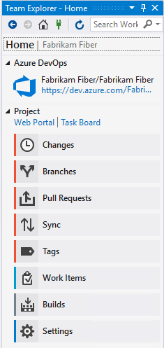
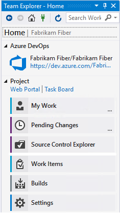

# Team Explorer reference

This article provides links to Azure DevOps articles about the various functions in **Team Explorer**.

Use the **Team Explorer** tool window to coordinate your code efforts with other team members to develop a project, and to manage work that's assigned to you, your team, or your projects. **Team Explorer** connects Visual Studio to Git and GitHub repositories, Team Foundation version control (TFVC) repositories, and projects hosted on [Azure DevOps Services](/azure/devops/user-guide/what-is-azure-devops-services) or an on-premises [Azure DevOps Server](/azure/devops/index-all) (formerly known as Team Foundation Server, or TFS). You can manage source code, work items, and builds.

> [!IMPORTANT]
> Starting with the release of Visual Studio 2019 [**version 16.8**](/visualstudio/releases/2019/release-notes-history), the Git version control experience is the default. If you'd like to learn more about how it compares with Team Explorer, see the [**Side-by-side comparison of Git and Team Explorer**](../version-control/git-team-explorer-feature-comparison.md) page.

## Home page

After you [connect to a project](connect-team-project.md) in **Team Explorer**, the following links become available in the **Project** section:

- [Clone repository](/azure/devops/repos/git/clone)
- [Web Portal](/azure/devops/project/navigation/index)
- [Task Board](/azure/devops/boards/sprints/task-board)

The **Home** page has different functions depending on whether you're connected to a [Git](/azure/devops/repos/git/gitquickstart?view=vsts&tabs=visual-studio&preserve-view=true) or [Team Foundation Version Control (TFVC)](/azure/devops/repos/tfvc/overview) repository.

> [!TIP]
> For a comparison of the two version control systems, see [Choose the right version control for your project (Azure DevOps)](/azure/devops/repos/tfvc/comparison-git-tfvc).

| **Home** page with Git | **Home** page with TFVC |
| - | - |
|  |  |

## Changes page (Git)

See [Save work with commits](/azure/devops/repos/git/commits).

## Branches page (Git)

See [Create work in branches](/azure/devops/repos/git/branches).

## Pull Requests page (Git)

See [Review code with pull requests](/azure/devops/repos/git/pullrequest).

## Sync page (Git)

See [Update code with fetch and pull](/azure/devops/repos/git/pulling).

## Tags page (Git)

See [Work with Git tags](/azure/devops/repos/git/git-tags).

## My Work page (TFVC)

See [Suspend/resume work](/azure/devops/repos/tfvc/suspend-your-work-manage-your-shelvesets) and [Code review](/azure/devops/repos/tfvc/day-life-alm-developer-suspend-work-fix-bug-conduct-code-review).

## Pending Changes page (TFVC)

See [Manage pending changes](/azure/devops/repos/tfvc/develop-code-manage-pending-changes), [Find shelvesets](/azure/devops/repos/tfvc/suspend-your-work-manage-your-shelvesets), and [Resolve conflicts](/azure/devops/repos/tfvc/resolve-team-foundation-version-control-conflicts).

## Source Control Explorer page (TFVC)

See [Add/view files and folders](/azure/devops/repos/tfvc/add-files-server).

## Work Items page

The **Work Items** page lets you see [work item](/azure/devops/boards/work-items/about-work-items) queries. See:

- [Add work items](/azure/devops/boards/backlogs/add-work-items)
- [Use the query editor to list and manage queries](/azure/devops/boards/queries/using-queries)
- [Organize query folders and set query permissions](/azure/devops/boards/queries/set-query-permissions)
- [Open query in Excel](/azure/devops/boards/backlogs/office/bulk-add-modify-work-items-excel)

- [Open query in Project](/previous-versions/azure/devops/boards/backlogs/office/create-your-backlog-tasks-using-project)
- [Email query results list using Outlook](/azure/devops/boards/queries/share-plans)
- [Create reports from query in Excel](/azure/devops/report/excel/create-status-and-trend-excel-reports) (TFS only)

::: moniker range=">= vs-2019"

> [!NOTE]
> Starting with Visual Studio 2019 and continuing with later versions, there's a new [Work Items experience](/azure/devops/boards/work-items/set-work-item-experience-vs). For information, see [View and add work items](/azure/devops/boards/work-items/view-add-work-items).

::: moniker-end

## Builds page

The **Builds** page lets you see build definitions for the project.

See:

- [Create build pipelines](/azure/devops/pipelines/tasks/index)
- [View and manage builds](/azure/devops/pipelines/overview)
- [Manage the build queue](/azure/devops/pipelines/agents/pools-queues)
- [Install continuous delivery (CD) tools for Visual Studio](/azure/devops/pipelines/apps/cd/azure/aspnet-core-to-acr#install-continuous-delivery-cd-tools-for-visual-studio-2017)
- [Configure and execute continuous delivery (CD) for your app](/azure/devops/pipelines/apps/cd/azure/aspnet-core-to-acr#configure-and-execute-continuous-delivery-cd-for-your-app)

## Settings page

The **Settings** page lets you configure administrative features for either a project or project collection. See the following articles:

| Project | Project Collection | Other |
| - | - | - |
| [Security, Group Membership](/azure/devops/organizations/security/set-project-collection-level-permissions) [Security, Source Control (TFVC)](/azure/devops/organizations/security/set-git-tfvc-repository-permissions) [Work Item Areas](/azure/devops/organizations/settings/set-area-paths) [Work Item Iterations](/azure/devops/organizations/settings/set-iteration-paths-sprints) [Portal Settings](/azure/devops/report/sharepoint-dashboards/configure-or-add-a-project-portal) [Project Alerts](/azure/devops/organizations/notifications/manage-team-group-global-organization-notifications) | [Security, Group Membership](/azure/devops/organizations/security/set-project-collection-level-permissions) [Source Control (TFVC)](/azure/devops/repos/tfvc/decide-between-using-local-server-workspace) [Process Template Manager](/azure/devops/boards/work-items/guidance/manage-process-templates) | [Git Global Settings](/azure/devops/repos/git/git-config) [Git Repository Settings](/azure/devops/repos/git/git-config) |

## See also

- [Connect to projects in Team Explorer](connect-team-project.md)
