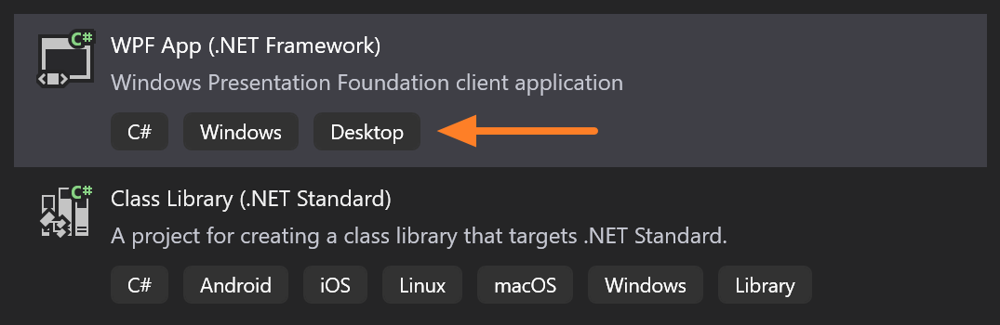
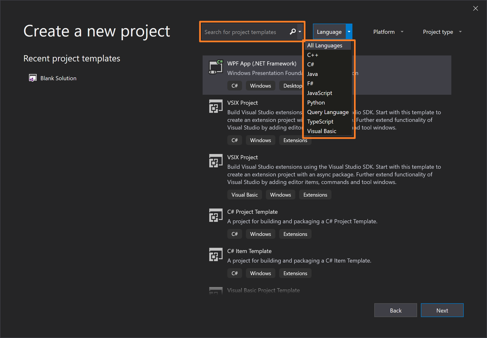

# Add tags to project templates

Starting in [Visual Studio 2019](https://aka.ms/vs/download/?cid=learn-onpage-download-cta) version 16.1 Preview 2, you can add language, platform, and project type tags to your project templates. 

Tags are used in two places in the **New Project** dialog box:

- Tags appear under the template description.

   

- Tags enable the template to be searched and filtered.

   

You can add tags by updating the *.vstemplate* XML file. You can either use template tags that are built into Visual Studio or create custom template tags. Template tags appear only in the Visual Studio 2019 **New Project** dialog box. Template tags don't affect how the template renders in earlier versions of Visual Studio.

## Add or edit tags

You might want to add or edit tags in your project template's *.vstemplate* XML when you take one of the following actions:

* [Create a new project template](how-to-create-project-templates.md) by using the Export Template wizard.
* [Update your existing project template](how-to-update-existing-templates.md).
* [Create a new VSIX project template](../extensibility/getting-started-with-the-vsix-project-template.md).

## Syntax

```xml
<LanguageTag> Language Name </LanguageTag>
<PlatformTag> Platform Name </PlatformTag>
<ProjectTypeTag> Project Type </ProjectTypeTag>
```

## Attributes

You can use the following optional attributes in advanced user scenarios:

|Attribute|Description|
|---------------|-----------------|
|`Package`|A GUID that specifies the Visual Studio package ID.|
|`ID`|Specifies the Visual Studio resource ID.|

Syntax:

```xml
<LanguageTag Package="{PackageID}" ID="ResourceID" />
<PlatformTag Package="{PackageID}" ID="ResourceID" />
<ProjectTypeTag Package="{PackageID}" ID="ResourceID" />
```

## Elements

### Child elements

None.

### Parent elements

|Element|Description|
|-------------|-----------------|
|[TemplateData](../extensibility/templatedata-element-visual-studio-templates.md)|(Required) Categorizes the template and defines how it displays in either the **New Project** dialog box or the **Add New Item** dialog box.|

## Text value

A text value is required unless you use the `Package` and `ID` attributes.

The text provides the name of the template.

## Built-in tags

Visual Studio offers a list of built-in tags. When you add a built-in tag, the tag renders a localized resource. 

The following list shows built-in tags that are available in Visual Studio. Corresponding values are shown in parentheses.

| Language tag | Platform tag | Project type tag |
| -- | -- | -- |
| C++ (`cpp`) | Android (`android`) | Cloud (`cloud`) |
| C# (`csharp`) | Azure (`azure`) | Console (`console`) |
| F# (`fsharp`) | iOS (`ios`) | Desktop (`desktop`) |
| Java (`java`) | Linux (`linux`) | Extensions (`extension`) |
| JavaScript (`javascript`) | macOS (`macos`) | Games (`games`) |
| Python (`python`) | tvOS (`tvos`) | IoT (`iot`) |
| Query Language (`querylanguage`) | Windows (`windows`) | Library (`library`) |
| TypeScript (`typescript`) | Windows App SDK (`windowsappsdk`) | Machine Learning (`machinelearning`) |
| Visual Basic (`visualbasic`) | Xbox (`xbox`) | Mobile (`mobile`) |
| XAML (`xaml`) | | Office (`office`) |
| | | Other (`other`) |
| | | Service (`service`) |
| | | Test (`test`) |
| | | UWP (`uwp`) |
| | | Web (`web`) |
| | | WinUI (`winui`) |

## Example

The following example shows the metadata for a project template for a Visual C# application:

```xml
<VSTemplate Type="Project" Version="3.0.0"
    xmlns="http://schemas.microsoft.com/developer/vstemplate/2005">
    <TemplateData>
        <Name>My template</Name>
        <Description>A basic template</Description>
        <Icon>TemplateIcon.ico</Icon>
        <ProjectType>csharp</ProjectType>
        <LanguageTag>csharp</LanguageTag>
        <PlatformTag>windows</PlatformTag>
        <PlatformTag>linux</PlatformTag>
        <PlatformTag>My Platform</PlatformTag>
        <ProjectTypeTag>console</ProjectTypeTag>
        <ProjectTypeTag>desktop</ProjectTypeTag>
    </TemplateData>
    <TemplateContent>
        <Project File="MyTemplate.csproj">
            <ProjectItem>Form1.cs<ProjectItem>
            <ProjectItem>Form1.Designer.cs</ProjectItem>
            <ProjectItem>Program.cs</ProjectItem>
            <ProjectItem>Properties\AssemblyInfo.cs</ProjectItem>
            <ProjectItem>Properties\Resources.resx</ProjectItem>
            <ProjectItem>Properties\Resources.Designer.cs</ProjectItem>
            <ProjectItem>Properties\Settings.settings</ProjectItem>
            <ProjectItem>Properties\Settings.Designer.cs</ProjectItem>
        </Project>
    </TemplateContent>
</VSTemplate>
```

## See also

- [Visual Studio template schema reference](../extensibility/visual-studio-template-schema-reference.md)
- [Create project and item templates](creating-project-and-item-templates.md)
- [Customize project and item templates](customizing-project-and-item-templates.md)
- [Get started with the VSIX project template](../extensibility/getting-started-with-the-vsix-project-template.md)
