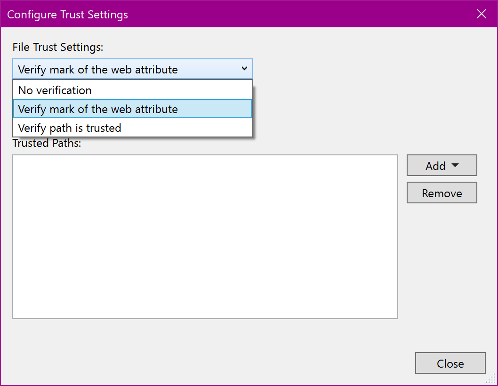
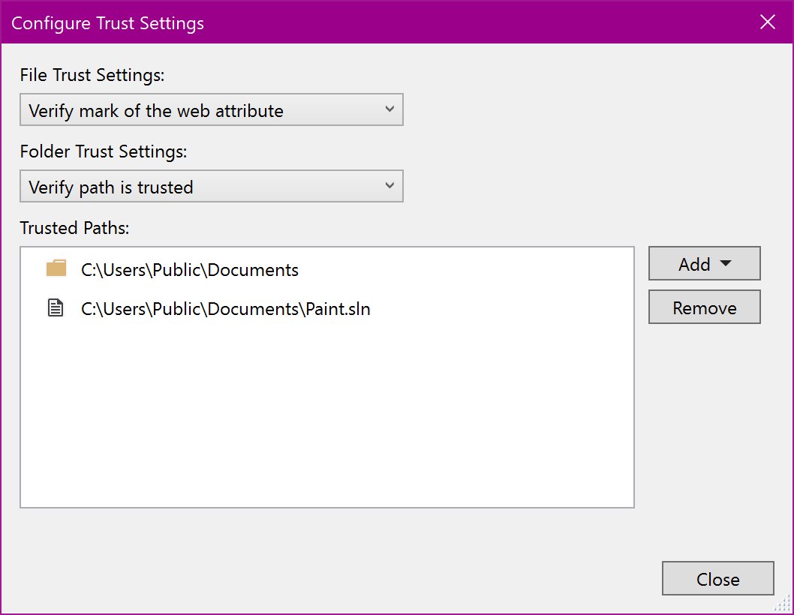

# Configure trust settings for files and folders

In previous versions of Visual Studio, projects with the mark of the web were blocked from opening until the user explicitly approved them. To help you keep your Visual Studio secure, we've extended this type of check to include the opening of files and folders.

These additional checks are disabled by default.

> [!WARNING]
> You should still ensure any files, folders or solutions come from a trusted person or a trusted location before approving them. 

## Configure your trust settings
To change your trust settings, follow these steps:

1. Open **Tools** > **Options** > **Trust Settings** and click on the **Configure Trust Settings** link in the pane.
2. Choose what level of checks you'd like for files and folders. You can have different checks for each one. Your options are:
    * No verification: Visual Studio won't perform any checks.
    * Verify mark of the web attribute: Visual Studio will block and ask for permission to open if the file or folder has the mark of the web attribute.
    * Verify path is trusted: Visual Studio will block and ask for permission to open if the file or folder path isn't part of the Trusted Paths list.

## Add trusted paths
To add trusted paths, follow these steps:

1.  Open **Tools** > **Options** > **Trust Settings** and click on the **Configure Trust Settings** link in the pane.
2.  Click **Add** in the Trust Settings dialog and select **File** or **Folder**.
3.  Navigate to and select the file or folder you'd like to add to the trusted list using the File/Folder Explorer.
4.  Your path will now appear in the Trusted Paths list.

## Remove trusted paths
To remove trusted paths, follow these steps:
1.  Open **Tools** > **Options** > **Trust Settings** and click on the **Configure Trust Settings** link in the pane.
2.  Select the path you'd like to remove in the Trusted Paths list and click **Remove** in the Trust Settings dialog.
    * To select multiple entries, hold down **Shift** as you click on the paths.
3.  The selected path(s) are removed from the Trusted Paths list. 
