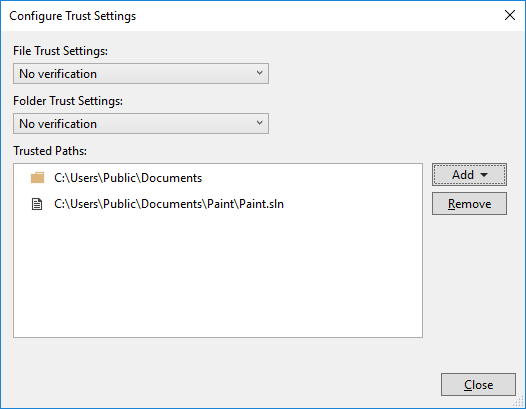

# Configure trust settings for files and folders

::: moniker range=">=vs-2022"

Visual Studio 2022 and later features enhanced **trust settings** functionality. If untrusted code is opened in the IDE, a warning dialog displays. Mark of the web (MotW) security warnings are also integrated into the overall trust functionality.

Software developers are increasingly being targeted by malware. The trust settings functionality aims to raise awareness about the risks of handling unfamiliar code, and helps protect against malicious actors, who are targeting scenarios ranging from opening content (for example, repositories, solutions, projects, and files) to building and running applications with Visual Studio. 

By default, Visual Studio displays a security warning when the [**Mark of the Web** identifier](#when-opening-content-from-the-web-mark-of-the-web) is detected. However, this default behavior can be customized to [always show a security warning](#always-require-a-trust-decision), regardless of the content's original location.

## Customize trust settings

You can customize the trust policies to configure the security settings for opening content in Visual Studio.

### When opening content from the web (Mark of the Web)

Visual Studio shows a security warning when you try to open content tagged with the Mark of the Web (MotW) identifier. The trust-related alert informs you of the possible security risks associated with opening files from potentially unsafe sources, such as internet downloads.

:::image type="content" source="media/vs-2022/web-content-alert.png" alt-text="Screenshot showing the mark of the web alert.":::

:::moniker-end

:::moniker range="visualstudio"

You can modify the default trust experience in the **Tools** > **Options** pane, under the **All Settings** > **Environment** > **Security** > **Trust** section.

:::image type="content" source="media/visualstudio/web-content-trust-settings.png" alt-text="Screenshot that shows how to modify the Security options related to opening content from the web.":::

:::moniker-end
:::moniker range="vs-2022"

You can modify the default trust experience in the **Tools** > **Options** dialog, under the **Environment** > **Security** section.

:::image type="content" source="media/vs-2022/web-content-trust-settings.png" alt-text="Screenshot showing how to modify the Security options related to opening content from the web.":::

:::moniker-end

::: moniker range=">=vs-2022"

The Mark of the Web is a security feature used by Windows to identify files that originate from the internet. When you download a file, Windows adds this identifier to the file's metadata, signaling that the content might be unsafe to execute or open. Visual Studio uses this identifier to protect your development environment from potential threats.

:::moniker-end

:::moniker range="visualstudio"

### Always require a trust decision

When you enable the **Require a trust decision before opening content** option and set the **Trust decision prompt** to **Always ask**, Visual Studio detects if you're attempting to open content that isn't designated as *trusted*. A dialog warns you about the security implications.

To enable the **Always ask** prompt, follow these steps:

1. Open the **Tools** > **Options** pane and expand the **All Settings** > **Environment** > **Security** > **Trust** section.

1. Select the **Require a trust decision before opening content** checkbox.

1. Use the dropdown list and set the **Trust decision prompt** option to **Always ask**.

   :::image type="content" source="media/visualstudio/trusted-settings-options.png" alt-text="Screenshot that shows how to enable the Trust decision prompt to Always ask.":::

> [!NOTE]
> The **Skip trust checks for temporary locations Visual Studio creates automatically** option isn't enabled by default. This option has no effect unless the **Trust decision prompt** option is set to **Always ask**.

:::moniker-end
:::moniker range="vs-2022"

### Always require a trust decision

When you enable the **Always require a trust decision** option, Visual Studio detects if you're attempting to open content that isn't designated as *trusted*. You see a dialog that warns you about the security implications.

To enable the **Always require a trust decision** feature, follow these steps:

1. Open the **Tools** > **Options** dialog and expand the **Environment** > **Security** section.

1. In the **Trust Policies** pane, select **Always require a trust decision** in the **Require a trust decision** dropdown.

:::image type="content" source="media/vs-2022/trusted-settings-options-dialog.png" alt-text="Screenshot showing how to enable trusted locations by using the trust settings options.":::

> [!NOTE]
> The **Skip trust checks for temporary locations Visual Studio creates automatically** option isn't enabled by default. It has no effect unless the **Always require a trust decision** option is also enabled.

:::moniker-end

::: moniker range=">=vs-2022"

:::image type="content" source="media/vs-2022/trusted-settings-warning-dialog.png" alt-text="Screenshot of the trust settings warning dialog.":::

## Manage trust settings

Here's how to add trusted locations, and to remove them.

### Add trusted locations

After you enable the trust settings, all content that you open with Visual Studio is considered untrusted until you add it to the list of trusted locations. You can trust a folder location directly from the *warning* dialog. Here's how:

1. Choose the folder you want to trust (the current folder or the parent folder) from the **Trust level** dropdown list.

   :::image type="content" source="media/vs-2022/trust-folder-trust-level.png" alt-text="Screenshot showing how to trust a folder from the warning dialog.":::

:::moniker-end

:::moniker range="visualstudio"

2. Select **Trust and continue** on the dialog.

   Visual Studio adds the folder path to the **Trusted Locations** list in the **Tools** > **Options** pane under the **All Settings** > **Environment** > **Security** > **Trust** section.

:::moniker-end
:::moniker range="vs-2022"

2. Select the **Trust and continue** button on the dialog.

   Visual Studio adds the folder path to the **Trusted locations** list in the **Tools** > **Options** dialog under the **Environment** > **Security** section.

:::moniker-end

:::moniker range="visualstudio"

You can also add folders to the **Trusted Locations** from the **Trust Settings** dialog. Here's how:

1. Open the **Tools** > **Options** pane and expand the **All Settings** > **Environment** > **Security** > **Trust** section.

   (The pane opens to the same location when you select **Manage trust settings** in the *warning* dialog.)

1. On the toolbar for the **Trusted Locations** list, select **+ Add**.

1. In the **Add item** dialog, select **More actions** (**...**) for the **Path** setting. Browse to and select the folder you want to add to the trusted list, and then select **Save**.

   :::image type="content" source="media/visualstudio/add-trusted-location.png" alt-text="Screenshot that shows how to a folder as a trusted location.":::

   The folder path appears in the **Trusted Locations** list. In the **Trusted By** column, the folder you added shows **User** as the trust setting.
   
   :::image type="content" source="media/visualstudio/trusted-locations.png" alt-text="Screenshot showing a folder added to the Trusted Locations list with the User trusted by setting.":::

After you configure the **Trust** options, the folder path for any content you create in Visual Studio is automatically added to the **Trusted Locations** list. Every automatically added folder path shows **System** as the trust setting in the **Trusted By** column.
 
:::image type="content" source="media/visualstudio/trusted-by-values.png" alt-text="Screenshot that shows User and System level trust settings in the Trusted Locations list.":::

:::moniker-end
:::moniker range="vs-2022"

You can also add folders to **Trusted locations** from the **Trust Settings** dialog. Here's how:

1. Open the **Tools** > **Options** dialog and expand the **Environment** > **Security** section.

   (The pane opens to the same location when you select **Manage trust settings** in the *warning* dialog.)

1. Next to the **Trusted locations** list, select **Add a Folder**.

1. In the **Browse** dialog, locate the folder you want to add to the trusted list, highlight the folder, and then select **Select folder**.

   The folder path appears in the **Trusted locations** list. In the **Trusted By** column, the folder you added shows **Local User** as the trust setting.
   
   :::image type="content" source="media/vs-2022/trusted-locations.png" alt-text="Screenshot showing a folder added to the Trusted locations list.":::

After you configure the **Trust** options, the folder path for any content you create in Visual Studio is automatically added to the **Trusted locations** list. Every automatically added folder path shows **System** as the trust setting in the **Trusted By** column.

:::image type="content" source="media/vs-2022/trusted-by-values.png" alt-text="Screenshot showing Local User and System level trust settings in the Trusted locations list.":::

:::moniker-end

:::moniker range=">=vs-2022"

### Remove trusted locations

To remove trusted locations, follow these steps:

:::moniker-end

:::moniker range="visualstudio"

1. Open the **Tools** > **Options** pane and expand the **All Settings** > **Environment** > **Security** > **Trust** section.

1. In the **Trusted Locations** list, highlight the path you want to remove, and then select **Remove**.

   You can remove multiple entries at the same time with multi-select. Use **Shift** while you highlight the paths.

The selected paths are removed from the **Trusted Locations** list.

:::moniker-end
:::moniker range="vs-2022"

1. Open the **Tools** > **Options** dialog and expand the **Environment** > **Security** section.

1. In the **Trusted locations** list, highlight the path you want to remove, and then select **Remove**.

   You can remove multiple entries at the same time with multi-select. Use **Shift** while you highlight the paths.

The selected paths are removed from the **Trusted locations** list.

:::moniker-end

::: moniker range="<=vs-2019"

Visual Studio prompts for user approval before opening projects that have the [Mark of the Web](/previous-versions/windows/internet-explorer/ie-developer/compatibility/ms537628(v=vs.85)). For added security, you can also configure Visual Studio to prompt for user approval before opening any file or folder that has the mark of the web attribute, or that isn't designated as *trusted*. File and folder checks are disabled by default.

> [!WARNING]
> You should still ensure that the file, folder, or solution comes from a trusted person or a trusted location before approving it.

> [!NOTE]
> In Visual Studio 2022 and later, the Trust Settings functionality is enhanced to show a warning whenever you attempt to open untrusted code in files, folders, projects, and solutions in the IDE. This feature is disabled by default. To learn more, see the recent [Visual Studio version of this page](?view=vs-2022&preserve-view=true).

## Configure trust settings

To change trust settings, follow these steps:

1. Open **Tools** > **Options** > **Trust Settings** and select the **Configure Trust Settings** link in the right-hand pane.

2. Choose the level of checks you'd like for files and folders. You can have different checks for each one. The options are:

   * **No verification**: Visual Studio doesn't perform any checks.

   * **Verify mark of the web attribute**: If the file or folder has the mark of the web attribute, Visual Studio blocks and asks for permission to open.

   * **Verify path is trusted**: If the file or folder path isn't part of the **Trusted Paths** list, Visual Studio blocks and asks for permission to open.

   

## Add trusted paths

To add trusted paths, follow these steps:

1. Open **Tools** > **Options** > **Trust Settings** and select the **Configure Trust Settings** link in the right-hand pane.

2. Click **Add** in the **Trust Settings** dialog, and then select **File** or **Folder**.

3. Navigate to and select the file or folder you want to add to the trusted list.

   The file or folder path appears in the **Trusted Paths** list.

   

## Remove trusted paths

To remove trusted paths, follow these steps:

1. Open **Tools** > **Options** > **Trust Settings** and select the **Configure Trust Settings** link in the right-hand pane.

2. Select the path you'd like to remove in the **Trusted Paths** list, and then click **Remove**.

   > [!TIP]
   > To select multiple entries, hold down **Shift** while you select the paths.

   The selected paths are removed from the **Trusted Paths** list.

::: moniker-end

## See also

[Build an application in Visual Studio](walkthrough-building-an-application.md)
