# Getting started with C# and ASP.NET in Visual Studio
In this tutorial for C# development with ASP.NET Core using Visual Studio, you'll create a C# ASP.NET Core web app, add code to it, explore some features of the IDE, and run the app.

If you haven't already installed Visual Studio, go to the [Visual Studio downloads](https://aka.ms/vsdownload?utm_source=mscom&utm_campaign=msdocs) page to install it for free.

## Before you begin
Here's a quick FAQ to introduce you to some key concepts.
### What is C#?
[C#](/dotnet/csharp/getting-started/introduction-to-the-csharp-language-and-the-net-framework) is a type-safe and object-oriented programming language that's designed to be both robust and easy to learn.
### What is ASP.NET Core?
ASP.NET Core is an open-source and cross-platform framework for building internet-connected applications, such as web apps and services. ASP.NET Core apps can run on either .NET Core or the .NET Framework. You can develop and run your ASP.NET Core apps cross-platform on Windows, Mac, and Linux. ASP.NET Core is open source at [GitHub](https://github.com/aspnet/home).
### What is Visual Studio?
Visual Studio is an integrated development suite of productivity tools for developers. Think of it as a program you can use to create programs and applications.  

## Start developing
Ready to start developing? Let's go!

### Create a project
First, you'll create a ASP.NET Core project. The project type comes with all the template files you'll need, before you've even added anything.

1. Open Visual Studio 2017.

2. From the top menu bar, choose **File** > **New** > **Project...**.

3. In the **New Project** dialog box in the left pane, expand **Visual C#**, expand **Web**, and then choose **.NET Core**. In the middle pane, choose **ASP.NET Core Web Application**, name the file *MyCoreApp*, and then choose **OK**.   

   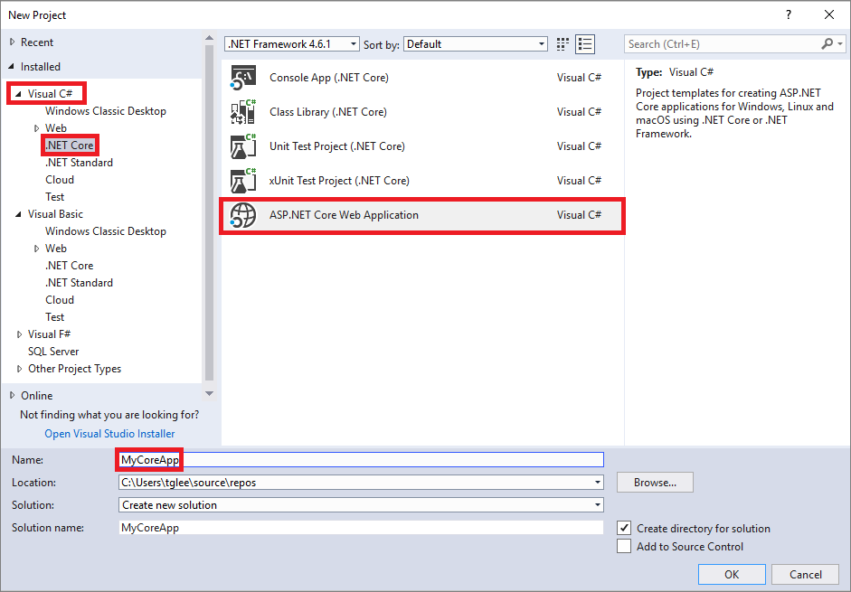

#### Add a workload (optional)
If you don't see the **ASP.NET Core Web Application** project template, you can get it by adding the **ASP.NET and web development** workload. You can add this workload in one of the two following ways, depending on which Visual Studio 2017 updates are installed on your machine.

##### Option 1: Use the New Project dialog box
1. Click the **Open Visual Studio Installer** link in the left pane of the **New Project** dialog box.

  

2. The Visual Studio Installer launches. Choose the **ASP.NET and web development** workload, and then choose **Modify**.

   

##### Option 2: Use the Tools menu bar
1. Cancel out of the **New Project** dialog box and from the top menu bar, choose **Tools** > **Get Tools and Features...**.

2. The Visual Studio Installer launches. Choose the **ASP.NET and web development** workload, and then choose **Modify**.   

#### Add a project template
1. In the **New ASP.NET Core Web Application** dialog box, choose the **Web Application (Model-View-Controller)** project template.  

2. Select **ASP.NET Core 2.0** from the top drop-down menu. (If you don't see **ASP.NET Core 2.0** in the list, install it by following the **Download** link that should appear in a yellow bar near the top of the dialog box.) Choose **OK**.

   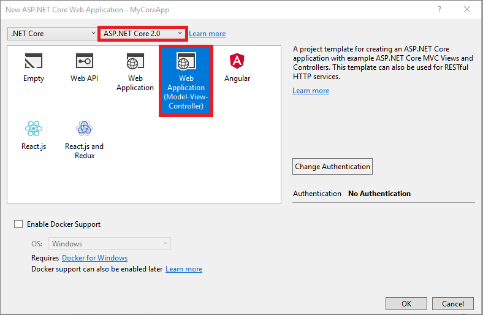

### About your solution
This solution follows the Model-View-Controller (MVC) architectural pattern that separates an app into three main components:

* **Models** include classes that represent the data of the app. The model classes use validation logic to enforce business rules for that data. Typically, model objects retrieve and store model state in a database.
* **Views** are the components that display the app's user interface (UI). Generally, this UI displays the model data.
* **Controllers** include classes that handle browser requests. They retrieve model data and call view templates that return a response. In an MVC app, the view displays only the information; the controller handles and responds to user input and interaction.

The MVC pattern helps you create apps that are easier to test and update than traditional monolithic apps.

### Tour your solution
1. The project template creates a solution with a single ASP.NET Core project that is named **MyCoreApp**. Expand the project node to expose its contents.

    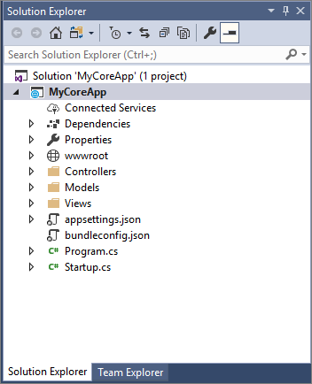

1. Open the **HomeController.cs** file from the **Controllers** folder.

      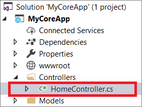

2. View the **HomeController.cs**

  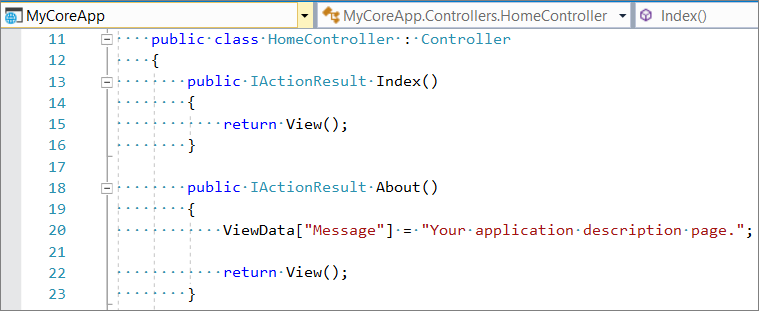

4. The project also has a **Views** folder that contains other folders that map to each controller (as well as one for **Shared** views). For example, the view CSHTML file (an extension of HTML) for the **/Home/About** path would be at **Views/Home/About.cshtml**. Open that file.

  

5. This CSHTML file uses the Razor syntax to render HTML based on a combination of standard tags and inline C#.

  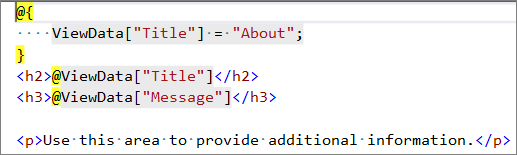

 >[!NOTE]
 > To learn more about this, see the [Getting started with C# and ASP.NET using the Razor syntax](/aspnet/web-pages/overview/getting-started/introducing-razor-syntax-c) page.

6. The solution also contains a **wwwroot** folder that is the root for your web site. You can put static site content, such as CSS, images, and JavaScript libraries, directly at the paths you'd want them to be at when the site is deployed.

 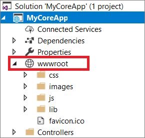

7. There are also a variety of configuration files that serve to manage the project, its packages, and the application at runtime. For example, the default application [configuration](/aspnet/core/fundamentals/configuration) is stored in **appsettings.json**. However, you can override some/all of these settings on a per-environment basis, such as by providing an **appsettings.Development.json** file for the **Development** environment.

 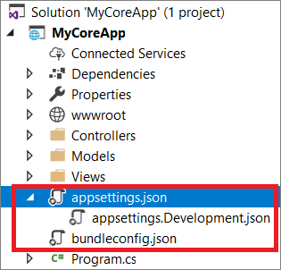

## Run and debug the application

1. Choose the **IIS Express** button in the IDE to build and run the app in Debug mode. (Alternatively, press **F5**, or choose **Debug > Start Debugging** from the menu bar.)

  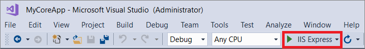

  > [!NOTE]
  > If you get an error message that says **Unable to connect to web server 'IIS Express'**, close Visual Studio and then open it by using the **Run as administrator** option from the right-click or context menu. Then, run the application again.

1. Visual Studio launches a browser window. Select **About**.

 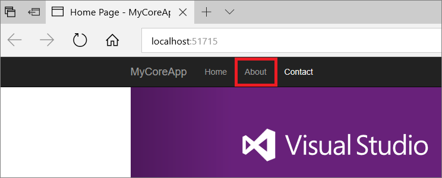

 Among other things, the About page in the browser renders the text that is set in the HomeController.cs file.

   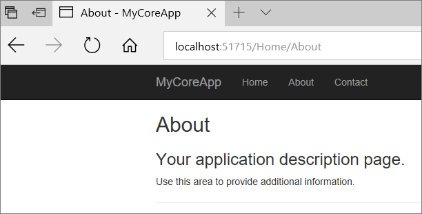

1. Keep the browser window open and return to Visual Studio. Open **Controllers/HomeController.cs** if it's not already open.

 

1. Set a breakpoint in the first line of the **About** method. To do this, click in the margin or set the cursor on the line and press **F9**.

  This line sets some data in the **ViewData** collection that is rendered in the CSHTML page at **Views/Home/About.cshtml**.

 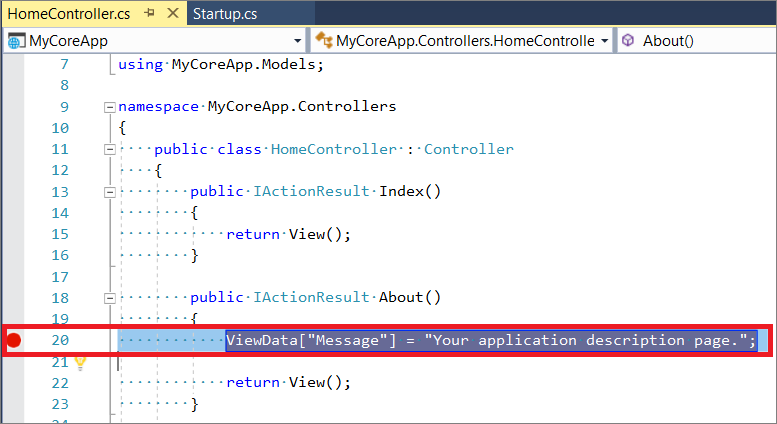

1. Return to the browser and refresh the About page. This will trigger the breakpoint in Visual Studio.

1. In Visual Studio, mouse over the **ViewData** member to view its data.

 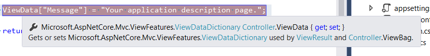

1. Remove the application breakpoint using the same method you used to add it.

1. Open **Views/Home/About.cshtml**.

 

1. Change the text **"additional"** to **"changed"** and save the file.

 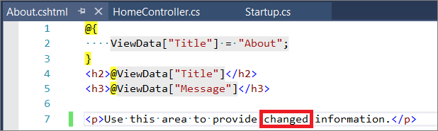

1. Return to the browser window to see the updated text. (Refresh the browser if you don't see the text that you changed.)

  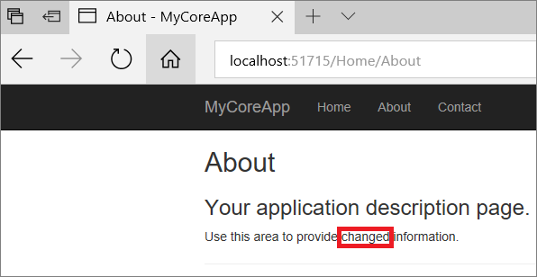

1. Choose the **Stop Debugging** button from the toolbar to stop debugging. (Alternatively, press **Shift**+**F5**, or choose **Debug** > **Stop Debugging** from the menu bar.)

 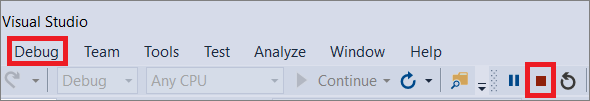

Congratulations on completing this tutorial!

## See also
* [Getting started with ASP.NET Core MVC and Visual Studio](/aspnet/core/tutorials/first-mvc-app/start-mvc?tabs=aspnetcore2x)
* [Getting started with Razor Pages in ASP.NET Core](/aspnet/core/tutorials/razor-pages/razor-pages-start)
* [What's New in C#](/dotnet/csharp/whats-new)
* [C# Language Reference](/dotnet/csharp/language-reference/index)
* [C# Fundamentals for Absolute Beginners](https://mva.microsoft.com/en-US/training-courses/c-fundamentals-for-absolute-beginners-16169) video course
