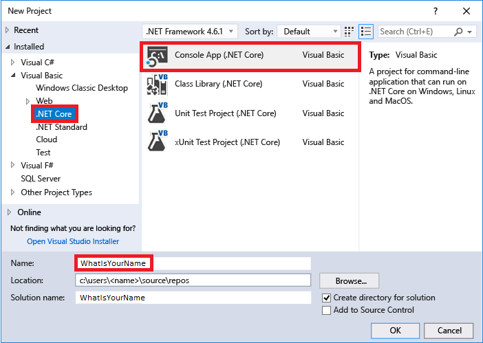

# Getting started with Visual Basic in Visual Studio
In this tutorial for Visual Basic (VB), you'll use Visual Studio to create and run a few different console apps, and explore some features of the Visual Studio [integrated development environment (IDE)](visual-studio-ide.md) while you do so.

If you haven't already installed Visual Studio, go to the [Visual Studio downloads](https://aka.ms/vsdownload?utm_source=mscom&utm_campaign=msdocs) page to install it for free.

## Before you begin
Here's a quick FAQ to introduce you to some key concepts.
### What is Visual Basic?
Visual Basic is a type-safe programming language that's designed to be easy to learn. It is derived from BASIC, which means "Beginner's All-purpose Symbolic Instruction Code".
### What is Visual Studio?
Visual Studio is an integrated development suite of productivity tools for developers. Think of it as a program you can use to create programs and applications.  
### What is a console app?
A console app takes input and displays output in a command-line window, a.k.a. a console.
### What is .NET Core?
.NET Core is the evolutionary next step of the .NET Framework. Where the .NET Framework allowed you to share code across programming languages, .NET Core adds the ability to share code across platforms. Even better, it's open source. (Both the .NET Framework and .NET Core include libraries of prebuilt functionality as well as a common language runtime (CLR), which acts as a virtual machine in which to run your code.)

## Start developing
Ready to start developing? Let's go!

### Create a project
First, we'll create a Visual Basic application project. The project type comes with all the template files you'll need, before you've even added anything!

1. Open Visual Studio 2017.

2. From the top menu bar, choose **File** > **New** > **Project...**.

3. In the **New Project** dialog box in the left pane, expand **Visual Basic**, and then choose **.NET Core**. In the middle pane, choose **Console App (.NET Core)**. Then name the file *HelloWorld*.  

   

#### Add a workgroup (optional)
If you don't see the **Console App (.NET Core)** project template, you can get it by adding the **.NET Core cross-platform development** workload. You can add this workload in one of the two following ways, depending on which Visual Studio 2017 updates are installed on your machine.

##### Option 1: Use the New Project dialog box
1. Click the **Open Visual Studio Installer** link in the left pane of the **New Project** dialog box.

  

2. The Visual Studio Installer launches. Choose the **.NET Core cross-platform development** workload, and then choose **Modify**.

   

##### Option 2: Use the Tools menu bar
1. Cancel out of the **New Project** dialog box and from the top menu bar, choose **Tools** > **Get Tools and Features...**.

2. The Visual Studio Installer launches. Choose the **.NET Core cross-platform development** workload, and then choose **Modify**.   

## Create a "What Is Your Name" application
Let's create an app that prompts you for your name and then displays it along with the date and time. Here's how:

1. If it is not already open, then open your *WhatIsYourName* project.

2. Enter the following Visual Basic code immediately after the opening bracket that follows the `Sub Main(args As String())` line and before the `End Sub` line:

     ```vb
     Console.WriteLine(vbCrLf + "What is your name? ")
     Dim name = Console.ReadLine()
     Dim currentDate = DateTime.Now
     Console.WriteLine($"{vbCrLf}Hello, {name}, on {currentDate:d} at {currentDate:t}")
     Console.Write(vbCrLf + "Press any key to exit... ")
     Console.ReadKey(True)
    ```

    This code replaces the existing <xref:System.Console.WriteLine%2A>, <xref:System.Console.Write%2A>, and <xref:System.Console.ReadKey%2A> statements.

 

3. When the console window opens, enter your name. Your console window should look similar to the following screenshot:

   

5. Press any key to close the console window.

## Create a "Calculate This" application
1. Open Visual Studio 2017, and then from the top menu bar, choose **File** > **New** > **Project...**.

2. In the **New Project** dialog box in the left pane, expand **Visual Basic**, and then choose **.NET Core**. In the middle pane, choose **Console App (.NET Core)**. Then name the file *CalculateThis*.  

3. Enter the following code between the `Module Program` line and `End Module` line:

   ```vb
   Public num1 As Integer
   Public num2 As Integer
   Public answer As Integer
   Sub Main()
       Console.WriteLine("Type a number and press Enter")
       num1 = Console.ReadLine()
       Console.WriteLine("Type another number to add to it and press Enter")
       num2 = Console.ReadLine()
       answer = num1 + num2
       Console.WriteLine("The answer is " & answer)
       Console.ReadLine()
   End Sub
   ```

  Your code window should look like the following screenshot:

   

4. Click **CalculateThis** to run your program. Your console window should look similar to the following screenshot:       

    

Congratulations on completing this tutorial!

## See also
* [Visual Basic Guide](/dotnet/visual-basic/index)
* [What's new in Visual Basic](/dotnet/visual-basic/getting-started/whats-new)
* [IntelliSense for Visual Basic code files](visual-basic-specific-intellisense.md)
* [Visual Basic Language Reference](/dotnet/visual-basic/language-reference/index)
* [Visual Basic Fundamentals for Absolute Beginners](https://mva.microsoft.com/en-us/training-courses/visual-basic-fundamentals-for-absolute-beginners-16507) video course
