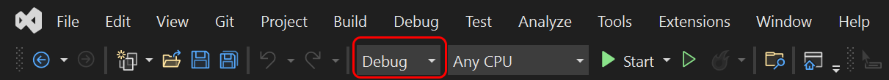
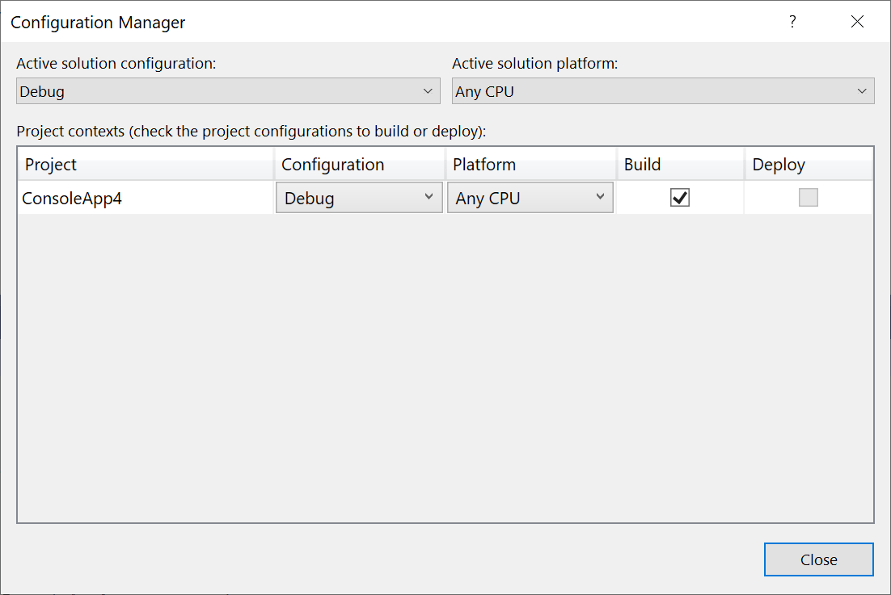
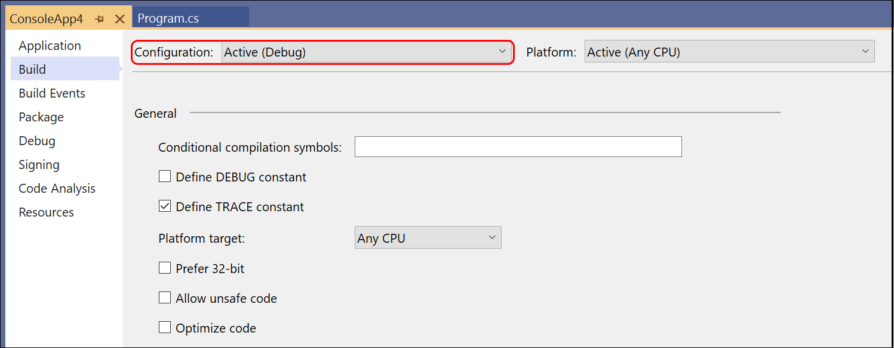
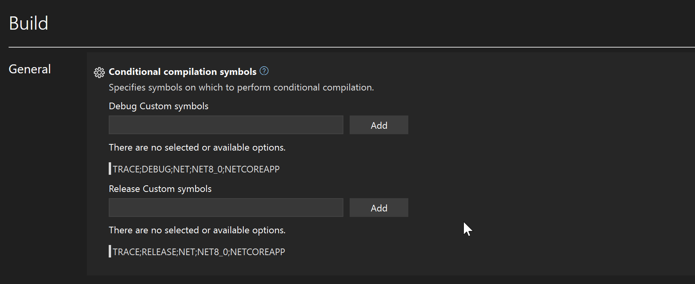

# Understand build configurations

You need build configurations when you need to build your projects with different settings. For example, **Debug** and **Release** are build configurations, and different compiler options are used accordingly when building them.  One configuration is active and is indicated in the command bar at the top of the IDE.

:::moniker range="<=vs-2019"

:::moniker-end
:::moniker range=">=vs-2022"

:::moniker-end

The configuration and the platform control where built output files are stored. Normally, when Visual Studio builds your project, the output is placed in a project subfolder named with the active configuration (for example, *bin/Debug/x86*), but you can change that.

You can create your own build configurations at the solution and project level. The solution configuration determines which projects are included in the build when that configuration is active. Only the projects that are specified in the active solution configuration will be built. If multiple target platforms are selected in Configuration Manager, all projects that apply to that platform are built. The project configuration determines what build settings and compiler options are used when you build the project.

To create, select, modify, or delete a configuration, you can use the **Configuration Manager**. To open it, on the menu bar, choose **Build** > **Configuration Manager**, or just type **Configuration** in the search box. You can also use the **Solution Configurations** list on the **Standard** toolbar to select a configuration or open the **Configuration Manager**.

> [!NOTE]
> If you can't find solution configuration settings on the toolbar and can't access the **Configuration Manager**, it might be because you're using Visual Basic development settings. For more information, see [How to: Manage configurations with Visual Basic developer settings applied](/visualstudio/ide/understanding-build-configurations).

By default, **Debug** and **Release** configurations are included in projects that are created by using Visual Studio templates. A **Debug** configuration supports the debugging of an app, and a **Release** configuration builds a version of the app that can be deployed. For more information, see [How to: Set debug and release configurations](../debugger/how-to-set-debug-and-release-configurations.md). You can also create custom solution configurations and project configurations. For more information, see [How to: Create and edit configurations](../ide/how-to-create-and-edit-configurations.md).

## Solution configurations

A solution configuration specifies how projects in the solution are to be built and deployed. To modify a solution configuration or define a new one, in the **Configuration Manager**, under **Active solution configuration**, choose **Edit** or **New**.

Each entry in the **Project contexts** box in a solution configuration represents a project in the solution. For every combination of **Active solution configuration** and **Active solution platform**, you can set how each project is used.

When you define a new solution configuration and select the **Create new project configurations** check box, Visual Studio creates a new project configuration in all of the projects. Likewise, when you define a new solution platform and select the **Create new project platforms** check box, Visual Studio creates the new platform option in all of the projects. Also, if you add a project that targets a new platform, Visual Studio adds that platform to the list of solution platforms and makes the platform available as an option in all of the projects. You can modify the settings for each project, for cases where platforms are not needed or supported by some projects.

The active solution configuration also provides context to the IDE. For example, if you're working on a project and the configuration specifies that it will be built for a mobile device, the **Toolbox** displays only items that can be used in a mobile device project.

## Project configurations

The configuration and platform that a project targets are used together to specify the build settings and compiler options to use when it's built. A project can have different settings for each combination of configuration and platform. To modify the properties of a project, open the shortcut menu for the project in **Solution Explorer**, and then choose **Properties**.  At the top of the **Build** tab of the project designer, choose an active configuration to edit its build settings.

:::moniker range="<=vs-2019"

:::moniker-end
:::moniker range=">=vs-2022"

:::moniker-end

The predefined constants for each configuration are shown underneath the textbox where you can enter your own. These predefined constants are defined by the SDK your project uses. To see where these properties are defined, you can look for how the MSBuild property `DefineConstants` is defined and modified in the .NET SDK installation folder where `.props` and `.targets` files are located. The SDKs provide MSBuild properties that you can set in the project file to disable the predefined definitions; for example, see [DisableImplicitFrameworkDefines](/dotnet/core/project-sdk/msbuild-props#disableimplicitframeworkdefines).

## How Visual Studio associates project configurations with solution configurations

When you define a new solution configuration and don't copy settings from an existing one, Visual Studio uses the following criteria to associate the existing project configurations with the new solution configuration. The criteria are evaluated in the order shown.

1. If a project has a configuration name (*\<configuration name> \<platform name>*) that matches the name of the new solution configuration, that configuration is used. Configuration names are not case-sensitive.

1. If the project has a configuration name in which the configuration-name part matches the new solution configuration, that configuration is used, whether the platform portion matches or not.

1. If there is still no match, the first configuration that's listed in the project is used.

## How Visual Studio associates solution configurations with new project configurations

When you create a project configuration (in the **Configuration Manager**, by choosing **New** on the drop-down menu in the **Configuration** column for that project) and select the **Create new solution configurations** check box, Visual Studio looks for a like-named solution configuration to build the project on each platform it supports. In some cases, Visual Studio renames existing solution configurations or defines new ones.

Visual Studio uses the following criteria to associate solution configurations with project configurations:

- If a project configuration doesn't specify a platform or specifies just one platform, then a solution configuration whose name matches that of the new project configuration is either found or added. The default name of this solution configuration does not include a platform name; it takes the form *\<project configuration name>*.

- If a project supports multiple platforms, a solution configuration is either found or added for each supported platform. The name of each solution configuration includes both the project configuration name and the platform name, and has the form *\<project configuration name> \<platform name>*.

## How configurations affect the build

When you build a solution using the **Build** > **Build Solution** command, Visual Studio only builds the active configuration. All projects that are specified in that solution configuration are built, and the only project configuration that's built is that one specified in the active solution configuration and active solution platform, which is shown in the toolbar in Visual Studio. For example, **Debug** and **x86**. Other defined configurations and platforms are not built.

If you want to build multiple configurations and platforms in one action, you can use the **Build** > **Batch Build** option in Visual Studio. To access this feature, press **Ctrl**+**Q** to open the search box, and enter `Batch build`. Batch build is not available for all project types. See [How to: Build multiple configurations simultaneously](how-to-build-multiple-configurations-simultaneously.md).

## Related content

- [Walkthrough: Build an application](../ide/walkthrough-building-an-application.md)
- [Compile and build](../ide/compiling-and-building-in-visual-studio.md)
- [Solutions and projects](../ide/solutions-and-projects-in-visual-studio.md)
- [C/C++ build reference](/cpp/build/reference/c-cpp-building-reference)
- [Configure projects to target platforms](how-to-configure-projects-to-target-platforms.md)
