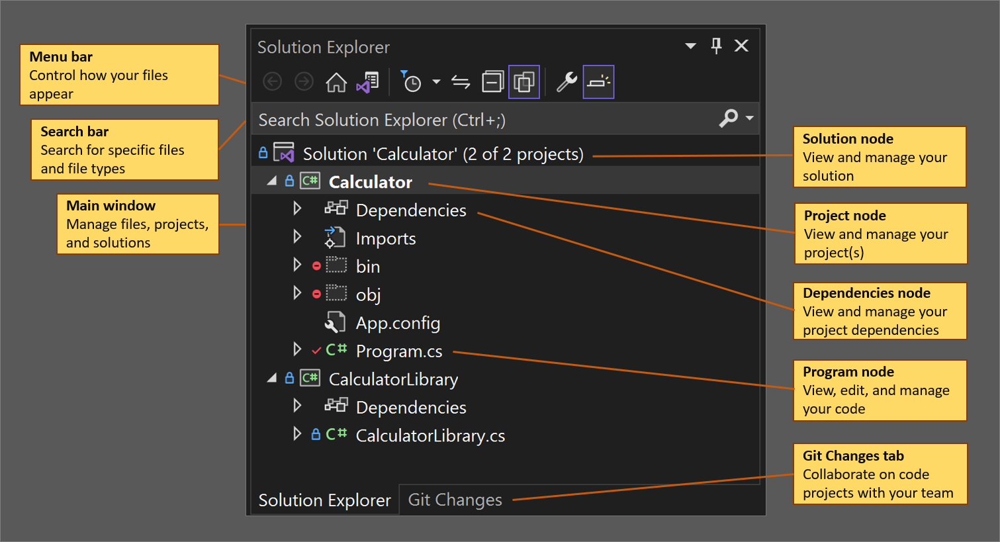

# How to use Solution Explorer

You can use the Solution Explorer tool window to create & manage your solutions and projects and to view & interact with your code. In this article, we'll detail the user interface (UI) options that help you do so.

> [!NOTE]
> This topic applies only to Visual Studio on Windows.

## Solution Explorer tool window

To start, let's take a look at the Solution Explorer tool window in the [Visual Studio IDE](../get-started/visual-studio-ide.md), with an open C# console solution that has two projects.

The tool window contains the following UI (user interface) elements:

- **Menu bar**, where you can control how your files appear
- **Search bar**, where you can search for specific files and file types
- **Main window**, where you can view and manage your files, projects, & solutions
- **Solution node**, where you can manage your solution(s)
- **Project node**, where you can manage your project(s)
- **Dependencies node**, where you can manage your solution & project dependencies
- **Program node**, where you can view, edit, and manage your program or application (app)
- **[Git changes tab](../version-control/git-with-visual-studio.md?view=vs-2019&preserve-view=true#git-changes-window)**, where you can use Git & GitHub within Visual Studio to collaborate on projects with your team

> [!TIP]
> If you don't see the Solution Explorer tool window, you can open it from the Visual Studio menu bar by using **View** > **Solution Explorer**, or by pressing **Ctrl**+**Alt**+**L**.

## Solution Explorer menu bar

To continue, let's take a closer look at the Solution Explorer menu bar.

The menu bar contains the following UI elements, from left to right:

- **Back** button, to toggle between search results
- **Forward** button, to toggle between search results
- **Home** button, to return to the default view
- **Switch** button, to switch between solutions and available views
- **Pending Changes Filter** button & drop-down menu, to view open files or files with pending changes
- **Sync with Active Document** button, to locate a file from the code editor
- **Refresh** button, which appears only when you select a dependency, such as a function or a package
- **Collapse All** button, to collapse the file view in the main window
- **Show All Files** button, to view all files, including [unloaded projects](filtered-solutions.md#toggle-unloaded-project-visibility)
- **Properties** button, to view and change settings for specific files and components
- **Preview Selected Items** button, to view a selected file or component in the code editor

### Solution Explorer right-click context menu

In Solution Explorer, there are several file properties that you can interact with by using the right-click context menu. For more information about the right-click context menu options, see the [Manage project and solution properties](managing-project-and-solution-properties.md) page.

## See also

- [What are solutions and projects in Visual Studio?](solutions-and-projects-in-visual-studio.md)
- [Customize window layouts in Visual Studio](customizing-window-layouts-in-visual-studio.md)
